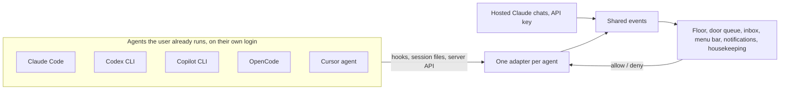

# Agent Office for every developer

## Problem Frame

Agent Office is Aaron's Mac app. It hosts his Claude Code chats on two subscription accounts and shows each chat as a character in a 3D office. The GitHub repo is already public, but it has no license, so nobody may legally reuse it, and nobody outside MWS uses it. He wants other developers who run several coding agents at once to use it every day, the way he does, and he wants to keep using it every day himself.

Some of the groundwork has shipped, from step 1 of `docs/brainstorms/2026-09-25-rooms-for-any-setup-requirements.md`:
- Every git repository gets its own room, and the MWS monorepo is recognised wherever it's cloned.
- `~/.config/agent-office/departments.json` defines rooms, playground folders, the ship-it commands and the review command. A room can be tied to an account, which replaces the old `/research/` label check.
- The office has eight hand-built looks. New rooms get the plain look.
- A release workflow publishes an unsigned arm64 dmg. Downloaded builds check GitHub for newer releases.
- Chats hand off to Terminal, iTerm2 or the desktop app, and a docked shell terminal sits next to the chat.

Step 2 of that doc, generated room looks, was built and then reverted: the looks didn't hold up next to the hand-built rooms.

What still keeps it personal:
- **Login.** Office chats run on subscription logins, either `claude setup-token` tokens or Claude Code's own login, and both paths are in the public repo today. The Agent SDK overview says: "Unless previously approved, Anthropic does not allow third party developers to offer claude.ai login or rate limits for their products, including agents built on the Claude Agent SDK." The terminal handoff also writes the account's token into a temp script.
- **Claude only.** Most developers who run agents in parallel mix Claude Code with Codex, Copilot, OpenCode or Cursor.
- **First run needs a Claude account.** Onboarding walks a first launch through connecting one before the office shows anything. With no configured commands, the ship-it steps are hidden.

The release changes what the office is by default. It becomes a companion to the agents people already run under their own logins: it watches them through their hooks and session files and answers their permission prompts. Hosted Claude chats, the part that replaces the desktop app today, stay available once the user adds an API key. Aaron's subscription logins leave the public code and move into a private module that his own install loads.

## Requirements

**Companion core**
- R1. The office runs with no login, token or API key. First run no longer asks for an account, which onboarding does today. It finds which supported agents are installed and offers to install their hooks in one consent dialog, with a checkbox per detected agent (on by default) and one Continue. It then shows every session active in the last 24 hours as a character with live state. If no supported agent is installed, it lists the supported agents with a link to each. If agents are installed but none ran in the last 24 hours, it says how to start one, through New agent (R12) or the agent itself.
- R2. Each agent's hooks are installed with the same safeguards the Claude hook bridge uses today: a backup, a re-read before every write, an atomic replace, and removal of exactly the office's own entry. Each adapter declares its install method: a marked entry in a JSON settings file (today's installer), a format-preserving edit for a TOML config, or a plugin file the office owns. A hook exits at once, silently, when the office isn't running. At startup, the office rewrites an installed entry that no longer matches the current one (events, timeout or script) under the same safeguards. It also rewrites the hook script and the endpoint file. Settings → Outside chats shows each agent's hook state ("not installed", "installed" or "failed", with the reason) and an Install button, so a declined or failed install stays visible and can be retried.
- R3. Each supported agent gets one adapter. It turns that agent's hooks, session files or server API into the office's shared events: session seen, state change, tool call (for "doing now"), permission asked, permission answered, turn done and session ended. It maps each tool call and permission request to the office's tool vocabulary: the shell command as one string, the file path, and whether the call reads, edits or does something else. The dangerous-request rules and placement read only that vocabulary, and a request the adapter can't map counts as dangerous. The floor, door queue, inbox, menu bar, notifications and housekeeping contain no agent-specific code, and adding an agent never changes them.
- R4. An adapter declares what its agent supports: live state, approvals from the office, transcript replay, the account, and how to find a session's processes for RAM. The office hides anything an agent lacks instead of faking it, and housekeeping shows no RAM for agents that can't provide it. An agent that can't be approved from outside still shows Needs you, and Open brings it forward.
- R5. Where an agent supports it, its permission prompts join the door queue. They're answered from the chat card, the inbox, the keys and Mac notifications, all through the one `resolveRequest` path, and the first answer wins. The dangerous-request rules apply to every agent: those requests always need a click in the app. If the go/no-go spike (see Outstanding Questions) shows that an agent's own prompt freezes while the office's hook waits, approving from the office is off for that agent, and it shows Needs you plus Open instead.
- R5a. Always allow works for companion agents too. The office saves the rule per agent and repository, built from the tool vocabulary (R3) the way it keeps Claude's literal suggested rule today. It answers matching future requests itself through the hook, and the existing rules view lists and revokes these rules alongside the hosted-chat rules. WebFetch, WebSearch and dangerous requests never get Always allow.
- R6. The office never blocks an agent. If the office is closed, crashes or leaves a request unanswered, the agent falls back to its own prompt in its own UI. The office counts as closed whenever no window app is connected to the agent host: while that's so, the permission hook hands back at once with no decision. An answer given in the agent's own UI withdraws the office's copy of the request.
- R7. Open on a companion agent brings forward the app it runs in (terminal, IDE or desktop app), at the exact tab or window where that app allows it.
- R8. Companion agents are the normal case, so they lose the Visitor badge. Their character already shows which agent they are.
- R9. Adapters in the first release. "Expected" comes from the docs survey and hasn't been tried yet:

  | Agent | Live state | Approve from the office | Where it comes from |
  |---|---|---|---|
  | Claude Code (terminal, IDE, desktop app) | Yes, shipped | Expected: today's bridge doesn't subscribe to `PermissionRequest` yet | Hooks; transcripts in `~/.claude/projects` |
  | Codex CLI | Expected | Expected | Hooks including `PermissionRequest`; session files |
  | Copilot CLI | Expected | Expected | Hooks including `permissionRequest`; `~/.copilot/session-state` |
  | OpenCode | Expected | Expected | Local server API and event stream, or a plugin |
  | Cursor agent | After a spike | After a spike | Hooks, though whether they fire in the CLI is disputed |

  If the Cursor spike fails, Cursor ships with state from its transcripts only, or waits for a later release.
- R10. Every ingestion path gets the same hardening as today's hook listener, not only the hook socket: session files, plugin output and server responses included. That means schema-validated parsing, size caps, and session ids checked per agent. The office talks to OpenCode's server only on loopback and uses its password when one is set.

**Characters**
- R11. Each agent type has its own character. Claude keeps the blob; Codex, Copilot, OpenCode and Cursor get their own shapes in the same matte, big-eyed style. Colour, status ring, tag, poses and state behaviour are identical for all of them. An adapter without a character of its own uses a generic one with the agent's name on its tag.
- R12. Characters are original designs. None copies a vendor logo.

**Starting agents**
- R13. Without an API key, New agent and the review queue's start button open the user's terminal app in the chosen folder, or in a fresh worktree, and run the chosen agent's CLI with the prompt. This reuses the terminal handoff's app choice and quoting (`src/main/handoff.ts`), so the prompt never reaches a shell or AppleScript unquoted. The form lists the installed agents and picks Claude Code when it's installed, otherwise the first installed agent in R9's order.
- R14. The spot where the agent will sit shows "Waiting for <agent> to start…" with Cancel, following the existing "setting up worktree…" pattern. When the session arrives it walks in as a companion agent, keeping the room chosen in the form and, for a review, its place in PR reviews. A launch that fails shows its error on the form.
- R15. On a companion agent, the ship-it condition (CI failing, comments waiting, ready to clean up) shows as a cue on its tag and its inbox row, because that's what tells the user which agent to go to. The step's button copies its prompt and brings the agent forward so the user can paste it. On a hosted chat the button sends the step, as it does today.

**Hosted Claude chats (opt-in)**
- R16. With an Anthropic API key in Settings, today's office chats come back: the composer, plan and question cards, the subagent strip, model and effort, Move into the office, and New agent starting a hosted chat. The key is stored the way tokens are stored today.
- R17. The public build never starts an Agent SDK query without a configured API key. That covers chat titles, health checks and room naming as well as chats. It refuses to run a session that reports any credential source other than that key.
- R18. Hosted chats show their cost per chat and per day, since API billing is per token.
- R19. Accounts come from account providers. The public code ships one provider, for API keys. Several labelled accounts work side by side, as they do today, and a room can still be tied to an account (shipped). The 5-hour and weekly usage and the account suggestions built on it show only when a provider reports those windows. The API key provider doesn't, so strangers never see them.

**The floor**
- R20. Rooms stay as they shipped: one room per git repository, worktrees in their repository's room, folders outside any repository on the Side projects playground, and `departments.json` for splits, renames, accents, looks and playground folders. There is no automatic per-package split and no settings screen for rooms.
- R21. Rooms keep the order that has shipped: MWS rooms and config rooms first, in config order, then built rooms, oldest first. PR reviews and the playground keep their fixed places.
- R23. Live placement by files keeps working, with the current jitter guard, between rooms that already exist.
- R24. Four new hand-built looks join the existing eight: web studio, data lab, docs library and CLI workshop. They're built the same way, with size tiers and a signature piece. A new room gets one of them from what's in its repository. It gets the plain look when nothing matches, and `departments.json` can set any look. Existing looks keep their names and props.
- R25. No look contains real brand logos, club crests or company marks.

**Workflow**
- R26. The review panel shows the diff file by file, the branch, the PR link and CI status, and opens files in the editor. It works for every agent, since it reads git and `gh`, not the agent.
- R27. Ship-it steps are config, extending the shipped `commands` section of `departments.json`. Each step has a label, a prompt or slash command, and the condition that shows it: changes without a PR, CI failing, unresolved comments, or merged. The defaults are plain prompts any agent understands, such as "Commit this and open a PR", "Fix the failing CI checks" and "Answer the unresolved review comments". A slash-command step shows only where the office knows the agent has that command, as it does today. Aaron's `/mws-*` steps stay in his config.
- R28. The review queue stays: PRs where the user's review is requested, found through `gh`, with the in-tray, the drawer section and a button that starts a review agent with the configured review command. The agent is hosted when there's a key and runs in the terminal otherwise (R13). The default review prompt is already plain ("Review this pull request: <url>"), and `/pr-review-rundown` stays in Aaron's config. The review queue also finds the local clone among companion sessions and recent folders, not only office chats.
- R29. Housekeeping stays and covers every agent: worktree cleanup with the same safety checks, RAM per agent (R4), and parking. The office never stops a companion agent's processes, as it doesn't for visitors today.
- R30. Linear, ntfy phone push and Jev (TypeSafe room picking) aren't part of the public release. They're left out of the README and onboarding and are off by default. They stay in the public repo because they're already opt-in behind their own keys and hold nothing personal. Jev's room naming needs an API key under R17. The docked shell terminal stays as it is. The git self-updater only runs in builds installed with `pnpm app:install` from a checkout. Downloaded builds use the GitHub releases check, pointed at the public repo.

**Release**
- R31. The repo carries an MIT license. Releases stay unsigned Apple Silicon builds on GitHub Releases, from the existing release workflow, each with a published SHA-256 checksum that the README install steps mention.
- R32. The README is rewritten for strangers. It covers what the app is, with a GIF and a link to the web demo; how to install it, including the Gatekeeper step and the checksum; which agents are supported and what each one can do; how to turn on notifications (R33); and where data lives. Aaron's personal setup moves out of it.
- R33. A script, published with each release, re-signs the downloaded app with the user's self-signed certificate so Mac notifications work. The README says how to create the certificate once (today's steps, reworded for strangers). Re-signing has to be repeated after every update, so the update notice in a downloaded build reminds the user to run it again.
- R33a. Without notifications set up, no request goes unseen. The door queue, inbox and menu bar strip show every one, and onboarding says what the certificate step adds.
- R34. The existing demo mode (sample agents, no accounts) builds as a static page on GitHub Pages, linked from the README. It shows the floor and the drawer with sample data. An action that needs a real agent says so when clicked. On a screen too narrow for the floor, the page shows a GIF and says the demo needs a larger screen.
- R35. The app never calls itself a vendor's product or copies one's visuals. "Works with Claude Code, Codex, …" in the README is as far as it goes, in line with the Agent SDK branding rules.
- R36. A short CONTRIBUTING guide explains how to add an adapter and a character.
- R36a. A post-merge check runs the stranger path on a clean data folder with no key and no config. It covers companion sessions from recorded fixtures for each adapter, rooms built on their own, a terminal launch, and the default ship-it steps. It sits next to the existing real-floor run and reports failures the same way.

**Aaron's private login provider**
- R37. Aaron's subscription logins live in a private account provider: setup-token accounts, Claude Code login accounts, the token in the terminal handoff, and the 5-hour and weekly usage. The office loads it at startup from his data folder, and only when the file belongs to him and nobody else can write to it. Nothing needs rebasing. Everything else of Aaron's lives as config in his data folder: MWS rooms and looks, ship-it and review commands, the research room and the ntfy files.
- R38. Aaron's existing accounts, chats and rooms keep working unchanged after the switch. Room ids and look names don't change, and his accounts load through his provider.
- R39. After the switch, his floor looks and works as it does today: the same departments, both accounts, his skills on the ship-it strip and the gym.

## Success Criteria
- Aaron uses the public build plus his private provider every day from release onward, and no feature he uses today is missing.
- The test machine is a clean Mac user account with at least one supported agent installed and a session running. A stranger goes from the release page to seeing that session on the floor in under 5 minutes, including the Gatekeeper step, without a token or any config. Notification setup doesn't count toward the 5 minutes.
- Other developers use it every day. Release downloads keep growing from one release to the next, and more of the issues opened are feature requests than bug reports. There's no target number yet.
- Every first-release adapter passes the same check: a session appears and its state changes live. Every adapter the go/no-go spike clears also honours a permission prompt answered in the office.
- The no-config post-merge check (R36a) passes on main.

## Scope Boundaries
- macOS on Apple Silicon only. Linux, Windows and Intel Macs are left to contributors.
- No claude.ai login of any kind in the public code, Claude Code's own login included. Subscription logins live in Aaron's private provider (R37).
- No settings screen for rooms and no automatic per-package split. `departments.json` covers both.
- Hosted chats take an API key only; no Bedrock or Vertex.
- The office can't send messages into a companion agent's session. Chatting happens in the agent's own UI, or in a hosted chat.
- The office doesn't host other agents in terminals. Revisit if people ask for a composer for agents other than Claude. The docked shell terminal next to a chat stays.
- No Developer ID signing, notarization, auto-update for downloaded builds, or Homebrew cask.
- Not in the first release: Linear, phone push and Jev (R30); an `emit` command for arbitrary scripts; the day timelapse; ambient mode and sounds; team or multiplayer offices.
- No adapter for Aider, which has no hooks, or for Gemini CLI and Antigravity CLI. Gemini CLI no longer serves most individual users, and Antigravity can only deny through PreToolUse.

## Key Decisions
- **Companion by default, hosting opt-in.** With no login in the office, the terms problem goes away, any agent can join, and a stranger sees their own agents with no setup. Hosted chats stay behind an API key, so none of the chat work already built is lost. Two alternatives were considered. A terminal host running each user's own CLI gives full chat for every agent, but it replaces the custom chat view with a terminal. API-key-only hosting puts off heavy users, who are mostly on subscriptions, and leaves other agents second-class.
- **Any coding agent, five adapters at launch.** Claude Code, Codex CLI, Copilot CLI and OpenCode are expected to allow approvals from outside, and Cursor may join after a spike. Claude Squad and Vibe Kanban already run several agents by wrapping their CLIs, and Pixel Agents (MIT) shows Claude Code agents as a pixel-art office. What sets Agent Office apart is one place to see and answer every local agent you already run, without changing how you start them. The README GIF and the web demo show the door queue with several kinds of agent in it.
- **Own character per agent.** The character shows which agent it is, so departments can stay about where the work happens.
- **Rooms as shipped, plus four hand-built looks picked by stack.** One room per repository already gives strangers a floor with no setup, and splitting per package would scatter typical monorepos. Generated looks were reverted because they didn't hold up, so the new looks are hand-built like the existing eight. A room's look is the first thing a stranger sees.
- **Always allow for every agent.** The office keeps the rules and answers matching requests itself, so companion agents get the same flow Aaron uses every day.
- **A no-config post-merge check.** Aaron's own setup never exercises the stranger path (private provider, MWS config, Claude only), so an automated run on a clean data folder guards it.
- **Open in terminal when there's no key.** Starting an agent or a review still works for companion users, through their own CLI. Claude Squad and Vibe Kanban also wrap the user's installed CLIs.
- **Unsigned release with a re-sign script.** It costs nothing, but users face a Gatekeeper step, and anyone who wants notifications has to make a certificate once and re-sign after each update. Developer ID is the upgrade once issues about missed prompts or notifications keep coming in.
- **MIT license.**
- **Subscription logins in a private provider, not a fork.** Login and usage code runs through main, shared and renderer, so a fork would conflict on most outside PRs to accounts, the inbox or New agent. A provider interface with API keys as its public implementation keeps the seam in one place, and Aaron's provider needs no rebasing. Anthropic's rule allows exceptions "unless previously approved." If Aaron gets approval, his provider can become public.
- **Approvals settled by a go/no-go spike.** No agent's approval from outside has been tried yet, Claude included. The plan starts with a spike, as the original app did, and R5 names the fallback, so planning doesn't wait on it.

## Dependencies / Assumptions
- The repo is already public. Its history contains the subscription login code, and a release removes it from the code from then on, not from history.
- Verified in the Claude Code hooks docs on 2026-09-27: `PermissionRequest` hooks return allow or deny, hooks time out after 600 seconds by default, and they fire in the terminal, the IDE extensions and the desktop app. An `http` hook type exists.
- Verified in the Agent SDK overview on 2026-09-27: the claude.ai login rule and the branding rules cited above.
- From a documentation survey on 2026-09-27, not yet tested: the `PermissionRequest` and `permissionRequest` hooks in Codex CLI and Copilot CLI, and OpenCode's permission endpoint on its local server. Cursor's hooks return allow or deny but may not fire in its CLI. The location of Codex session files isn't confirmed in official docs.
- Assumed, not checked: macOS 27 still lets users open an unsigned app through System Settings → Privacy & Security → Open Anyway. Ad-hoc signed apps still get no notifications, as the README says today.

## Outstanding Questions

### Resolve Before Planning
- None.

### Deferred to Planning
- [Affects R5, R6, R9][Needs research] The plan's first unit is a go/no-go spike, on Claude Code first, then Codex and Copilot. For each agent: does its own prompt stay answerable while the office's permission hook waits? If it doesn't, how long should the hook wait before handing back, and how does an answer given in the agent's own UI reach the office? Where the answer is no, R5's fallback applies.
- [Affects R1, R2][Needs research] Does each agent pick up hook changes in sessions that are already running, or only in new ones? If only new ones, onboarding says which sessions need a restart to go live, and until then they show transcript state.
- [Affects R9][Needs research] The Cursor spike: do hooks fire in the Cursor agent CLI? And does OpenCode's TUI expose its server API without the user running `opencode serve`?
- [Affects R3][Technical] Where the adapter seam goes in today's visitor pipeline. Whether Claude's hook moves from the curl script to the `http` hook type, and whether a refused connection then shows as an error in the agent's UI. How to keep Claude's Notification `permission_prompt` and a new `PermissionRequest` from both raising the same request. `resolveRequest` also assumes an SDK session (`engine.running`), and the listener accepts only UUID session ids.
- [Affects R14][Technical] How the office matches an arriving session to the launch that started it: a launch id in an environment variable that the hook forwards, or the folder, agent and a time window.
- [Affects R7, R13][Needs research] Which terminal apps beyond Terminal and iTerm2 can be opened at a folder running a command and focused at an exact tab (Ghostty, Warp). Whether the macOS Automation prompt comes back after each update of an ad-hoc signed build.
- [Affects R24][Technical] Which signals in a repository pick web studio, data lab, docs library or CLI workshop.
- [Affects R33][Needs research] Does re-signing a downloaded build (the app, the agent host and the unpacked `claude` binary) with a self-signed certificate bring notifications back, and does macOS keep the permission across re-signs with the same certificate?
- [Affects R5a][Technical] What a companion rule looks like for agents that don't suggest one, built from the tool vocabulary, and how a match is decided.
- [Affects R34][Technical] Whether the renderer's demo mode runs without the Electron preload or needs a stub.
- [Affects R19, R37][Technical] The shape of the account-provider interface, and how the office loads a private provider from the data folder. `sessionEnv` currently deletes `ANTHROPIC_API_KEY`, and validation reads subscription rate-limit headers, so API keys need their own validation and health states.
- [Affects R11][Design] Character shapes for Codex, Copilot, OpenCode and Cursor: original designs that don't copy their logos.

## Next Steps
→ `/ce:plan` for structured implementation planning.
