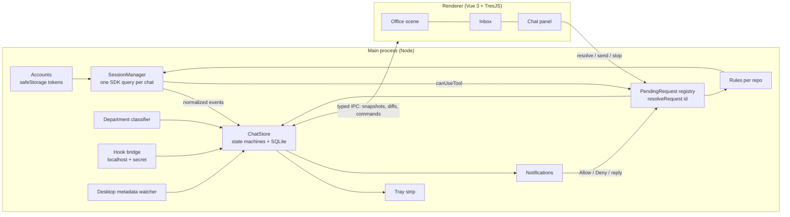
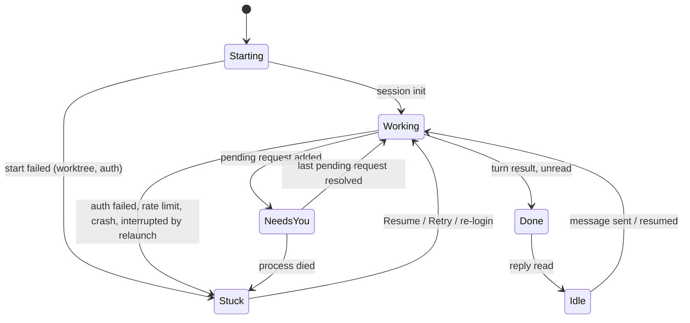

# feat: Build the Agent Office desktop app

**Target repo:** `agent-office` (new; today it holds only `docs/` and `prototypes/`).

## Overview

Build a personal macOS app that replaces the Claude desktop app's Code tab for Aaron's daily work. It hosts Claude Code sessions for both of his accounts itself, and shows each chat as a character in a cute, colourful 3D office. Chats needing a decision queue at his office door, and a menu bar strip and native notifications cover the times the window is closed. Work ships in six phases, following the build order agreed in the origin doc. Phase 0 is a go/no-go test of the riskiest assumptions.

## Problem Frame

Aaron runs about ten Claude Code chats at once on a busy day, across two accounts, each in its own desktop app instance. Nothing shows across both which chats are blocked on him, and blocked chats waste the parallelism he pays for. He wants to stop using the desktop app and work from an office where every chat is an agent at a desk, grouped by the code it touches (see origin: `docs/brainstorms/2026-09-23-agent-office-requirements.md`).

## Requirements Trace

All of R1–R20 in the origin doc, grouped here by where the plan delivers them:

- **Office (R1–R9):** Units 5, 6, 9 and 14.
- **Starting and running (R10–R11):** Units 4, 8 and 9.
- **Permissions (R12):** Units 5, 7 and 8.
- **Review (R13):** Unit 10.
- **Input (R14):** Units 5, 8 and 11.
- **History and inbox (R15–R16):** Units 7 and 12.
- **Accounts and outside chats (R17–R18):** Units 3, 4 and 13.
- **App shell (R19–R20):** Units 2, 4 and 7.
- **Housekeeping (R21–R23):** Units 6 and 15.
- **Workflow (R24–R28):** Units 16 and 17.

Success criteria carried forward:

| Criterion | Delivered by |
|---|---|
| Aaron stops opening the desktop app within two weeks | The phased order; each phase is usable on its own |
| "Who needs me?" answerable in under two seconds | Unit 7: menu bar strip and inbox |
| A notification within one second of a permission request | Unit 7 |
| From the overview, every department's name and counts and every agent's state are readable without zooming | Unit 6: sections, signs, status rings, captions |
| Smooth and legible at 15 agents | Unit 14 |
| Time chats wait on him drops against the desktop-app baseline, and the app measures it | Units 5 and 14 |
| He can check the two-week goal from data | Unit 14: chats started outside the office, per day |

## Scope Boundaries

These come from the origin doc:
- Single user, one Mac, macOS only.
- No code editing in the office.
- Not a replacement for `claude` in scripts or CI.
- No cloud sessions in v1.
- New Claude Code features appear as plain transcript rows until they earn a visual.

Two more, added during planning:
- Personal use only: no distribution, auto-update or signing for others. Anthropic's terms bar offering claude.ai subscription logins in third-party products.
- No rewind/checkpoint UI in v1. The SDK exposes it, but it isn't in R10–R16.
- No "Call in / Send back" from the prototypes in v1. Clicking any agent already opens its chat, and the door queue stays reserved for agents that need you.

### Deferred to Separate Tasks

- Remote Control (driving office sessions from phone or web): its SDK support is unclear and it isn't in the requirements. Revisit after v1.
- claude.ai connector parity (Linear, Slack, Sentry, etc. inside office sessions): see Risks. Unit 1 measures the gap; a follow-up task decides how to close it.

## Context & Research

### Relevant Code and Patterns

- `prototypes/combined.html` is the single source for the chosen direction, and the visual acceptance reference for Unit 6:
  - the Open floor with sectioned departments, signs and live counts
  - your glass office at the front, with the numbered door queue (waypoint pathing, release and move-up)
  - blob characters (poses, blinking, walking around furniture), status rings, "doing now" captions
  - chip labels that collapse to dots, the camera overview and glide
  - the inbox-first drawer with the department board and the permission card with 1/2/3 keys
  The earlier directions (Tower, Corner office, standalone Open floor) were removed after the pick; they remain in git history.
- Machine facts verified on 2026-09-23:
  - Each desktop app instance launches `claude` (v2.1.280) with `--print --input-format stream-json --output-format stream-json`, passes the account's login in `CLAUDE_CODE_OAUTH_TOKEN`, and does not set `CLAUDE_CONFIG_DIR`, so both accounts share `~/.claude`.
  - Each instance keeps per-chat JSON under `~/Library/Application Support/<instance>/claude-code-sessions/**/local_*.json`, with `title`, `cliSessionId`, `lastActivityAt` and `isArchived`.
  - Worktrees follow `<repo>/.claude/worktrees/<name>`.
  - `gh` and `code` are on PATH. Node v22 is installed.

### Institutional Learnings

- There is no `docs/solutions/` yet; this is a greenfield repo. Unit 1 writes the first one (the spike results).

### External References

- Claude Agent SDK (TypeScript) facts:
  - Each `query()` is its own `claude` subprocess, and `options.env` replaces its environment.
  - Streaming input supports `interrupt()`, `setModel()`, `setPermissionMode()`, and `applyFlagSettings({ effortLevel })`, which applies from the next turn.
  - `canUseTool` receives `suggestions` and a `requestId`, and returns `updatedPermissions` with destinations `session`, `localSettings`, `projectSettings` or `userSettings`. `ExitPlanMode` and `AskUserQuestion` also arrive through `canUseTool`.
  - `resume` with `forkSession` continues a copy under a new session id.
  - Default `settingSources` loads CLAUDE.md, skills, slash commands and MCP servers, and fires the shell hooks in settings files.
  - Errors surface as typed assistant errors: `authentication_failed`, `rate_limit`, `overloaded`, and others.
  - Result messages carry `modelUsage` and `total_cost_usd`.
  - Slash commands run by sending the literal command text; `supportedCommands()` lists them.
  - Docs: `code.claude.com/docs/en/agent-sdk/typescript`, `/permissions`, `/sessions`, `/claude-code-features`, `/hosting`, `/skills`.
- Electron is the recommended shell. The SDK runs in the main process with no sidecar. Tray images can be redrawn live via `nativeImage`, `Notification` supports `actions` and `hasReply` on macOS, and `safeStorage` stores secrets under a Keychain-held key. Notification actions need a stable signing identity (self-signed is enough), and the Alerts notification style. Sources: electronjs.org docs for `nativeImage`, `safeStorage` and notifications.
- three.js practice at this scale:
  - Merge static props.
  - Use one shadow-casting light with a tight frustum.
  - Run the ambient-occlusion pass at half resolution.
  - Render on demand when hidden or idle.
  - Cull and throttle labels.

## Key Technical Decisions

- **Electron with electron-vite, TypeScript throughout; Vue 3 with TresJS in the renderer.** Electron hosts the Node SDK in-process, and the desktop app itself is Electron. Aaron chose Vue with TresJS to match his daily stack. Post-processing (ambient occlusion, tilt-shift) runs through three.js's composer via TresJS's render-loop hooks if `@tresjs/post-processing` lacks it.
- **Claude Agent SDK as the engine: one streaming-input `query()` per chat.** It gets typed controls on top of the same protocol the desktop app speaks. Raw CLI spawning stays a fallback only.
- **Account isolation mirrors the desktop app.** Each session gets `env: { ...process.env, CLAUDE_CODE_OAUTH_TOKEN: <account token> }`, with no `CLAUDE_CONFIG_DIR`, so both accounts keep sharing `~/.claude` skills, hooks and CLAUDE.md, exactly as today.
- **Tokens come from `claude setup-token`, one per account, pasted during onboarding.** They're stored as separate `safeStorage`-encrypted entries, under a key held in the macOS Keychain (satisfies R17).
- **Main-process state is the single source of truth; the renderer is a projection.** A ChatStore (one state machine per chat) and a PendingRequest registry live in main. The queue, inbox, chat panel, keyboard, tray and notifications all read the same data, which closes the "inbox and queue drift apart" gap. The IPC protocol:
  - The renderer requests a full snapshot on mount, after relaunch, and whenever a window is shown, then subscribes to diffs.
  - Diffs are per-chat patches, coalesced in main and flushed once per frame tick. The message rate stays bounded however many chats stream.
  - While no window is visible, main pushes only state transitions (for the tray and notifications), not text deltas.
- **The ChatStore keeps each chat's in-flight partial message and a bounded recent message list in memory.** That copy feeds live diffs and snapshots, so a snapshot taken mid-stream is complete. Older history pages in from the chat's JSONL transcript on demand. The metadata database never holds message content.
- **Session orchestration stays in the Electron main process; transcript indexing does not.**
  - Generation happens in each session's own `claude` subprocess, so main only routes events.
  - Rejected alternative: running the session engine in a `utilityProcess`, which adds a second IPC hop for little v1 benefit.
  - Mitigations: per-chat event handling runs inside an error boundary, so one session's exception can't take down the others, the tray or notifications.
  - FTS indexing runs in a utility process, and SQLite writes are batched, so the one-second notification target isn't competing with background work.
- **The renderer is treated as reachable by untrusted content.** Transcripts contain model output, file contents and fetched web pages, and the renderer can reach the approval path. Hardening:
  - The window runs with `sandbox`, context isolation, no node integration and `webviewTag` off.
  - A strict Content-Security-Policy: scripts from the app bundle only, no eval. `img-src` is limited to the bundle and data or blob URLs, and `connect-src` to the bundle. Remote images in transcripts render as links, so opening a transcript can't beacon anywhere.
  - New windows are denied, and navigation away from the bundle is blocked. External links open in the browser only after a confirmation, and only for `http`/`https`; any other scheme is refused.
  - Markdown renders with raw HTML disabled and passes through a sanitizer. There is never raw-HTML binding of model or tool content.
  - The preload exposes a closed set of named commands, never a generic invoke bridge.
  - Main verifies that every approval comes from the app's own window. A keyboard-triggered approval must also come while the window is focused. Notification actions are exempt, since they arrive while unfocused.
- **Resolving a permission request is idempotent.** Every surface calls one main-process `resolveRequest(requestId, decision)`. The first resolution wins; later ones return "already answered", and the losing surface updates to show where it was answered. This prevents double-running a command when the notification and the chat both fire.
- **A chat can have several pending requests.** They are ordered per chat. Keys 1/2/3 act only on a request card that is visible on screen:
  - With a chat open, they act on its oldest unanswered card.
  - With no chat open, the first press opens the first queued chat and shows its card, and a second press decides.
  The queue is ordered by each chat's oldest pending item; that order is visual only. This refines the key behaviour in the origin's R12 (see Open Questions).
- **Every session runs in Auto mode (`permissionMode: 'auto'`) by default,** so `canUseTool` only fires for what Auto mode escalates. Plan mode stays available per chat.
- **Risky requests always need a click.** The SDK marks requests that mustn't be approved by one stray key (`defaultToNo`) and asks that mustn't offer a persistent rule (`suppressAlwaysAllowRule`); the office honours both. On top of that, main flags a request as dangerous when it matches a pattern list. Examples:
  - destructive shell: `rm -rf`, `sudo`, `curl … | sh`, `git push --force`
  - edits to credential or config paths
  - anything outside the chat's working tree
  Dangerous requests render with a warning style. Keys and the notification's Allow action are disabled for them, so they must be allowed with a click in the app. The notification still offers Deny and Open.
- **The office owns "Always allow" per account and repository, not per worktree.**
  - A rule is the literal suggestion string from the SDK (e.g. `Bash(pnpm test:*)`), never widened by the UI.
  - It's stored in the office database against the account and the repository root, found through git's common directory, so worktrees map to their repository.
  - It's applied to new sessions at start, and to live sessions via `updatedPermissions` with destination `session`.
  - WebFetch and WebSearch are never offered Always allow, because their results are the main prompt-injection vector (see Open Questions).
  - Rejected alternative: letting the SDK write to `localSettings` or `projectSettings`. Those land in the worktree's `.claude/` folder and vanish with it, or would change the desktop app's and terminal's behaviour too.
  - Consequence: office rules don't apply to terminal or desktop sessions (see Risks).
  - R12's per-department permissions view lists and revokes these rules.
- **Account-level login failure is one event.** The first `authentication_failed` on an account marks that account "needs login": one grouped queue item, one notification, and no new turns started on that account. After re-login, its stuck chats offer Resume.
- **Navigation:** the office and the drawer are the whole app.
  - The drawer opens on the inbox. For an open chat it has two tabs, Chat and Review.
  - The top bar holds the tally, History (⌘Y), ⌘K search, Overview, and a settings menu (Accounts, Permissions, Stats).
  - Onboarding blocks the office until at least one account validates. The second account can be added later from settings.
- **Relaunch contract:**
  - Quitting while agents work asks for confirmation, then interrupts the turns.
  - After a crash, sleep-induced process death, or relaunch, chats that were mid-turn come back as Stuck (interrupted) with a Resume action. They never auto-resume, so tools never run by surprise.
  - Pending permission requests don't survive a restart; they become Stuck.
- **Drafts are durable.** Composer drafts are saved per chat. If a request is answered elsewhere while Aaron types, the draft stays, and the card shows where it was answered.
- **Department placement:**
  - Placement comes from file events in tool calls: Read, Edit, Write, MultiEdit, NotebookEdit, and Grep/Glob paths, including subagent activity.
  - Events are weighted (edits 3, reads 1) over a sliding window of the last 20.
  - A chat switches department only when another department holds at least 60% of the weight on two consecutive evaluations. Ties stay.
  - Moves wait while a chat is queued or its panel is open.
  - Path-to-department rules live in an editable config with the origin doc's defaults.
  - The thresholds are starting values, tuned in Unit 9.
- **Fresh worktrees follow the existing convention:** `<repo>/.claude/worktrees/<slug>` on a new branch. The desktop app uses the same convention, so adopted chats and new ones look alike.
- **Outside chats come in through a hook bridge.**
  - With consent, a small command hook is added to `~/.claude/settings.json`: back up first, remove on uninstall.
  - It POSTs hook events to a localhost listener, authenticated with a per-install secret in a user-only file.
  - Events for office-hosted sessions are ignored, since the SDK stream already covers them.
  - Titles and accounts come from watching the desktop apps' per-chat JSON folders.
- **Adoption forks instead of resuming.** "Move into the office" confirms first ("the original stays as it is; the office continues a copy"), then resumes with `forkSession`. The office never writes to a transcript another client might hold, and the original's entry is marked Moved.
- **Persistence splits into two SQLite files, both in WAL mode, plus the transcripts themselves.**
  - A metadata database (`better-sqlite3`, owned by main) holds chats, colours, departments, read state, wait metrics, rules and drafts. Drafts are encrypted with `safeStorage`; everything else relies on FileVault.
  - A separate search database, owned by the indexing utility process, holds a contentless FTS5 index: tokens plus file offsets. Snippets are re-read from the JSONL transcript, so no message text is copied into SQLite.
  - Separate files mean a long index pass can never hold a lock that stalls main's writes, or the notification path.
  - Transcripts stay where Claude Code writes them (`~/.claude/projects/**.jsonl`).
- **Local processes are launched with argument arrays, never through a shell.** This covers git, `gh` and the editor, since file paths, branch names and PR text can come from repository content.
- **Rejected shell alternatives:** Tauri v2 and a SwiftUI shell, which both need a separately built and signed Node sidecar for the SDK, plus an IPC layer. The webview gains (memory) don't matter here, and Electron hosts the SDK, git, `gh` and the hook listener in one process.

## Open Questions

### Resolved During Planning

- *SDK or CLI stream-json?* SDK. It's the same protocol with typed controls (see Key Technical Decisions).
- *Which app shell?* Electron (see above).
- *How does each account log in, and how are tokens refreshed?* `claude setup-token` produces long-lived tokens, and re-login is the same paste flow triggered by the account-level auth failure. Rate limits surface as typed errors, shown per chat as Stuck (rate-limited) with a retry time when the error provides one.
- *How does adoption avoid two writers?* Fork (see above).
- *Where do git, PR and CI data come from?* Local `git` in the chat's working directory, and `gh` using his existing login. CI logs are fetched on demand, never cached. Refresh happens on Stop events and on panel focus.
- *Do office-started sessions still fire the shared hooks?* Yes, with default `settingSources`. The office doesn't rely on them for its own chats anyway.
- *How does the office lay itself out as departments fill?* Each department grows by desk rows within a fixed zone. When a zone is full, it borrows the adjacent free zone and the floor extends toward the front. The performance budget is set at 15 agents (1.5× his typical peak). Details are in Unit 9.
- *What happens with several pending asks, answers from two surfaces at once, and relaunch?* See Key Technical Decisions.
- *How do DOM labels work inside TresJS?* The prototypes' chips, collapse-to-dot and culling are built on three.js's `CSS2DRenderer`, so the port keeps it and renders it from TresJS's render loop. Rejected: `@tresjs/cientos`'s `Html` component, which uses a different positioning model and would mean rewriting that behaviour. Revisit only if driving CSS2D from the loop turns out awkward.

### Defaults kept (2026-09-23)

Aaron kept these as built. Reverting either one is a small change in Units 5 and 7.

- *Keyboard approval with no chat open*. The origin accepted "keys act on the first queued agent when no chat is open". The security review showed that approves a command that was never on screen. The plan makes the first press open the card and the second decide. Speed stays at two keys, and he always sees what he's allowing. Dangerous requests always need a click.
- *No Always allow for WebFetch and WebSearch*. Fetched content is the easiest way to inject instructions into an agent, so these tools always ask.

### Deferred to Implementation

- How to attribute outside chats' processes to a working directory cheaply (batched `lsof` for cwd, or process arguments): decide in Unit 15.

- Exact classifier weights and window size: tune against real transcripts in Unit 9.
- Does `@tresjs/post-processing` cover ambient occlusion and tilt-shift, or does the scene drop to three.js's composer? Decide when porting the scene in Unit 6.
- Exact notification behaviour when the app window is hidden and Aaron replies inline: verify on the signed build in Unit 7.
- How much of the claude.ai connector set can be recreated as local MCP servers: measured in Unit 1, decided in a follow-up.
- Whether subagent partial text is worth streaming (`forwardSubagentText`) or complete subagent messages are enough: decide in Unit 8 from how it feels.

## Output Structure

    agent-office/
      package.json
      electron.vite.config.ts
      electron-builder.yml
      src/
        shared/                 # types: chat state, events, IPC contract, department config
        main/
          index.ts              # app lifecycle, single-instance lock, login item
          accounts/             # tokens (safeStorage), account health
          sessions/             # SessionManager over the Agent SDK, message normalizer
          store/                # ChatStore state machine, SQLite, relaunch contract
          permissions/          # PendingRequest registry, resolveRequest, rules per repo
          departments/          # file-event classifier with jitter guard
          worktrees/            # fresh worktree creation
          review/               # git diff, gh PR/CI
          history/              # transcript indexer (FTS5), resume
          outside/              # hook bridge listener, hook installer, desktop metadata watcher
          tray/                 # menu bar strip image + menu
          notify/               # notifications with actions
          metrics/              # wait-time tracking
          housekeeping/         # parking, resources, safe cleanup
          workflow/             # next-step actions, Linear, review requests
          jobs/  briefing/      # presets, morning summary
        preload/index.ts
        renderer/
          App.vue
          office/               # TresJS scene: floor, props, characters, queue, labels, camera
          panels/               # Inbox, Chat, NewAgent, Review, History, Permissions, Accounts
          state/                # projection of main-process state, keyboard map
      spikes/                   # Unit 1 throwaway scripts
      resources/hook/           # outside-chat bridge hook script
      tests/
        fakes/                  # shared scripted fake engine
        main/                   # Vitest
        renderer/               # Vitest + @vue/test-utils
        e2e/                    # Playwright (Electron) with the scripted fake engine
      docs/  prototypes/

## High-Level Technical Design

> *This illustrates the intended approach and is directional guidance for review, not implementation specification. The implementing agent should treat it as context, not code to reproduce.*

The queue holds every chat in Needs you or Stuck, plus one grouped item per account that needs login.

## Implementation Units

### Phase 0 — Go / no-go

- [x] **Unit 1: Feasibility spike** (GO, see `docs/solutions/2026-09-sdk-dual-account-spike.md`)

**Goal:** Prove, or disprove, the four assumptions the architecture rests on, before building the app.

**Requirements:** R17, R18, R11, R12 (feasibility only)

**Dependencies:** Two tokens from `claude setup-token`, one per account.

**Files:**
- Create: `spikes/dual-account.ts`
- Create: `spikes/fork-adopt.ts`
- Create: `spikes/controls.ts`
- Create: `docs/solutions/2026-09-sdk-dual-account-spike.md`

**Approach:**
- **Dual accounts:** two concurrent streaming `query()` sessions in one Node process, each with its own token in `env`. Confirm both run at once, and that errors are typed when one token is revoked or wrong.
- **Controls:** `canUseTool` round-trip with `suggestions`, `interrupt()`, `setModel()`, `applyFlagSettings({ effortLevel })`, `setPermissionMode('plan')`, and an `ExitPlanMode` approval.
- **Adoption:** resume a chat the desktop app currently has open, using `forkSession`. Confirm the original transcript isn't appended to, and that the fork continues with full context.
- **Measure the gaps:** list which MCP tools are available in a token-authenticated session versus a desktop session (the claude.ai connector gap). Confirm shell hooks from `~/.claude/settings.json` fire. Confirm that a chat started on one account can continue on the other: fork it under the other account's token, for R17's move-to-other-account. Confirm the `setup-token` token lifetime, from the docs or by inspecting its metadata.
- Write the result as a solutions doc: go / no-go per assumption. How a partial pass is handled:
  - **Must pass for Units 2–12:** a token-authenticated session runs, the runtime controls work, and `canUseTool` requests reach the broker. If any fails, fall back to jump-and-approve with status from hooks (origin Key Decisions).
  - **Dual-account concurrency:** if only one account can be hosted at a time, v1 hosts main, and research chats appear via hooks with jump-and-approve until it's solved.
  - **Gate only Unit 13:** fork adoption and hook firing. If they fail, outside chats stay read-only.
  - **Connector gap:** it feeds only the follow-up task and doesn't block anything.

**Test scenarios:**
- Test expectation: none. This unit is throwaway spike scripts. Its output is the solutions doc with explicit pass/fail per assumption.

**Verification:**
- The solutions doc records pass/fail for dual-account concurrency, the runtime controls, fork-adoption safety, and hook firing, plus the list of missing connector tools.

### Phase 1 — Sessions, state, queue, approvals

- [x] **Unit 2: App scaffold and shell**

**Goal:** A running Electron app with the chosen stack, a typed IPC contract, a tray icon, and correct background behaviour.

**Requirements:** R19, R20

**Dependencies:** Unit 1 is a go.

**Files:**
- Create: `package.json`, `electron.vite.config.ts`, `electron-builder.yml`
- Create: `src/main/index.ts`, `src/main/security.ts`, `src/preload/index.ts`, `src/shared/ipc.ts`
- Create: `src/renderer/App.vue`
- Test: `tests/main/lifecycle.test.ts`, `tests/main/security.test.ts`, `tests/e2e/launch.spec.ts`

**Approach:**
- Stack: electron-vite with Vue 3, TresJS and TypeScript in strict mode. Tests with Vitest, end-to-end with Playwright's Electron support.
- Single-instance lock. Closing the window hides it and the app keeps running. Quit comes from the tray menu or ⌘Q. Login item set via `app.setLoginItemSettings`.
- Typed IPC contract in `src/shared/`. The preload exposes a closed set of named commands.
- Window hardening per Key Technical Decisions: sandbox, CSP, no webview, deny new windows, block navigation, and sender verification for privileged commands.
- Build with a stable self-signed identity, so notification permissions persist between builds.

**Patterns to follow:**
- electron-vite's Vue template layout.

**Test scenarios:**
- Happy path: launching shows the window and a tray icon.
- Happy path: closing the window keeps the process and tray alive, and clicking the tray shows the window again.
- Edge case: launching a second instance focuses the existing window instead of starting a new one.
- Integration: the renderer can call a typed IPC command and receive a pushed event.
- Error path: a page script trying to open a new window or navigate to an external URL is blocked. A privileged command sent from anything other than the app window's contents is rejected.
- Edge case: an inline script injected into the DOM doesn't execute (the CSP blocks it).

**Verification:**
- The app runs from the tray with the window closed, and relaunching focuses the existing instance.

- [x] **Unit 3: Accounts and onboarding**

**Goal:** Add, label, validate, store and re-login both accounts.

**Requirements:** R17

**Dependencies:** Unit 2

**Files:**
- Create: `src/main/accounts/tokens.ts`, `src/main/accounts/health.ts`
- Create: `src/renderer/panels/Accounts.vue`
- Test: `tests/main/accounts.test.ts`

**Approach:**
- First run shows onboarding, and it blocks the office until at least one account validates. It explains how to run `claude setup-token` for each account. Aaron pastes each token and gives it a label (main or research). The second account can be added later from settings.
- Each token is stored as its own `safeStorage`-encrypted entry. Tokens are never logged, sent to the renderer, written in plain text, stored in SQLite, or included in serialized errors.
- Validation runs a minimal one-turn query on the account. `accountInfo()` returns no email or plan for `setup-token` logins, so the label is the account's identity (spike finding).
- Account health is ok or needs login, and feeds the queue (see Key Technical Decisions).
- **Headroom per account** comes from the `rate_limit_event` messages each session streams (status, utilization and reset time per window). It's shown in settings and on the new-agent form, and a warning status suggests the other account.
- An optional Linear personal API key (for Unit 16) is stored the same way as the tokens.

**Test scenarios:**
- Happy path: adding an account stores an encrypted entry; restarting reads it back; the renderer only ever sees the label and health.
- Error path: an invalid token fails validation with a clear message and isn't saved.
- Happy path: on first run the office stays hidden behind onboarding until one account validates, then appears. Adding the second account later from settings doesn't interrupt running chats.
- Edge case: removing an account deletes its entry, and its chats show Stuck (needs login).
- Integration: a simulated `authentication_failed` on any chat flips the account to needs login and creates one grouped queue item.
- Error path: after onboarding and a failed validation, searching the SQLite file, the logs and the renderer state finds no token substring.

**Verification:**
- Both accounts can be added and survive restart, and the token plaintext appears nowhere on disk or in logs.

- [x] **Unit 4: Session engine and chat store**

**Goal:** Start, drive, persist and recover chats. Every SDK event becomes chat state.

**Requirements:** R10, R11, R17, R20, and the relaunch contract

**Dependencies:** Unit 3

**Files:**
- Create: `src/main/sessions/manager.ts`, `src/main/sessions/normalize.ts`
- Create: `src/main/store/chats.ts`, `src/main/store/db.ts`, `src/main/store/ipc-sync.ts`, `src/main/sessions/replay.ts`, `src/shared/chat.ts`
- Create: `tests/fakes/fake-engine.ts`
- Test: `tests/main/normalize.test.ts`, `tests/main/chat-store.test.ts`, `tests/main/relaunch.test.ts`, `tests/main/ipc-sync.test.ts`, `tests/main/replay.test.ts`

**Approach:**
- **SessionManager** wraps one streaming `query()` per chat, with the account's token env, the working directory, and optional `resume`/`forkSession`. It exposes send, interrupt, set model, set effort (`applyFlagSettings({ effortLevel })`), set permission mode, and stop. Sessions default to Auto mode. The subprocess PID is tracked for Unit 15's resource sampling.
- **The normalizer** maps SDK messages to chat events: text delta, tool use, tool result, subagent start/stop (via `parent_tool_use_id`), turn result with usage, typed error.
- **Doing now:** from the latest events, the store derives a one-line caption per chat for the office and the board. Examples: "Editing BidFlow.vue", "Running pnpm test", "3 subagents exploring", "Waiting for you · Bash", "Done · ready to review", "Idle 38m".
- **The ChatStore** runs the state machine from the design section. It persists metadata to SQLite and pushes diffs to the renderer.
- **The relaunch contract** (see Key Technical Decisions): a quit confirmation when agents are working; after a restart, interrupted chats come back as Stuck with Resume.
- **Per-chat replay** reads one chat's JSONL transcript back into the store, for relaunch recovery and for paging older history into the chat panel. Cross-chat search stays in Unit 12.
- **IPC sync:** snapshot on mount, relaunch and window show; per-chat patches coalesced per frame tick; state transitions only while hidden.
- **Error isolation:** each chat's event handling runs inside an error boundary. A crash marks that chat Stuck (crashed) and nothing else. The SDK throws error results from the message iterator (e.g. `[ede_diagnostic] result_type=user`, or `401 OAuth access token is invalid`). Wrap every chat's iterator, map thrown errors to Stuck reasons (401 → needs login), and offer Resume (spike finding).
- **A scripted fake engine** with the same surface drives the tests and end-to-end runs without spending tokens.

**Test scenarios:**
- Happy path: starting a chat goes Starting → Working → Done. A sent message goes Idle → Working. Reading the reply goes Done → Idle.
- Happy path: turn results accumulate token usage per chat and per account.
- Edge case: parallel tool calls in one turn map to separate tool rows, in order.
- Edge case: subagent events attach to the parent chat by `parent_tool_use_id`, and the subagent list updates when they finish.
- Error path: a `rate_limit` error becomes Stuck (rate-limited), keeping the retry-after when present. A process exit mid-turn becomes Stuck (crashed).
- Integration: quitting with a Working chat asks for confirmation. After relaunch that chat is Stuck (interrupted), and Resume continues the same session id.
- Integration: after relaunch, a Stuck chat's earlier turns are replayed from its transcript and appear in the store.
- Edge case: a renderer reload mid-stream receives a snapshot that includes the in-flight partial text, then continues with diffs.
- Edge case: with 15 chats streaming at once, the IPC push rate stays at or below one flush per frame tick. With the window hidden, only state transitions are pushed.
- Error path: an exception thrown while handling one chat's event marks only that chat Stuck, and other chats keep streaming.
- Happy path: "doing now" derivation. An Edit on `components/BidFlow.vue` gives "Editing BidFlow.vue"; three running subagents give "3 subagents exploring"; a pending Bash request gives "Waiting for you · Bash"; a turn result gives "Done · ready to review".

**Verification:**
- Against the fake engine, every state transition in the design section is covered, and a real session on each account completes a turn with usage recorded.

- [x] **Unit 5: Permission broker and rules**

**Goal:** One idempotent path for every decision Claude asks for: tool permissions, plan approval and questions. Also per-repository "Always allow" rules and wait-time metrics.

**Requirements:** R12, R7 (queue data), R14 (plan approval), success criterion on wait time

**Dependencies:** Unit 4

**Files:**
- Create: `src/main/permissions/registry.ts`, `src/main/permissions/rules.ts`, `src/main/permissions/danger.ts`, `src/main/permissions/repo-root.ts`
- Create: `src/main/metrics/wait.ts`
- Test: `tests/main/permissions.test.ts`, `tests/main/rules.test.ts`, `tests/main/danger.test.ts`, `tests/main/wait-metrics.test.ts`

**Approach:**
- `canUseTool` registers a PendingRequest (request id, chat, tool, input, suggestions, created at), and the chat moves to Needs you.
- `resolveRequest(id, decision)` resolves once. A repeat returns "already answered" with the source of the first answer.
- Decision kinds:
  - Allow once.
  - Always allow: save a rule for the repository root and return `updatedPermissions` for the session.
  - Deny with a message.
  - Answer AskUserQuestion via `updatedInput`.
  - Approve or reject a plan (on approval, switch the permission mode back).
- New sessions in a repository start with its saved rules for that account. Revoking a rule removes it for live sessions too.
- `repo-root` resolves a worktree to its repository through git's common directory, independently of Unit 9's worktree creation.
- `danger` classifies each request against the pattern list and attaches the reason. The SDK left `defaultToNo` unset even for `rm -rf`, so this list is required; honour the SDK flags when they are set (spike finding). Approval commands check the sender and, for keyboard approvals, window focus.
- Wait metrics record created-at and resolved-at per request, plus when a chat entered Done and when it was read.

**Test scenarios:**
- Happy path: allow once resolves the SDK callback with allow, and the chat returns to Working.
- Happy path: always allow stores the suggested rule for the repository root. A new session in a worktree of the same repository doesn't ask again for a matching call.
- Edge case: two pending requests in one chat resolve independently, oldest first by default.
- Edge case: resolving from the notification and the chat within milliseconds runs the tool once; the second call gets "already answered (notification)".
- Error path: resolving a request whose session died returns "session ended", and the chat shows Stuck.
- Integration: approving an ExitPlanMode request switches the session out of plan mode, and the next edit runs without a plan prompt.
- Happy path: wait metrics produce a median blocked-to-resolved time over a sample of requests.
- Edge case: a WebFetch request never offers Always allow, and prompts even if a broad rule exists.
- Edge case: a rule saved on the main account doesn't auto-allow the same call on the research account.
- Happy path: `rm -rf dist` and `git push --force` are flagged dangerous with a reason, and `pnpm test` isn't.
- Error path: a keyboard approval arriving while the window is unfocused is rejected; a notification approval for a non-dangerous request is accepted.
- Error path (accepted residual risk): a Bash call matching an existing always-allow rule runs without prompting, even when the previous tool result contained injected instructions. This documents why rules stay narrow.

**Verification:**
- Every surface can resolve a request exactly once, and rules survive worktree deletion and app restart.

- [ ] **Unit 6: Office scene**

**Goal:** Port the chosen prototype to a TresJS scene, driven by the store projection.

**Requirements:** R1, R2, R3, R5, R6, R7, R8, R9

**Dependencies:** Unit 4 (store projection); runs in parallel with Unit 5 against the fake engine.

**Files:**
- Create: `src/renderer/office/Office.vue`, `src/renderer/office/characters.ts`, `src/renderer/office/props.ts`, `src/renderer/office/layout.ts`, `src/renderer/office/queue.ts`, `src/renderer/office/labels.ts`, `src/renderer/office/camera.ts`
- Create: `src/renderer/state/projection.ts`
- Test: `tests/renderer/layout.test.ts`, `tests/renderer/queue.test.ts`, `tests/renderer/pose.test.ts`

**Approach:**
- Separate pure logic from rendering:
  - layout: desk slots per department, zone growth
  - queue: spot assignment and move-up
  - pose: which pose each state and location maps to
  The scene only reads their outputs.
- **Adaptive floor** (origin R3):
  - Only departments with active (non-parked) agents are shown, re-packed in a fixed order.
  - Folding and unfolding animate over ~400ms, and re-layout is deferred while he's hovering or zoomed in.
  - The layout function is pure (visible departments and desk counts in, zone rectangles out) and unit-tested.
- **Clear sections** (origin R3):
  - each department gets a subtle floor tint from its accent, with a crisp edge inlay
  - low partitions or planters, with an opening onto the main aisle
  - a sign readable at overview distance: name, folder in mono, live counts, needs-you in amber
  - inside Side projects and the gym, each desk or treadmill carries a project nameplate
- **Scannable state** (origin R5):
  - a floor status ring under every agent in the state colour, which stays visible when tags collapse
  - a one-line "doing now" caption on each tag, from the chat's current activity (see Unit 4)
  - hovering a department highlights it, and clicking a tally count highlights those agents
- **Labels:** chips, captions and signs are DOM labels positioned by three.js's `CSS2DRenderer`, driven from TresJS's render loop. See Open Questions for the alternative.
- Characters come from the prototype's blob builder: blinking, breathing, and walking by waypoints around furniture.
  - Each chat gets a stable colour from a curated palette of at least 20. Colours aren't reused until all are in use, and never within one department; a hue-hash fallback keeps a minimum distance.
  - Needs you and Stuck walk to the queue at your office door; Stuck uses the warning bubble.
  - Subagents appear as minis next to their parent.
- Your office sits at the front of the floor, nearest the default camera. Its desk monitor mirrors the queue.
- Overview framing adapts to the open drawer (camera view offset). Clicking glides the camera in, "Overview" returns, and ⌘K jumps to an agent by name.
- Performance, from the research practices:
  - static props merged into few draw calls
  - one shadow-casting light
  - ambient occlusion at half resolution
  - render on demand when hidden
  - label culling and collapse-to-dot when crowded

**Patterns to follow:**
- `prototypes/combined.html` (scene, characters, labels, queue pathing and release, drawer)

**Test scenarios:**
- Happy path: three chats in Needs you get queue spots 1–3 in order of their oldest pending request. Releasing spot 1 moves the others up.
- Edge case: a Stuck chat joins the queue with the warning variant, and an account-login item appears once, however many chats it affects.
- Edge case: a department with more chats than desks grows a row, and when the zone is full it borrows the adjacent zone. No two agents share a desk.
- Happy path: when Admin's last agent is parked, Admin folds away and the remaining sections keep their relative order. Starting an agent in Admin brings the section back before the agent walks in.
- Edge case: a department emptying while he hovers over the floor doesn't re-layout until the pointer leaves, or the camera returns to the overview.
- Happy path: state-to-pose mapping (desk and gym columns of the origin doc's R5 table).
- Integration: a store diff moving a chat to Needs you starts its walk to the next free queue spot within one frame.
- Happy path: each department's sign shows its name, folder and live counts; a new needs-you updates the count in amber within one store diff.
- Happy path: every agent's floor ring matches its state colour, including when its tag has collapsed to a dot.
- Happy path: the caption reads "Editing BidFlow.vue" after an Edit tool call on that file, and "Waiting for you · Bash" while a Bash request is pending.
- Edge case: 15 agents across all departments show no overlapping signs or tags at the overview; captions may hide at the farthest zoom, but rings and signs never do.
- Happy path: hovering a department highlights its zone and agents. Clicking "3 need you" in the tally highlights those three on the floor and in the board.
- Edge case: at least 15 agents never share a colour, and two agents in the same department never share one.

**Verification:**
- With the fake engine running the prototype's sample chats, the scene matches `prototypes/combined.html` visually. Queue and state changes animate correctly.

- [ ] **Unit 7: Inbox, notifications and menu bar strip**

**Goal:** The fast path for "who needs me?", whether the window is open, hidden or closed.

**Requirements:** R12, R16, R19, and the success criteria on speed and notifications

**Dependencies:** Units 5 and 6

**Files:**
- Create: `src/renderer/panels/Inbox.vue`, `src/renderer/state/keys.ts`
- Create: `src/main/notify/index.ts`, `src/main/tray/strip.ts`
- Test: `tests/renderer/inbox.test.ts`, `tests/renderer/keys.test.ts`, `tests/main/tray.test.ts`, `tests/e2e/approve-from-inbox.spec.ts`

**Approach:**
- **The inbox** is the drawer's default view when no chat is open. It lists "Waiting for you" in queue order. Below that, every other agent appears as a board grouped by department: a header with counts, then one row per agent with state, title, doing now, and time in state, in floor order.
  - Each waiting item shows the full command, never truncated, with quick Allow and Deny. Dangerous items show Open instead of Allow.
  - Each item expands to show the last reply and a basic reply box, so Phase 1 can drive chats before Unit 8.
- **Quick start** (⌘N): pick an existing folder and account, write a prompt, start. Phase 1 needs this so it can start sessions before Unit 9's desk flow and worktrees.
- **Keys:** 1/2/3 act only on a visible request card. With no chat open, the first press opens the first queued card. j/k step through the queue, and Esc returns to the inbox.
- **Notifications** fire per new pending request, grouped per account for login failures. Each says who needs help with what: the agent title, its department, and the request ("Auto mode wants to run: pnpm test …"). They carry Allow once (not for dangerous requests), Deny, Open and an inline reply, all routed through `resolveRequest` or send. First run shows how to switch the notification style to Alerts.
- **Phone push via ntfy:** every notification also goes to one private ntfy topic, read from `~/.config/agent-office/ntfy-topic` (0600, generated 2026-09-23; Aaron is subscribed on his iPhone).
  - ntfy priorities set the phone behaviour: needs you and stuck are high, done and review requests normal, housekeeping low.
  - Payloads are redacted summaries: agent, department, tool and a short request, never full commands or file contents.
  - **Decisions from the phone:** permission notifications carry ntfy `http` action buttons, Allow once and Deny. Tapping one POSTs a signed decision to a second private reply topic (`~/.config/agent-office/ntfy-reply-topic`). The office subscribes to it via ntfy's JSON stream and applies the decision through `resolveRequest`, so no inbound port is opened on the Mac.
  - Each decision carries the request id, the decision, an expiry (30 minutes) and an HMAC-SHA256 signature. The key is stored in `~/.config/agent-office/ntfy-hmac-key` (0600) and moves into `safeStorage` in the app.
  - Unsigned, expired, replayed or already-answered decisions are ignored and logged.
  - Dangerous requests get only a Deny button, plus "Allow from your Mac".
- **The menu bar strip** is a template image redrawn from the store: the needs-you count plus dots. Clicking it opens the window on the inbox; its menu has Quit.

**Test scenarios:**
- Happy path: a new pending request appears in the inbox, in the queue and in the tray count within one store diff.
- Happy path: pressing 1 with no chat open opens the first queued chat with its card visible, and pressing 1 again allows it.
- Edge case: a dangerous request ignores 1/2/3, and its notification has no Allow action.
- Happy path: ⌘N starts a chat in a chosen folder on the chosen account, and it appears in the office and the inbox.
- Edge case: j past the last queued chat stays on the last one. Esc from a chat returns to the inbox.
- Error path: a notification action for a request already answered in the app does nothing, and the app shows no duplicate.
- Happy path: tapping Allow once on the phone posts a signed decision to the reply topic; the office verifies it and resolves the request within a few seconds.
- Error path: a decision with a bad signature, a past expiry, or a request id that is already answered is ignored and logged. A dangerous request's phone notification has no Allow button.
- Integration (end-to-end): the fake engine emits a request; clicking inbox Allow resolves it, the character walks back, and the tray count drops.

**Verification:**
- The time from a fake request to a visible notification is under one second, and approving from any surface produces the same state.

### Phase 2 — Conversation

- [ ] **Unit 8: Conversation panel**

**Goal:** A full chat view at desktop Code tab parity.

**Requirements:** R11, R12, R14 (plan and questions UI)

**Dependencies:** Units 4, 5 and 7

**Files:**
- Create: `src/renderer/panels/Chat.vue`, `src/renderer/panels/chat/Transcript.vue`, `src/renderer/panels/chat/Composer.vue`, `src/renderer/panels/chat/RequestCard.vue`, `src/renderer/panels/chat/PlanCard.vue`, `src/renderer/panels/chat/QuestionCard.vue`
- Test: `tests/renderer/transcript.test.ts`, `tests/renderer/composer.test.ts`, `tests/renderer/request-card.test.ts`

**Approach:**
- The transcript shows streaming text (partial messages), tool rows with results and diff stats, a subagent card, and Stuck banners with Resume, Retry and Re-login.
- Markdown renders with raw HTML disabled plus a sanitizer. Links open externally only after a confirmation.
- The composer keeps a draft per chat, persisted. Send with ⌘↵ and Stop. A visible effort control (Low, Medium, High, Extra high, Max) sits next to the model in the chat header, with an Auto-mode chip. Changes apply from the next turn, as in Claude Code.
- One request card per pending request, stacked oldest first. Plan and question cards are variants.
- A queue strip at the top steps through waiting chats.

**Test scenarios:**
- Happy path: streamed deltas render incrementally, and tool use followed by its result renders one row with a result summary.
- Happy path: a draft typed, then the chat switched away and back, is restored; after relaunch it is still there.
- Edge case: a request answered from a notification while typing keeps the draft, and the card reads "Answered from notification".
- Edge case: unknown tool or event types render as plain rows, never as errors.
- Error path (security): a tool result containing `` or a `<script>` tag renders as inert text, and no approval is triggered.
- Edge case: a dangerous request card shows the warning style, and only a click allows it.
- Error path: sending while the account needs login shows the re-login prompt and doesn't lose the text.

**Verification:**
- A real session on each account can be driven end to end from the panel: send, stop, model and effort change, allow and deny, plan approval, answering a question.

- [ ] **Unit 9: New agent flow and department placement**

**Goal:** Start agents from a desk or a command, in a folder or a fresh worktree. Place and move chats by the files they touch.

**Requirements:** R4, R8, R10

**Dependencies:** Units 4 and 6

**Files:**
- Create: `src/renderer/panels/NewAgent.vue`
- Create: `src/main/worktrees/create.ts`
- Create: `src/main/departments/classifier.ts`, `src/shared/departments.ts`
- Test: `tests/main/classifier.test.ts`, `tests/main/worktrees.test.ts`, `tests/e2e/new-agent.spec.ts`

**Approach:**
- Starting an agent:
  - Choose a recent repository or a folder. Optionally ask for a fresh worktree (`<repo>/.claude/worktrees/<slug>` on a new branch).
  - Write the prompt, and pick the model and effort. The default effort is remembered, and Auto mode is on by default.
  - The desk shows "setting up worktree…"; a failure shows on the desk and in the chat with Retry.
- The account defaults to main for main-account folders and research for the gym. When main's headroom is low, the form suggests research for monorepo work (R17); an overflow agent keeps its department and shows an account badge.
- A rate-limited chat offers "Continue on the other account": the office forks it under the other account's token and parks the original.
- Placement follows the classifier in Key Technical Decisions. A starting chat sits at the desk it was started from until the classifier has evidence. Moves are deferred while queued or open.

**Test scenarios:**
- Happy path: file events mostly under `frontend/marketplace/**` place a monorepo chat in Marketplace.
- Edge case: one stray read in `frontend/mobile/**` doesn't move it. A sustained shift (at least 60% on two evaluations) does.
- Edge case: an even split between two departments keeps the chat where it is.
- Edge case: a chat queued at your door doesn't change department until released.
- Error path: worktree creation failing (branch exists, dirty repo) shows the error on the desk with Retry and leaves no half-created worktree.
- Integration (end-to-end): starting from an empty Mobile desk walks a new character in from the entrance to that desk, and the first message is sent.

**Verification:**
- New chats start in either mode on either account, and placement stays stable on replayed real transcripts.

### Phase 3 — Review

- [ ] **Unit 10: Review panel**

**Goal:** See what each chat changed, and its branch, PR and CI.

**Requirements:** R13

**Dependencies:** Unit 8

**Files:**
- Create: `src/main/review/git.ts`, `src/main/review/github.ts`
- Create: `src/renderer/panels/Review.vue`
- Test: `tests/main/review-git.test.ts`, `tests/main/review-github.test.ts`, `tests/renderer/review.test.ts`

**Approach:**
- A file-by-file diff from `git` in the chat's working directory, against the merge base with the default branch.
- The branch, plus PR and CI status from `gh` using his existing login. CI logs are fetched only when he opens them.
- "Open in editor" launches the configured editor (default `code`) at the file and line, with an argument array (no shell).
- Empty states: no changes yet, branch not pushed, no PR, CI not run.
- Refresh on Stop events and on panel focus.

**Test scenarios:**
- Happy path: a worktree with two modified files and one new file lists three files with correct stats and hunks.
- Edge case: a clean worktree shows "No changes yet"; a branch without upstream shows "Not pushed".
- Error path: `gh` not logged in or offline shows a notice and a working git diff, never a broken panel.
- Integration: a Stop event refreshes the diff and PR state.

**Verification:**
- For a real chat's worktree, the panel matches `git diff` and `gh pr view` output.

- [ ] **Unit 15: Housekeeping (parking, resources, cleanup)**

**Goal:** Keep worktrees, processes and RAM under control. Park stale chats and clean up what isn't used any more, safely.

**Requirements:** R21, R22, R23, and the success criterion on stale worktrees

**Dependencies:** Units 4, 6 and 10 (git state reuses Unit 10's git helpers)

**Files:**
- Create: `src/main/housekeeping/resources.ts`, `src/main/housekeeping/cleanup.ts`, `src/main/housekeeping/stale.ts`
- Create: `src/renderer/panels/Housekeeping.vue`
- Test: `tests/main/resources.test.ts`, `tests/main/cleanup.test.ts`, `tests/main/stale.test.ts`, `tests/e2e/cleanup.spec.ts`

**Approach:**
- **Stale:** the last-message time comes from the store for office chats and from transcript mtime for outside chats.
  - 1 day without a message: the chat is Parked, and its agent walks to the Parked area.
  - 3 days: it's suggested for cleanup.
  - Thresholds live in settings.
- **Resources:** sampled every ~10s.
  - Each office session's process tree (the `claude` subprocess and its descendants, e.g. vite or vitest), with resident memory per agent.
  - For outside chats, `claude` processes are matched to their working directory.
  - Worktrees are listed with `git worktree list` per known repository, with disk size computed lazily and cached.
- **Git state per worktree:** uncommitted changes, unpushed commits, and PR state (open or merged, via `gh`).
- **Cleanup actions:**
  - Stop processes: signal the agent's child processes, never the office itself. Parking already does this for long-running children (dev servers, watchers, docker compose); they restart on demand.
  - Archive chat.
  - Remove worktree: `git worktree remove` without force, allowed only when clean, or when fully pushed with the PR merged.
- "Clean up safe" previews the list, runs the allowed actions, and reports what was freed (GB and worktree count).
- Everything runs through argument-array process launches. Nothing is deleted when the git state can't be determined.

**Test scenarios:**
- Happy path: a chat whose last message was 26 hours ago is Parked; one from 4 days ago appears in the cleanup list with its RAM and worktree size.
- Happy path: "Clean up safe" on three clean worktrees stops their processes, archives the chats, removes the worktrees, and reports freed memory and "removed 3 worktrees".
- Edge case: a worktree with uncommitted or unpushed changes is listed but blocked, with the reason shown, and "Clean up safe" skips it.
- Edge case: a message arriving for a Parked chat brings its agent back to a desk.
- Error path: `gh` unavailable means PR state is unknown, so the worktree counts as not safe unless it's clean and fully pushed.
- Error path: a process that refuses to exit after the grace period is reported, never force-killed silently.
- Integration: the resources sample for a session running a dev server attributes the dev server's memory to that agent.

**Verification:**
- On his machine, the Housekeeping view matches `git worktree list` and Activity Monitor within reason. Cleaning up safe candidates frees their memory and worktrees without touching anything with unpushed work.

### Phase 4 — Workflow

- [ ] **Unit 16: Workflow — ship-it actions, Linear on the desks, review queue**

**Goal:** Put Aaron's own MWS workflow one click away from each agent. Surface the PRs waiting for his review as a second queue.

**Requirements:** R24, R25, R28

**Dependencies:** Units 8, 9 and 10 (PR/CI data), Unit 15 (cleanup after merge)

**Files:**
- Create: `src/main/workflow/next-step.ts`, `src/main/workflow/linear.ts`, `src/main/workflow/review-requests.ts`
- Create: `src/renderer/panels/chat/ShipIt.vue`, `src/renderer/panels/ReviewRequests.vue`, `src/renderer/office/intray.ts`
- Test: `tests/main/next-step.test.ts`, `tests/main/linear.test.ts`, `tests/main/review-requests.test.ts`, `tests/e2e/review-queue.spec.ts`

**Approach:**
- **Next step** is a pure function from a chat's git, PR and CI state to the suggested actions, each sent to the session as a slash command:
  - Changes but no PR: `/mws-test-cases`, `/mws-verify`, `/mws-review`, `/mws-pr`.
  - PR open with unresolved comments: `/pr-comment-rundown`.
  - CI failing: `gh-fix-ci`.
  - PR merged: clean up (Unit 15), and move the Linear ticket.
  An action is only offered when the session's `supportedCommands()` includes it, since the MWS skills exist only in monorepo sessions.
- **Linear:**
  - The ticket id is parsed from the branch or worktree name (e.g. `auc-1302-…` gives AUC-1302).
  - Ticket title and status are fetched with a Linear personal API key, stored with `safeStorage` like the account tokens (optional; without it, tags show the bare id).
  - "Start from ticket" creates the worktree and branch from the ticket id and seeds the prompt with the ticket.
  - Moving a ticket's status always asks first.
- **Review queue:**
  - Polls `gh search prs --review-requested=@me --state=open` (every ~5 minutes, and on focus) for repo, title, author, age, size and CI.
  - The office shows an in-tray on Aaron's desk with envelopes, and the count is visible at the overview. Requests older than 2 working days turn amber.
  - The drawer gets a "Review requests" section below "Waiting for you".
  - "Review" starts an agent in a worktree checked out at the PR head, in the PR's department, running `/pr-review-rundown <PR>`.
  - A request leaves the tray when `gh` no longer lists it (review submitted or request withdrawn).

**Test scenarios:**
- Happy path: a chat with uncommitted changes and no PR offers test cases, verify, review and ship. After `/mws-pr` creates a PR, the offer changes to waiting on CI.
- Happy path: a PR with two unresolved review threads offers "Answer comments"; clicking it sends `/pr-comment-rundown` to that chat.
- Edge case: a Side-projects chat, whose session lacks the MWS skills, doesn't offer MWS actions.
- Happy path: branch `auc-1302-bid-flow-approach` shows AUC-1302 with its Linear title and status. Without an API key, the tag shows the id only.
- Error path: the Linear API or `gh` being unavailable shows a quiet notice, and the rest of the office keeps working.
- Happy path: two review requests appear in the tray and the drawer. "Review" on one starts an agent on that PR's head in a new worktree, running `/pr-review-rundown`.
- Edge case: a request withdrawn by its author disappears on the next poll without affecting a review agent already running.

**Verification:**
- With his real `gh` login, the tray lists exactly what GitHub shows under "Review requests", and each ship-it action runs the matching skill in the right chat.

### Phase 5 — Rich input

- [ ] **Unit 11: Attachments, slash commands, skills and plan mode**

**Goal:** Everything beyond plain text input.

**Requirements:** R14

**Dependencies:** Unit 8

**Files:**
- Modify: `src/renderer/panels/chat/Composer.vue`
- Create: `src/renderer/panels/chat/CommandPalette.vue`
- Create: `src/main/sessions/attachments.ts`
- Test: `tests/renderer/command-palette.test.ts`, `tests/main/attachments.test.ts`

**Approach:**
- Attachments: images and files by paste, drop or pick, sent as content blocks. Size and type limits enforced before sending.
- Typing "/" opens a palette from the session's `supportedCommands()` (built-ins, custom commands, skills), refreshed when commands change mid-session.
- Plan mode can be chosen at start or switched mid-chat, and approval uses Unit 8's plan card.

**Test scenarios:**
- Happy path: pasting a PNG sends an image content block, and the transcript shows a thumbnail.
- Happy path: "/" lists the session's commands, and choosing "/compact" sends it as a command.
- Edge case: an oversized or unsupported file is rejected with a message before sending.
- Integration: switching to plan mode mid-chat routes the next edit through the plan card.

**Verification:**
- Images, files, slash commands, skills and plan mode all work on a real session.

### Phase 6 — History, outside chats, jobs and briefing

- [ ] **Unit 12: History, search and usage**

**Goal:** Resume, search, rename and archive past chats, and see token usage.

**Requirements:** R15

**Dependencies:** Unit 4

**Files:**
- Create: `src/main/history/indexer.ts` (runs in a utility process), `src/main/history/resume.ts`
- Create: `src/renderer/panels/History.vue`
- Test: `tests/main/indexer.test.ts`, `tests/renderer/history.test.ts`

**Approach:**
- An incremental, contentless FTS5 index over `~/.claude/projects/**.jsonl` (both accounts share it), in its own search database, tracking a per-file offset. Snippets are re-read from the transcripts. It runs in a utility process so the main process stays responsive; per-chat replay already lives in Unit 4.
- Resume restarts a session on the right account, and the character walks back to a desk.
- Rename and archive are stored in office metadata.
- Usage per chat and per account comes from result messages for office sessions, and from the transcripts for older chats.

**Test scenarios:**
- Happy path: search for a phrase in an old transcript returns that chat with a snippet, and opening it shows the transcript.
- Edge case: a transcript appended to after indexing gets only the new lines indexed.
- Edge case: a malformed JSONL line is skipped and logged without stopping the index.
- Happy path: resuming an archived chat unarchives it and continues the same session.

**Verification:**
- Search covers months of existing transcripts within seconds of the first run, and resume works for chats started in the office and before it.

- [ ] **Unit 13: Outside chats and adoption**

**Goal:** Show desktop-app and terminal chats live, and move them into the office safely.

**Requirements:** R18

**Dependencies:** Units 4 and 6

**Files:**
- Create: `src/main/outside/listener.ts`, `src/main/outside/installer.ts`, `src/main/outside/desktop-meta.ts`
- Create: `resources/hook/agent-office-hook`
- Test: `tests/main/hook-listener.test.ts`, `tests/main/installer.test.ts`, `tests/main/desktop-meta.test.ts`, `tests/e2e/adopt.spec.ts`

**Approach:**
- **The installer** asks for consent and backs up `~/.claude/settings.json`. It adds one command hook, identified by a stable marker, for SessionStart, UserPromptSubmit, PreToolUse, PostToolUse, Notification, Stop, SubagentStop and SessionEnd.
  - Every write re-reads the file, patches only the marked entry, and writes to a temporary file then renames it (atomic on APFS), so concurrent edits by Claude Code survive.
  - Uninstall removes exactly the marked entry.
- **The hook script** POSTs the event JSON to `127.0.0.1` with a per-install secret. It reads the secret from a user-only (0600) file at run time, never from arguments. It fails silently and fast (short timeout), so it never slows a session.
- **The listener:**
  - binds `127.0.0.1` only
  - rejects non-loopback Host or Origin headers (DNS-rebinding defence)
  - caps body size
  - compares the secret in constant time
  - accepts only session ids that have a transcript under `~/.claude/projects`
  - ignores office-hosted session ids
  - updates visitor chats, shown read-only with a Visitor badge
- **The desktop metadata watcher** supplies titles, archived state and account (from the instance folder).
- **Move into the office** confirms, forks via `resume` with `forkSession`, and marks the original Moved.

**Test scenarios:**
- Happy path: a PreToolUse → Notification → Stop sequence for an outside session shows it Working, then Needs you (read-only), then Done.
- Edge case: events for an office-hosted session id are ignored, with no duplicate character.
- Error path: a request without the secret, or from a non-local address, is rejected.
- Error path: the listener doesn't accept connections on the LAN interface. A request with a non-loopback Host or Origin gets 403, an oversized body gets 413, and an event for a session id with no transcript is dropped and logged.
- Error path: killing the installer mid-write leaves either the original or the fully written settings file, never invalid JSON. An unrelated key changed between backup and install is preserved.
- Error path: the app not running means the hook exits quickly and the outside session is unaffected.
- Happy path: installing then uninstalling leaves `~/.claude/settings.json` byte-identical to the backup, apart from unrelated changes made in between.
- Integration (end-to-end): adopting an outside chat creates an office chat with a new session id and the full earlier context, and the original transcript is unchanged.

**Verification:**
- Chats from both desktop instances and a terminal appear with correct titles and accounts, and adoption never writes to the original transcript.

- [ ] **Unit 14: Performance budget and success metrics**

**Goal:** Prove the office stays smooth and legible at 15 agents, and surface the wait-time metric.

**Requirements:** R8 and the success criteria on smoothness and wait time

**Dependencies:** Units 6, 7 and 12

**Files:**
- Create: `tests/e2e/perf-15-agents.spec.ts`
- Create: `src/renderer/panels/Stats.vue`
- Test: `tests/renderer/labels-density.test.ts`

**Approach:**
- The fake engine drives 15 agents through mixed states: typing, walking, queueing, subagents.
- Frame-time budget, for both the default and zoomed views at 1440×900 on his MacBook:
  - an average of at least 50fps
  - no more than 1% of frames above 50ms
- A label density check: no overlapping chips at the overview.
- A small stats view shows two numbers:
  - **Wait time:** the median time chats wait on him this week, against a baseline computed from the last month of desktop-app transcripts. The baseline measures gaps from a turn's end to the next user message, and long tool-use-to-result gaps on permission-gated tools, labelled approximate.
  - **Outside starts:** chats started outside the office per day, from the hook bridge and desktop metadata. This checks the two-week goal.

**Test scenarios:**
- Happy path: 15 active agents hold the target frame time at 1440×900 on his MacBook.
- Edge case: 15 agents in one department, forcing zone borrowing, stay legible with no overlapping labels.
- Happy path: the stats view shows the median wait time from recorded metrics.

**Verification:**
- The performance test passes on his MacBook, and the stats view reports real numbers after a day of use.

- [ ] **Unit 17: Job board and morning briefing**

**Goal:** One-drop presets for recurring jobs, and a single summary card after a break.

**Requirements:** R26, R27

**Dependencies:** Units 9, 12 and 16

**Files:**
- Create: `src/main/jobs/presets.ts`, `src/main/briefing/summary.ts`
- Create: `src/renderer/panels/JobBoard.vue`, `src/renderer/panels/Briefing.vue`
- Test: `tests/main/presets.test.ts`, `tests/main/briefing.test.ts`

**Approach:**
- **Presets:** each is a skill or prompt template, with model, effort, department, account and worktree choice.
  - They're stored in office metadata and seeded with Sentry prep, WBSO, PR review, unit tests per area, backend warnings and characterize.
  - Dragging one onto a desk, or picking it in ⌘N, starts the agent there.
- **Briefing:** after 6 hours or more without interaction, or on the first open of the day, one dismissible card lists:
  - finished chats
  - waiting requests
  - PRs ready
  - CI failures
  - review requests
  - what housekeeping parked or cleaned
  Each line links to the agent or PR. There are no camera tours.

**Test scenarios:**
- Happy path: dropping "Weekly Sentry prep" on a desk starts an agent with that skill, model and effort, in the preset's department.
- Happy path: after an 8-hour gap, the briefing shows three finished chats, one CI failure and two review requests, with working links.
- Edge case: opening again within the hour shows no briefing. Dismissing it keeps it hidden until the next break.

**Verification:**
- His seeded presets start the right skills, and the briefing matches the day's actual activity.

## System-Wide Impact

- **Interaction graph:**
  - The SDK callbacks (`canUseTool`, the message stream) feed the registry and store, which fan out to the tray, notifications and renderer.
  - The hook bridge touches Aaron's global `~/.claude/settings.json`, which affects every Claude Code process on the machine, including both desktop app instances.
- **Error propagation:**
  - SDK errors become typed Stuck reasons per chat; account-level failures are raised once per account.
  - Hook-script failures must never propagate into outside sessions: fail fast and silent.
- **State lifecycle risks:**
  - Pending requests are memory-only, since their callbacks die with the process, and turn into Stuck on restart.
  - Worktree creation must clean up after itself on failure.
  - The FTS index tracks per-file offsets.
- **API surface parity:** a permission decision must behave identically from the chat, inbox, queue, keyboard and notification, which is enforced by the single `resolveRequest`.
- **Integration coverage:** the Playwright end-to-end tests with the fake engine cover approval from the inbox, new agent, adoption and 15-agent performance. Unit 1 and each unit's verification cover the real-SDK behaviour.
- **Trust boundary:** transcript content (model text, tool results, fetched pages, file contents) is untrusted, and it renders in the process that can reach `resolveRequest`. The defence is that the renderer can't run injected script (sandbox, CSP, no raw HTML) and that its IPC is a closed command set with sender and focus checks. The content itself is never trusted.
- **Unchanged invariants:**
  - The desktop apps, their chats and their transcripts are never written to by the office. Adoption forks.
  - `~/.claude` stays shared exactly as today, and the office's only change there is the consented, reversible hook entry.

## Risks & Dependencies

| Risk | Mitigation |
|------|------------|
| Dual-account headless sessions or fork adoption don't behave as documented | Unit 1 is a go/no-go before any app code. The fallback is jump-and-approve with hook status (origin Key Decisions). |
| Token-authenticated sessions lack claude.ai connectors (Linear, Slack, Sentry…), a real parity gap for his work | Unit 1 lists exactly what's missing; a follow-up task recreates the important ones as local MCP servers, or keeps those tasks in the desktop app for now. |
| Anthropic's terms bar third-party products from offering claude.ai logins | Keep the app strictly personal: no distribution. Recorded in Scope Boundaries. |
| Linear API key and `gh` polling | The key is stored like the tokens and is optional. `gh` reuses his login, polled every ~5 minutes and on focus, to stay within GitHub rate limits. |
| Ship-it actions call skills that only exist in some repos | Offered only when the session's `supportedCommands()` includes them. |
| Someone who learns the reply topic could post decisions | Every decision is HMAC-signed with a local key, bound to one request id, expires in 30 minutes and resolves at most once. Dangerous requests can't be allowed from the phone. |
| Phone push sends work details off the machine | Redacted payloads (agent, department, tool, short summary), ntfy with one private topic, and an off switch. |
| Cleanup deletes work Aaron still needed | Worktree removal only when clean, or fully pushed with the PR merged; never forced; a preview before bulk cleanup; unknown git state counts as unsafe. |
| Notification actions don't show (unsigned build, or Banners style) | Build with a stable self-signed identity; onboarding links to the notification settings. |
| Editing global `~/.claude/settings.json` could break other Claude Code sessions | Consent, backup, a minimal single-entry change, exact uninstall, and a fail-fast hook script. Tested in Unit 13. |
| Undocumented desktop metadata or JSONL formats change with an app update | The parsers tolerate unknown fields and skip bad lines. Outside chats fall back to showing a folder name instead of a title. |
| Prompt-injected content (a fetched page, a repo file) tries to run script in the renderer or steer an agent toward an already-allowed command | Renderer hardening and a closed IPC surface (Unit 2, Unit 8). Dangerous requests always need a click, rules stay literal and per account, and WebFetch/WebSearch always ask (Unit 5). Residual risk accepted for narrow rules. |
| Each session subprocess carries its account token in its environment, readable by local processes with enough privilege | Accepted: this is exactly how the desktop app runs today, not a regression. Tokens never reach disk in plain text, SQLite, logs or the renderer. |
| Office Always-allow rules don't apply in the terminal or the desktop app, so the same repo can prompt differently there | Accepted by design (see Key Technical Decisions); noted in the README. |
| Scene performance at 15 agents with ambient occlusion | The research practices are applied in Unit 6 and proven in Unit 14. Ambient occlusion can drop to off at overview distance if needed. |
| SDK or CLI updates change the message shapes | The normalizer is the single mapping point, and unknown events render as plain rows (origin scope). |
| Full parity is a lot for two weeks | The phased order keeps each phase usable, and Phase 1 alone replaces "which chat needs me" and approvals. |

## Phased Delivery

| Phase | Units | Usable result |
|---|---|---|
| 0 | 1 | Go/no-go on the architecture. |
| 1 | 2–7 | Office, queue, approvals, inbox, menu bar and notifications on real sessions. Chats start via ⌘N quick start and are driven from the inbox reply box. |
| 2 | 8–9 | Full conversation and new agents in folders or worktrees, with live department placement. |
| 3 | 10, 15 | Review inside the office, plus housekeeping: parking, RAM and worktree view, safe cleanup. |
| 4 | 16 | Ship-it actions with his skills, Linear on the desks, and the PR review queue. |
| 5 | 11 | Rich input. |
| 6 | 12–14, 17 | History, outside chats with adoption, proven performance and wait-time stats, job board and morning briefing. |

## Documentation / Operational Notes

- A README with setup: generating the two tokens, the notification Alerts setting, installing and uninstalling the hook bridge, and where data lives. Data lives in the app data folder, plus `~/.claude` untouched apart from the hook entry.
- The README also notes that office Always-allow rules apply only to office sessions, not the terminal or the desktop app.
- `docs/solutions/` gets the Unit 1 spike write-up and any later gotchas.

## Sources & References

- **Origin document:** [docs/brainstorms/2026-09-23-agent-office-requirements.md](../brainstorms/2026-09-23-agent-office-requirements.md)
- Prototype: `prototypes/combined.html` (earlier directions are in git history)
- Reference image: `docs/reference.png`
- Agent SDK docs: code.claude.com/docs/en/agent-sdk/typescript, /permissions, /sessions, /claude-code-features, /hosting, /skills
- Electron docs: electronjs.org/docs/latest/api/native-image, /api/safe-storage, /tutorial/notifications
