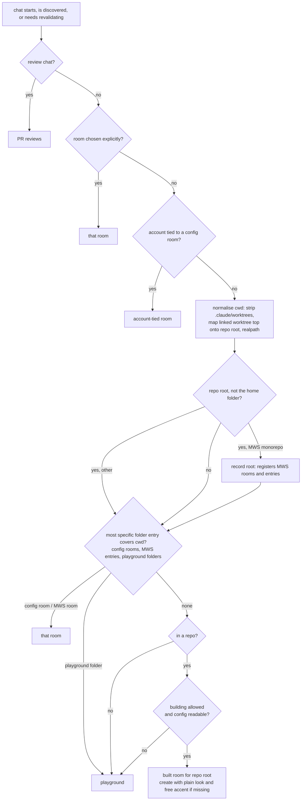
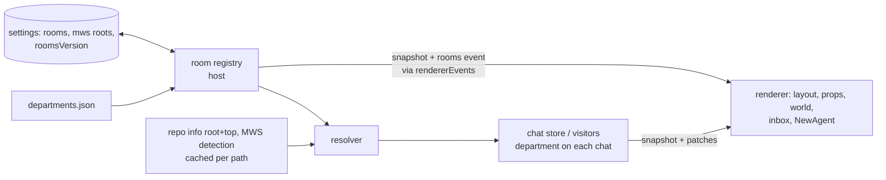
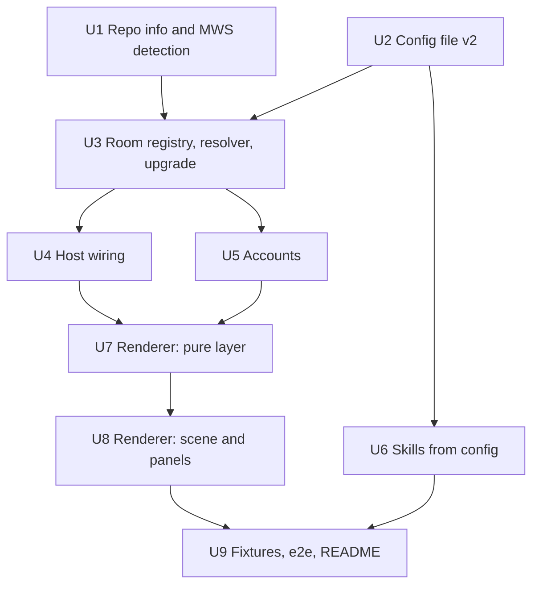

# feat: A room for every repo (rooms for any setup, step 1)

## Overview

The office today has seven fixed departments. Their ids, names, colours, folder rules and props are built into `src/shared/departments.ts`, `src/renderer/office/layout.ts` and `src/renderer/office/props.ts`. This plan replaces that fixed set with a list of rooms that the host owns and sends to the renderer:

- **Fixed rooms:** the playground and PR reviews.
- **MWS rooms:** the four monorepo rooms, which appear once an MWS monorepo is seen.
- **Config rooms:** rooms from a new `departments.json` format.
- **Built rooms:** one per git repository, with a plain look.

It also removes the research, MWS and skill-name assumptions from accounts, desktop-instance mapping and ship-it. Step 2 (construction and generated looks) is a separate plan.

## Problem Frame

Anyone other than Aaron gets every chat on the Side projects playground and an empty building. An MWS colleague gets the monorepo rooms only if their clone happens to be in a folder called `monorepo`. The fix gives each repo its own room, recognises MWS repos so colleagues get the MWS rooms with no setup, and uses a config file for anything unusual. Aaron's office must look the same and place chats the same afterwards (see origin: `docs/brainstorms/2026-09-25-rooms-for-any-setup-requirements.md`).

## Requirements Trace

- R1. Home room is the git repository. Worktrees share the repository's room. A room is identified by its repository path and named after its folder, with the parent folder added on name clashes. A moved repo gets a new room. Each room gets a unique accent from the palette.
- R2. Non-git folders go to the playground. Review-queue chats go to the fixed PR reviews room.
- R3. Rooms are built on chat start, including outside chats and chats found at first launch. Placement moves chats only between existing rooms.
- R4. Stable order: MWS rooms, then PR reviews, then config rooms in file order, then built rooms, oldest first. Empty rooms fold.
- R5. `departments.json` defines rooms (name, folders, accent, look) and playground folders. The most specific folder wins, and config beats built rooms.
- R6. Account-tied rooms win over folder rooms for that account's chats. Placement never moves those chats out. This replaces `/research/i`.
- R7. Aaron's office stays exactly the same.
- R8. The office works with no config. An unreadable config shows an error and pauses room building, and bad entries are skipped one by one and named.
- R9. The README documents the config, with Aaron's config as the example.
- R24. Every skill name comes from the config. With no ship commands the ship steps are hidden and a hint shows. When commands are configured but none are installed, the ship-it area says so.
- R25. Desktop instance to account mapping by label, longest match first, falling back to the first unclaimed account.
- R26. The low-usage hint suggests any other account with more room, in any room.
- R27. With one account, no config and no MWS repos, the UI never mentions research, the gym, the monorepo or MWS.
- R28. MWS detection signals: an `origin` in the MatchWornShirt org, or a folder name, README title or package name that mentions MWS or MatchWornShirt.
- R29. The MWS monorepo gets today's four rooms with no config. Its entries follow the most-specific-folder rule.
- R31. Built rooms without a look use the plain look: tint, sign and desks.
- Step 1 success criteria:
  - A fresh install with three repos gets three rooms.
  - An MWS colleague sees the four MWS rooms wherever their clone lives.
  - Aaron's office is unchanged.
  - Frame rate and readable signs hold with 10 rooms visible.

## Scope Boundaries

- There is no settings screen for rooms. The config file covers it.
- There are no generated looks, no construction scene and no Redecorate. Those are step 2.
- There are no generated looks for the playground, your office, the Lounge, the entrance or PR reviews.
- The hand-built MWS rooms are not replaced.
- Built rooms are never pruned. Rooms for deleted or moved repos stay in the list and fold away.
- Code identifiers keep the words `department` and `dept`. Renaming them to `room` would touch every file for no behaviour change. In this plan, "room" means the definition of a department.

### Deferred to Separate Tasks

- Step 2: construction, generated looks, Redecorate, MWS-themed generation (R10–R23, R30). This gets a separate plan after step 1 lands. It starts with the generation test on about five real repos.
- Prebuilt releases, a neutral app ID and signing. This is a separate follow-up.

## Context & Research

### Relevant Code and Patterns

- `src/shared/departments.ts` holds the fixed set: `deptIds`, `deptNames`, `defaultRules`, `ruleFor`, `homeDept`, `departmentOf`, `evidenceDept`, `showsAccountBadge`, `defaultAccount`, `accountHint`, and the `monorepo` set. `repoPath` strips `/.claude/worktrees/<slug>` as a string, and both `ruleFor` and `evidenceDept` rely on it.
- `src/main/departments/classifier.ts`: `loadRules` reads `departments.json` once and falls back silently. `createPlacement` skips `'gym'` and review chats.
- `src/main/store/chats.ts`:
  - `start` assigns `'rev'` for reviews, else `options.dept`, else `homeDept`.
  - `continueOnAccount` moves chats out of the gym.
  - `setDepartment` changes a chat's department.
  - `fromRecord` keeps any stored string.
- `src/main/store/db.ts`:
  - Migrations only add missing columns. There's no data migration yet.
  - The `settings` key/value table is reached through `setting` and `saveSetting`, with JSON values. There's no delete helper, so a raw `db.sql` delete works in tests.
- `src/main/store/ipc-sync.ts`:
  - `ChatSnapshot` is `{ seq, chats, logins }`, served by `getSnapshot`.
  - Patches go out through `hub.send('chatPatches')` every 16 ms.
  - Hidden windows only get state transitions (`transitionOnly`).
- `src/main/index.ts` forwards host events to the renderer only when they're listed in `rendererEvents`: `accountsChanged`, `chatPatches`, `housekeeping` and `reviewRequests`. Host commands the renderer can call are listed in `src/main/host/forwarded.ts`. Inline-host e2e runs skip both lists.
- `src/main/host/core.ts:49` wires `loadRules(configDir())` into the store, outside chats, placement and the `departmentRules` IPC. The notifier subtitle uses `deptNames`.
- `src/main/permissions/repo-root.ts`: `repoRoot` is synchronous, realpathed and resolves worktrees through `--git-common-dir`. It returns `cwd` on failure, so callers can't tell a non-repo from a repo root. Callers keep their own caches.
- `src/main/worktrees/create.ts` (`planWorktree`) puts app worktrees at `<repo>/.claude/worktrees/<slug>`. Claude Code also creates linked worktrees outside the repo, under `/private/tmp/claude-501/…`.
- `src/main/workflow/review-requests.ts` has `remoteSlug(url)`, which is not exported, and `localClone`, which reads `origin` asynchronously. `reviewStart` hardcodes `/pr-review-rundown`.
- `src/main/workflow/next-step.ts` hardcodes the `ship`, `fixCi` and `comments` commands. `nextSteps` filters them by installed names. `src/renderer/panels/chat/ShipIt.vue` only renders when there's a ticket, steps or a waiting state (`shown`), and the notice is gated on `shown`.
- `src/main/outside/visitors.ts`:
  - `accountFor` uses `/research/i`.
  - `placed()` skips `'gym'`.
  - `add()` uses `homeDept`.
  - `src/main/outside/desktop-meta.ts` `instances(root)` lists the desktop instances.
  - `src/main/outside/index.ts` has the `moveIntoOffice` gym logic.
- `src/main/outside/installer.ts` `writeEndpoint` creates the config dir with `mkdirSync(..., { recursive: true, mode: 0o700 })`.
- `src/renderer/office/layout.ts`:
  - `depts`, `dept` and `kindOf` are built at module load.
  - `tierOf`, `gridOf`, `sectionOf` and `minWidth` special-case `'gym'` and `'side'`.
  - `layoutFloor` walks the fixed `deptIds`. `prev?.zones[id].box` throws for a new id.
  - The packing search is exponential in the number of visible rooms.
- `src/renderer/office/props.ts`:
  - `buildOffice` builds every `DeptScene` up front.
  - `build: Record<DeptId, Build>` holds the hand-built props, keyed by id.
  - `deskShell` works for any room.
  - `setTier` calls `build[id]`.
  - Per-office singletons: `plat` LEDs and status canvas, the `mkt` auction canvas, and the `wallClock` hands, which also grow on every tier rebuild.
  - `desk()` adds a lamp when `id === 'rev'`.
- `src/renderer/office/world.ts`:
  - `anims` and `signs` are built once for every department.
  - `placeCoolers` uses `anims.gym`.
  - `if (anims.plat.shown)` runs outside `guard` (around L783).
  - `scenes[d.dept]` and `dept[id].name` are indexed without guards.
  - `offsetOf` parses nav owners by splitting on `:`.
- `src/renderer/office/labels.ts`: `createSign` sets name and path once. `renderSign` only updates counts. `.sign` in `Office.vue` is `white-space: nowrap` with no maximum width.
- `src/renderer/office/seating.ts`: `reseat` maps over `deptIds`.
- `src/renderer/state/projection.ts`: `toAgents` re-derives `dept` through `departmentOf` with `defaultRules`, which rewrites any unknown id.
- `src/renderer/state/inbox.ts`: board order and names come from `depts` and `dept`.
- `src/renderer/panels/NewAgent.vue` computes the section in the renderer, fetches `recentFolders()` and `departmentRules()` together in one `Promise.all`, and always sends `dept`.
- `src/renderer/state/demo.ts`: demo chats have no `department` except `rev`.
- Tests that pin departments:
  - `tests/fixtures/floors.ts`, `tests/fixtures/real-floor.json`, `tests/e2e/real-floor.spec.ts`, `tests/main/capture-real-floor.test.ts`
  - `tests/main/classifier.test.ts`, `tests/main/new-agent.test.ts`
  - `tests/renderer/{layout,labels,seating,standby,projection,trips,pose}.test.ts`
  - `tests/e2e/{new-agent,office-demo,review-queue}.spec.ts`
  - `tests/e2e/real-floor.spec.ts` details:
    - Its `beforeAll` launches the app on a template to add accounts, and every floor copies that `office.db`.
    - `evidenceFor` builds fake `/elsewhere/monorepo/...` paths.
    - It only checks the total of all sign counts and that signs exist.
- Test helpers:
  - `tests/fakes/office.ts` (`openOffice`), `tests/fakes/fake-engine.ts` (`supported` list), `tests/fakes/outside.ts`
  - git repo setups in `tests/main/rules.test.ts`, `tests/main/worktrees.test.ts` and `tests/main/visitor-housekeeping.test.ts`
  - `tests/e2e/adopt.spec.ts` gives a launch its own `AGENT_OFFICE_CONFIG_DIR`. `playwright.config.ts` otherwise shares one config dir across the whole run.

### Institutional Learnings

- Renaming department ids is the first data migration. It needs a run-once marker. `db.ts` has no `user_version` (`docs/plans/2026-09-23-001-feat-agent-office-app-plan.md`, Unit 6 and the follow-ups).
- During an update, the new renderer talks to the old host until the host restarts once idle. The renderer has to accept old snapshots and survive missing host commands.
- Only the host touches `office.db` and the config. Room changes have to reach hidden windows, so they can't be filtered as non-transitions.
- Per-frame code must not assume a prop exists (`100859c`: a missing clock blanked the office). Plain rooms have no props at all.
- Real-git tests time out under full-suite load (`fda407e`), so give git-backed tests longer timeouts.
- Debounced writes after the DB closes caused flaky tests (`0eea3fa`). Flush on teardown.
- `AGENT_OFFICE_CONFIG_DIR` sandboxes the config in e2e, so load the config through `configDir()`.
- Retained visitors never reach the floor (`210bdd3`).
- The real-floor spec runs after every merge. Its sign checks act as the acceptance gate for "Aaron's office looks the same".

### External References

- None. The codebase has strong local patterns for every layer this touches.

## Key Technical Decisions

- **Room definitions live in the host and travel in the snapshot.** `ChatSnapshot` gains `rooms` and `configErrors`.
  - A separate `rooms` event carries both on every change. It's added to `rendererEvents` in `src/main/index.ts` and is never filtered for hidden windows.
  - The renderer stops deriving departments and uses `chat.department`. Any id missing from its room list shows in the playground.
  - Rationale: the host already owns placement and `office.db`, and repo detection needs git, which the renderer can't run.
- **Keep the legacy ids for fixed and MWS rooms.** These are `mkt`, `adm`, `mob`, `plat`, `side` and `rev`.
  - Config rooms get `c-<slug(name)>`, with a short hash of the name when the slug comes out empty. Built rooms get `r-<short hash of the repo root>`.
  - Ids never contain `:`, because nav owners are parsed by splitting on it.
  - Rationale: stored chats keep working, and only `gym` needs migrating.
- **The looks are `showroom`, `backoffice`, `devices`, `servers`, `reading`, `gym`, `playground` and `plain`.** The shell follows the look: `gym` uses the gym shell, `playground` the yard, everything else a room. Every special case in `layout.ts`, `props.ts` and `world.ts` checks the look instead of the id. `build` is keyed by look.
- **Hand-built looks become reusable.** The `plat` LEDs and status canvas, the `mkt` auction and the clock hands move into per-room state, which also fixes the hands array growing forever. Rationale: a config room can pick any look, and a room can come and go at runtime.
- **What counts as the MWS monorepo.** It has to be an MWS repo under R28 whose root contains `frontend/marketplace`.
  - The MWS entries are the root's `frontend/marketplace`, `frontend/admin` and `frontend/mobile`, with the root itself going to Backend / infra.
  - "Mentions MWS" matches `mws` as a whole word or a `-`/`_`-separated part (`mws-gate` yes, `bmwsomething` no), and `matchwornshirt` anywhere, ignoring case.
  - The MWS rooms are registered whenever at least one monorepo root is known. Known roots are persisted in `settings`.
- **Paths get normalised before any matching.** A path is first mapped onto its main repository root:
  - The `/.claude/worktrees/<slug>` segment is stripped, as `repoPath` does today.
  - A linked worktree elsewhere has its worktree top rewritten onto the main root, using the cached `{ root, top }` from repo info.
  - The result is realpathed, with a cache per path.
  - Rationale: `repoRoot` realpaths and raw paths don't. Today's `ruleFor` strips worktree segments, and without the same step every worktree chat's marketplace edits would count for Backend / infra.
- **The order a chat's room is decided in** (see the High-Level Technical Design):
  1. Review chats go to PR reviews.
  2. An explicit choice at start wins.
  3. An account-tied room wins.
  4. Repo detection runs next. If the cwd's repository is the MWS monorepo, its root is recorded, which registers its entries.
  5. Then the most specific folder entry wins, across config rooms, MWS entries and playground folders. A config entry beats an MWS entry at the same folder.
  6. Otherwise the repo's built room, created when building is allowed.
  7. Otherwise the playground.
  - A repository whose root is the home folder itself, such as a dotfiles repo, doesn't count as a repository.
  - Running detection before folder matching means a broad playground folder like Aaron's never hides the monorepo.
- **Placement evidence matches strings, without extra git calls.**
  - Evidence normalises the file path, rewriting paths under the chat's raw cwd onto its cached normalised cwd.
  - It then takes the longest prefix across config room folders, MWS entries for known roots and built room roots.
  - A file inside the chat's cwd that matches nothing counts for the chat's folder-based home, meaning the room `resolve` gives for that cwd with no account, no review flag, no explicit choice and no building. That's the playground for a non-git folder, exactly like today's `'side'`.
  - Playground folders never count as evidence.
  - Rationale: evidence runs on every tool use and must stay cheap, R3 only allows moves to rooms that exist, and today's behaviour is kept, where a monorepo chat touching another repo doesn't move.
- **The upgrade is a one-time host step, marked in `settings` (`roomsVersion: 1`).** It runs before backfill and before any resolution. It does four things:
  - It records known MWS monorepo roots from stored chats with `mkt`, `adm`, `mob` or `plat` ids. Their cwds are mapped with `repoPath`, and each distinct root is confirmed once with `isMwsMonorepo`.
  - If there's no `departments.json` and the install looks like Aaron's, meaning a research-labelled account exists or stored chats use `gym`, it writes a config equivalent to today's behaviour:
    - `playground: ["/"]`
    - a "Research gym" room with `account: "research"`, the gym look and today's accent
    - today's skill names
    - The write goes to a temporary file that's then renamed into place.
  - It maps stored `gym` chats to the gym room using the config it just built in memory, without re-reading the file.
  - It sets the marker last.
  - Rationale: `"/"` is the only playground that reproduces today exactly. Today everything outside the monorepo rules goes to the playground, including git repos under `/private/tmp` and `/var/folders`. Aaron can narrow it. Other installs, such as a colleague on one account, get no legacy config, so their other repos get rooms and the MWS rooms still come from detection.
- **A chat whose stored room isn't registered gets resolved again and saved, without building.** This runs on load, and covers removed and renamed config rooms. While the config is unreadable, chats on `c-*` ids keep them.
- **The config is read once, when the agent host starts.** Edits apply after the host restarts, and the README says so. Rationale: config edits are rare, and a watcher brings reload edge cases (removed rooms mid-session, a half-written file) for little gain.
- **Row packing switches to greedy past 10 inside rooms.** With 10 or fewer, the current search runs. Above that, rows fill left to right up to the target width. Rationale: 10 rooms keeps the search around 10⁴ evaluations. Past that it explodes, and the success criterion only names 10.
- **Accents and building:**
  - A new built room takes the first palette accent that no room with chats uses. Failing that, one no registered room uses, and failing that, the least-used one.
  - Retained visitors never build rooms.
  - Rationale: stale folded rooms shouldn't use up the colours of rooms on the floor.
- **Account generalisation:**
  - A config room's `account` is a label substring, matched ignoring case, with the longest match winning, the same way as R25.
  - `defaultAccount(room)` prefers the account tied to an account-tied room, and otherwise accounts not tied to any room.
  - The badge shows when a chat's account differs from its room's tied account, or when a chat on a tied account sits outside that room.
  - `accountHint` suggests the usable account with the lowest usage once the chosen one is at 80% or more.
  - Account label suggestions become `main`, `work` and `personal`.
- **The review queue without a configured review command** starts the agent with a plain prompt, `Review this pull request: <url>`, which works in stock Claude Code.
- **The config format replaces the old array format.** An old array shows up as a config error naming the new format.
- **The playground sign subtitle becomes generic**: "folders without a room" instead of Aaron's `~/Documents/GitHub · outside`.
- **Sign names are truncated with an ellipsis at a fixed maximum width.** The full name goes in the sign's title and aria-label.

## Open Questions

### Resolved During Planning

- How stored ids map after the upgrade: the legacy ids are kept, and only `gym` gets migrated.
- How Aaron's config is in place before his first post-upgrade chat: the one-time upgrade step writes it before backfill.
- How strict the MWS matching is: whole word or `-`/`_`-separated part for `mws`, and anywhere for `matchwornshirt`.
- How badges and the default account work without `isResearch`: tied-account rules, covered in Key Technical Decisions.
- What happens past 10 rooms: greedy packing.
- What the review queue does without a review skill: a plain prompt.
- `~` or `/` for the legacy playground: `/`, for exact parity.
- Where linked worktrees outside the repo belong: onto the main root, so an MWS worktree under `/private/tmp` lands in the matching MWS room.
- Live reload or restart for config edits: restart. The config is read once when the host starts.

### Deferred to Implementation

- The exact short-hash length for built room ids, and collision handling. Pick something collision-safe for a few hundred repos.
- How the name-clash parent suffix handles two rooms whose parents also share a name. Keep it simple: use the parent folder only.
- Whether `isMwsMonorepo` reads `origin` from `.git/config` or through a synchronous `git remote get-url`. `remoteSlug` needs exporting either way.

## High-Level Technical Design

> *This illustrates the intended approach and is directional guidance for review, not implementation specification. The implementing agent should treat it as context, not code to reproduce.*

Deciding a chat's room (host):

Data flow:

## Implementation Units

- [x] **Unit 1: Repo info and MWS detection**

**Goal:** A cached way to ask "which repository is this path in, where's its worktree top, and is it the MWS monorepo?" that can tell "not a repo" apart from a repo root.

**Requirements:** R1, R2, R28, R29

**Dependencies:** None

**Files:**
- Create: `src/main/departments/repo-info.ts`
- Modify: `src/main/workflow/review-requests.ts` (export `remoteSlug`)
- Test: `tests/main/repo-info.test.ts`

**Approach:**
- `repoInfo(cwd)` makes one `git rev-parse --path-format=absolute --git-common-dir --show-toplevel` call and returns `{ root, top }`, or nothing for non-repos.
  - The root is worked out the same way `repoRoot` does it.
  - A root equal to the home folder counts as not a repo.
  - Results are cached per cwd.
  - `repoRoot` in `src/main/permissions/repo-root.ts` stays as it is for its existing callers.
- `isMwsMonorepo(root)` checks cheap file signals first:
  - `frontend/marketplace` must exist, or the answer is no.
  - The README's first heading, the folder name, and the `package.json` names at the root and in `frontend/*` are checked against the MWS matcher.
  - Only if those all miss does it read `origin` synchronously and check for the `matchwornshirt` owner through `remoteSlug`.
  - The result is cached per root.
- The MWS name matcher stays private to this file.

**Patterns to follow:**
- `src/main/permissions/repo-root.ts` for the git call.
- The per-caller caches in `src/main/permissions/rules.ts` (`roots` Map).

**Test scenarios:**
- Happy path: a temporary git repo returns its root, and a subfolder returns the same root and top.
- Happy path: a worktree under `<repo>/.claude/worktrees/x` returns the main repo root, with the worktree as its top.
- Happy path: a linked worktree created outside the repo returns the main repo root, with the linked folder as its top.
- Edge case: a folder outside git returns nothing, and so does a missing path.
- Edge case: a git repo at a fake home folder, with `HOME` pointing at it, counts as not a repo for its subfolders.
- Happy path: a repo with README `# MWS Monorepo` and `frontend/marketplace` counts as the MWS monorepo.
- Happy path: a repo whose `origin` is `https://github.com/MatchWornShirt/monorepo.git`, with a plain README and `frontend/marketplace`, counts as the MWS monorepo.
- Edge case: a repo with an MWS README but no `frontend/marketplace` isn't the monorepo.
- Edge case: folder names `mws-gate`, `mws_tools` and `matchwornshirt` count as MWS mentions. `bmwsomething` and `jmws` don't.
- Integration: a second call for the same cwd doesn't spawn git again. Assert through an injected runner or a counter.

**Execution note:** These tests create real git repos, so give them longer timeouts, as `tests/main/rules.test.ts` does.

**Verification:**
- Repo roots, worktree tops and MWS monorepo detection are correct for real temporary repos, and non-repos return nothing.

- [x] **Unit 2: Config file v2**

**Goal:** Read and validate the new `departments.json`, and report errors one entry at a time.

**Requirements:** R5, R6, R8, R24

**Dependencies:** None

**Files:**
- Create: `src/main/departments/config.ts`
- Modify: `src/main/departments/classifier.ts` (remove `loadRules`)
- Modify: `src/shared/departments.ts` (the config and room types; remove `DeptRule`, `defaultRules` and `validRules`; keep `repoPath`)
- Test: `tests/main/departments-config.test.ts`
- Modify: `tests/main/classifier.test.ts` (drop the silent-fallback `loadRules` tests)

**Approach:**
- Shape, as directional guidance:
  - `rooms` is a list. Each room has `name`, then either `folders` or `account`, plus optional `accent` and optional `look`.
  - `playground` is a list of folders.
  - `commands` holds optional `ship` (the four step commands), `fixCi`, `answerComments` and `review`.
- `loadConfig(dir)` returns one of three results. A missing file gives an empty config. An unreadable file gives the error, with room building paused. A readable file gives the config plus per-entry errors for the entries it skipped.
- Validation rules:
  - A room has exactly one of `folders` or `account`.
  - The look must be a known name.
  - The accent must be a valid hex colour.
  - Folders get `~` expanded.
  - Two rooms whose slugs match get an error for the second one.
  - The old array format gets an error that points to the README.
- Everything goes through `configDir()`, so `AGENT_OFFICE_CONFIG_DIR` keeps tests sandboxed.

**Patterns to follow:**
- `configDir` and `readConfig` in `src/main/notify/ntfy.ts`.

**Test scenarios:**
- Happy path: a full config with two folder rooms, one account room, playground folders and commands parses into the expected shape, with `~` expanded.
- Happy path: a missing file gives an empty config, no errors and room building not paused.
- Error path: invalid JSON gives an unreadable result with the parse message, and room building is paused.
- Error path: a room with both `folders` and `account`, an unknown look, or a bad accent is skipped. Each gets a named error, and the valid rooms are kept.
- Error path: an old-style array gives an error that mentions the new format.
- Edge case: rooms named `API` and `api`, or `Web app` and `web-app`, give a duplicate error for the second one. A room named only in non-Latin letters gets a hash-based id.

**Verification:**
- Every R8 behaviour is covered by tests, and the old `loadRules` is gone.

- [x] **Unit 3: Room registry, resolver and one-time upgrade**

**Goal:** The host-side list of rooms, the function that decides a chat's room, cheap placement evidence, and the migration that keeps Aaron's office the same.

**Requirements:** R1–R8, R29, R31

**Dependencies:** Unit 1, Unit 2

**Files:**
- Create: `src/main/departments/rooms.ts` (registry and resolver)
- Create: `src/main/departments/upgrade.ts` (the one-time step)
- Modify: `src/shared/departments.ts`:
  - `DeptId` becomes `string`.
  - Add a room definition type: id, name, subtitle, accent, look, optional repo root and parent folder name, created at.
  - Add the fixed and MWS room definitions with today's names and accents. The playground gets the generic subtitle.
  - Remove `deptIds`, `deptNames`, `isDeptId`, `homeDept` and `ruleFor` once their callers move over.
- Test: `tests/main/rooms.test.ts`, `tests/main/rooms-upgrade.test.ts`, `tests/main/rooms-parity.test.ts`

**Approach:**
- Registry state:
  - The fixed rooms: `side` (playground look) and `rev` (reading look).
  - The MWS rooms whenever a monorepo root is known: `mkt` (showroom), `adm` (backoffice), `mob` (devices) and `plat` (servers).
  - The config rooms.
  - The built rooms, persisted in `settings` under `rooms`: id, root, name, parent, accent, created at.
  - Known MWS monorepo roots, persisted in `settings`.
- Room order: MWS rooms, then `rev`, then config rooms in file order, then built rooms, oldest first. The playground stays outside. This reproduces today's order: Marketplace, Admin, Mobile, Backend / infra, PR reviews, Research gym.
- `resolve(cwd, account, { review, chosen, build })` follows the decision order in Key Technical Decisions, including path normalisation and detecting the repo before folder matching. With `build: false` it never creates a room.
- Creating a built room picks an accent by the accent rule, saves the room and emits `changed`.
- `evidenceRoom(file, chat)` matches strings only, after normalising the path. If nothing matches and the file is inside the chat's cwd, it returns the chat's folder-based home.
- `isTied(roomId)` and `tiedRoom(accountLabel)` answer the account questions for Unit 5.
- `revalidate(chats)` gives every chat whose stored room isn't registered a new room with `build: false` and saves it. While the config is unreadable, it skips chats on `c-*` ids. It runs on load.
- The upgrade runs in `createCore` before the store, outside chats and backfill, and only while `roomsVersion` is missing. It follows the upgrade decision in Key Technical Decisions: record MWS roots, write the legacy config atomically when the install looks like Aaron's, map stored `gym` to the gym room using the config in memory, then set the marker.

**Technical design:** See the flowchart in High-Level Technical Design.

**Patterns to follow:**
- `setting` and `saveSetting` in `src/main/store/db.ts`.
- `pickColour` in `src/shared/office.ts` for choosing an accent.
- `repoPath` in `src/shared/departments.ts` for stripping worktree segments.

**Test scenarios:**
- Happy path: a chat in a plain git repo gets a new built room named after the folder, with the plain look and a free accent. A second chat in a worktree of the same repo gets the same room.
- Happy path: a chat in a non-git folder gets the playground.
- Happy path: a review chat gets `rev` whatever its folder.
- Happy path: a chat on an account tied to a config room gets that room, even inside a repo that has a config folder room.
- Happy path: a chosen room at start wins over everything else except review.
- Happy path: in an MWS monorepo, `frontend/admin/x` gives `adm`, the root gives `plat`, and the MWS rooms become registered.
- Happy path: a cwd at `<monorepo>/.claude/worktrees/x/frontend/admin` gives `adm`. A linked worktree of the monorepo under another temporary folder, with a cwd in its `frontend/marketplace`, gives `mkt`.
- Edge case: with a config playground of `/` (or `~`), a new chat in `<monorepo>/frontend/admin` still gives `adm` on a fresh registry with no known roots. The monorepo root gets recorded.
- Edge case: a config room for `<monorepo>/frontend/admin` overrides `adm`.
- Edge case: two repos both named `api` in different parents get two rooms with the same name and different parents.
- Edge case: after all 22 palette accents are used, the next room still gets an accent. A room with chats never shares an accent with a new room while a free one exists.
- Edge case: a moved repo, meaning the same folder name at a new path, gets a new room.
- Edge case: a folder inside a git repo at the home folder counts as non-git and goes to the playground.
- Error path: while the config is unreadable, a chat in an unknown repo gets the playground and no room is created.
- Happy path: evidence for a file under `<monorepo>/frontend/marketplace` gives `mkt`. For a file under `<monorepo>/.claude/worktrees/x/frontend/marketplace` it also gives `mkt`. For a file in another repo with no room it gives nothing. For a file in the chat's own non-git cwd it gives the playground.
- Edge case: evidence for a chat whose cwd sits under a symlinked temporary folder still matches room roots, which are realpathed.
- Edge case: evidence for a playground chat on a tied account, editing files in its non-git cwd, counts for the playground, never the tied room.
- Edge case: `resolve(..., { build: false })` for an unknown repo creates nothing.
- Upgrade, happy path: an install with a research-labelled account, legacy chats and no config file ends up in the expected state:
  - A config gets written with `playground: ["/"]`, a Research gym on `account: "research"` and today's commands.
  - Known roots are recorded from the stored MWS chats.
  - Stored `gym` chats move to the gym room's id.
  - The marker is set.
- Upgrade, edge case: an install with one non-research account and only `side` or `plat` chats writes no config. It still records the MWS root when `isMwsMonorepo` confirms it.
- Upgrade, edge case: a stored `plat` chat in a plain folder that happens to be called `monorepo` records no root, because `isMwsMonorepo` says no.
- Upgrade, edge case: an install with no chats writes no config.
- Upgrade, edge case: an existing config file is left untouched.
- Upgrade, edge case: a second host start with the marker set changes nothing.
- Upgrade, error path: a crash after writing the config but before setting the marker re-runs cleanly, and gym chats still map to the gym room.
- Integration: a stored chat whose room was removed from the config gets resolved again on load and saved, without building a room.
- Integration: with an unreadable config at load, chats on `c-research-gym` keep that id.
- Integration (parity, `tests/main/rooms-parity.test.ts`): a fake `HOME` holds `Documents/GitHub/monorepo` (a real MWS repo with a `.claude/worktrees` worktree), `Documents/GitHub/agent-office` with a worktree, and a git repo under a temporary folder outside `HOME`. Legacy chats are seeded and the upgrade runs with no config. The test then checks two things:
  - New chats started in each folder land where today's `homeDept` puts them.
  - Replaying marketplace edits from a monorepo worktree chat, and from an agent-office chat, gives the same classifier moves as today.

**Verification:**
- The parity test passes: today's `homeDept` and `evidenceDept`, run on the same fixture, give the same answers as the new resolver and evidence for every case.

- [x] **Unit 4: Host wiring**

**Goal:** Put the registry and resolver behind every place that decides or reports a department, and get rooms to the renderer in both inline and split-host mode.

**Requirements:** R1–R8, R25

**Dependencies:** Unit 3

**Files:**
- Modify: `src/main/host/core.ts`:
  - Run the upgrade.
  - Load the config and build the registry.
  - Pass them in place of `deptRules`.
  - Take notifier subtitles from registry names.
  - Replace the `departmentRules` IPC with `roomFor(cwd, accountId)`.
- Modify: `src/main/host/forwarded.ts` (add `roomFor`, remove `departmentRules`)
- Modify: `src/main/index.ts` (add `rooms` to `rendererEvents`)
- Modify: `src/main/store/chats.ts`:
  - `start` resolves with build.
  - `continueOnAccount` resolves again when leaving an account-tied room.
  - `revalidate` runs on load.
  - `setDepartment` takes a string id.
- Modify: `src/main/departments/classifier.ts`:
  - Evidence goes through `evidenceRoom`.
  - Skip chats in account-tied rooms and review chats.
  - Moves only go to registered rooms.
- Modify: `src/main/outside/visitors.ts`:
  - Apply the R25 mapping in `accountFor`.
  - `add()` resolves with build, except for retained visitors. This covers chats found at first launch.
  - `placed()` skips account-tied rooms.
- Modify: `src/main/outside/index.ts`: in `moveIntoOffice`, drop the gym special-casing in favour of tied rooms.
- Modify: `src/main/store/ipc-sync.ts`:
  - The snapshot gains `rooms` and `configErrors`.
  - A `rooms` event carrying both goes out on registry `changed` and on config errors, even while the window is hidden.
- Modify: `src/shared/chat.ts`, `src/shared/ipc.ts` (snapshot and IPC types)
- Modify: `src/preload/index.ts`
- Test: `tests/main/rooms-host.test.ts`, updates to `tests/main/new-agent.test.ts`, `tests/main/backfill.test.ts`, `tests/main/hook-listener.test.ts`, `tests/main/finish.test.ts`, `tests/main/visitor-housekeeping.test.ts`, `tests/main/classifier.test.ts`, `tests/e2e/host.spec.ts`

**Approach:**
- The account-tied checks in the store, classifier and visitors all go through the registry's `isTied` and `tiedRoom`. No `'gym'` literal is left in main.
- The R25 mapping works in three steps:
  - Match account labels against the instance name, ignoring case, and take the longest match.
  - An instance that matches nothing goes to the first account that no other instance name matches. The instance names come from `instances()` in `src/main/outside/desktop-meta.ts`.
  - With no accounts, the account is unknown.
- `roomFor` returns the room a new chat in that folder would get, without building it: the existing room's definition, or a preview with the folder name, a tentative accent and a flag saying it's new.

**Patterns to follow:**
- The existing `hub.handle` and `hub.send` wiring in `src/main/store/ipc-sync.ts`.
- The `createPatchSync` visibility handling.
- The `rendererEvents` and forwarded-command lists.

**Test scenarios:**
- Happy path: `store.start` in a new repo creates the room, the chat's department is the new id, and a `rooms` event goes out.
- Happy path: `continueOnAccount` from the research account to main moves a gym chat to its home room.
- Happy path: the classifier moves a monorepo chat from `plat` to `mkt` on marketplace edits, including from a `.claude/worktrees` worktree.
- Edge case: the classifier never moves a chat into a repo room that doesn't exist, and never moves a chat out of an account-tied room.
- Happy path: instance `Claude-Research` maps to `research`, and `Claude` and `Claude-3p` map to `main`.
- Edge case: with labels `main` and `domain`, instance `Claude-Domain` maps to `domain` because the longest match wins.
- Happy path: a terminal visitor in a new repo creates a built room at backfill. A visitor in a non-git folder goes to the playground. A retained visitor creates no room.
- Integration: a snapshot taken while the window is hidden still includes a room created while hidden. A `rooms` event is never dropped by the transition-only filter.
- Integration (split host, `tests/e2e/host.spec.ts`): starting a chat in a new repo updates the renderer's room list without a snapshot reload.
- Integration: every event name the host sends is in `rendererEvents`. This is a unit test over the list.
- Integration: after a host restart with an occupied config room removed from the file, its chats move through `revalidate`.
- Happy path: the notifier subtitle for a chat in a built room is that room's name.

**Verification:**
- There are no `isResearch`, `'gym'`, `deptNames` or `defaultRules` references left in `src/main`, and the host tests pass in both inline and split mode.

- [x] **Unit 5: Accounts without research assumptions**

**Goal:** Account defaults, hints, badges and copy that work for any set of accounts.

**Requirements:** R6, R26, R27

**Dependencies:** Unit 3

**Files:**
- Modify: `src/shared/departments.ts`:
  - `defaultAccount` becomes room-aware.
  - `accountHint` works for any room and any account.
  - `showsAccountBadge` checks tied accounts.
  - Remove `isResearch` and the `monorepo` set.
- Modify: `src/main/workflow/index.ts` (review queue default account)
- Modify: `src/renderer/panels/AddAccount.vue`, `src/renderer/panels/Onboarding.vue` (the suggestions and the "main or research" copy)
- Test: `tests/main/new-agent.test.ts`, `tests/main/classifier.test.ts` (the badge cases)

**Approach:**
- The helpers take the room list, or a tied-account lookup, as an argument. Shared code stays free of host state.
- Hint copy: "{chosen} is at {n}% of its limit. Run this on {other}; it keeps its room."

**Test scenarios:**
- Happy path: the default account for an account-tied room is its tied account. For any other room, it's the first usable account not tied to a room.
- Edge case: with a single account, that account is always the default and the hint never shows.
- Happy path: with three accounts, the hint suggests the usable one with the lowest usage once the chosen one is at 80% or more, whatever the room.
- Edge case: the hint doesn't show when the other accounts are just as full or need login.
- Happy path: the badge shows for a main-account chat in the gym, and for a research-account chat in a repo room. It doesn't show for a research chat in the gym or a main chat in a repo room.
- Happy path: the AddAccount suggestions don't include `research`.

**Verification:**
- There are no `isResearch` references anywhere in `src`.

- [x] **Unit 6: Skills from the config**

**Goal:** Ship-it, Fix CI, Answer comments and the review queue take their commands from the config.

**Requirements:** R24

**Dependencies:** Unit 2

**Files:**
- Modify: `src/main/workflow/next-step.ts` (steps built from the config's commands, plus the hint and not-installed states)
- Modify: `src/main/workflow/review-requests.ts` (`reviewStart` uses the configured command, or the plain prompt)
- Modify: `src/main/workflow/index.ts` (pass the config commands)
- Modify: `src/shared/workflow.ts` (a `ShipIt` `hint` field for both messages)
- Modify: `src/renderer/panels/chat/ShipIt.vue`. `shown` also becomes true when `hint` is set, and the hint renders on its own line.
- Test: `tests/main/next-step.test.ts`, `tests/main/review-requests.test.ts`

**Approach:**
- No ship commands configured: the four ship steps are hidden. Clean up, Move ticket and the waiting states behave as today, and `hint` holds "Add your ship commands to departments.json to get buttons here." It only shows when the chat has uncommitted or unpushed work, the moment the ship steps would appear.
- Commands configured but none installed: `hint` holds "None of the configured ship commands are installed", under the same condition.
- With no `review` command, the review prompt is `Review this pull request: <url>`.
- Keep the fake engine's `supported` list working in `tests/fakes/fake-engine.ts`.

**Test scenarios:**
- Happy path: with Aaron's commands configured and installed, the steps match today exactly: the same ids, labels and order.
- Edge case: no config and uncommitted work give no ship steps and the config hint, and the section renders. A merged PR still offers Clean up.
- Edge case: commands configured but none installed, with uncommitted work, give the not-installed hint and no steps.
- Edge case: no config and no local work give no hint and no section.
- Happy path: a configured `fixCi` shows on failing CI, and it's absent when not configured.
- Happy path: `reviewStart` with a configured review command sends `<command> <url>`, and without one sends the plain prompt.

**Verification:**
- The workflow tests pass with and without a config. `/mws-` only appears in tests and in the upgrade's legacy config.

- [x] **Unit 7: Renderer pure layer**

**Goal:** Make layout, seating, labels, inbox and projection work over a room list passed in, instead of module constants.

**Requirements:** R1, R4, R27, R31, the 10-room criterion

**Dependencies:** Unit 4, Unit 5

**Files:**
- Modify: `src/renderer/office/layout.ts`:
  - `layoutFloor` takes the ordered room list.
  - Kind, tier, grid, section and minimum-width rules key on the look.
  - Fix the `prev` crash for new ids.
  - Greedy packing past 10 inside rooms.
  - Remove the module-load `depts` and `dept`.
- Modify: `src/renderer/office/seating.ts` (`reseat` over the passed room ids)
- Modify: `src/renderer/office/standby.ts`, `src/renderer/office/trips.ts`, `src/renderer/office/labels.ts`. Labels gets a way to rename a sign, the name-clash suffix helper, and the truncated name with the full name in the title and aria-label.
- Modify: `src/renderer/state/projection.ts`:
  - `toAgents` uses `chat.department`, and any id missing from the room list maps to `side`.
  - Badges come from room tie info.
  - If the snapshot has no `rooms`, which means an old host during an update, fall back to the legacy seven room definitions.
- Modify: `src/renderer/state/inbox.ts` (board order, names and accents from the room list)
- Test: `tests/renderer/layout.test.ts`, `tests/renderer/seating.test.ts`, `tests/renderer/labels.test.ts`, `tests/renderer/standby.test.ts`, `tests/renderer/projection.test.ts`, `tests/renderer/inbox.test.ts`, `tests/renderer/trips.test.ts`, `tests/renderer/pose.test.ts`

**Approach:**
- The room list is renderer state that the snapshot and `rooms` events feed. Pure functions receive it as an argument.
- A room that gets added counts as a desk added for re-pack purposes, through the existing `reseat(...).repack` path. Nothing new triggers a re-pack.
- The name-clash suffix is computed over the rooms shown: two shown rooms with the same name both get ` · <parent>`.

**Test scenarios:**
- Happy path: with the seven legacy rooms, `layoutFloor` gives the same floor as today for the existing fixtures (`floorFixture`, real-floor demand). This is the parity check.
- Happy path: a floor with three plain built rooms packs them after the config and MWS rooms, oldest first.
- Edge case: a room added between two layouts doesn't crash `layoutFloor` when `prev` lacks it.
- Edge case: 12 inside rooms use the greedy packer, finish in well under a frame budget (say under 5 ms), and don't overlap.
- Happy path: a config room with the gym look gets the gym grid and tiers. The playground look gets the yard.
- Happy path: `reseat` with a new room id seats agents there and reports `repack`.
- Happy path: two shown rooms named `api` get parent suffixes, and they lose them when one folds.
- Edge case: a 60-character folder name renders truncated with an ellipsis, and its title and aria-label carry the full name.
- Happy path: `toAgents` keeps a registered new id as is.
- Edge case: `toAgents` maps an id missing from the room list to `side`.
- Edge case: a snapshot without `rooms` still renders the legacy rooms.
- Happy path: the inbox board lists departments in room order, using registry names and accents.

**Verification:**
- There are no module-load room constants left in `layout.ts`, and the renderer unit tests pass, including the legacy parity cases.

- [x] **Unit 8: Renderer scene and panels**

**Goal:** Build, show and dispose rooms at runtime, with the plain look and reusable hand-built looks. Update the New agent form, the inbox config errors and demo mode.

**Requirements:** R1, R2, R5, R8, R27, R31

**Dependencies:** Unit 7

**Files:**
- Modify: `src/renderer/office/props.ts`:
  - Add `addRoom(def)` and `removeRoom(id)`.
  - `build` keyed by look, with `plain` as a no-op.
  - Move the `plat` LED and status canvas, the `mkt` auction and the clock hands into per-room state.
  - The desk lamp keys on the `reading` look.
- Modify: `src/renderer/office/world.ts`:
  - `anims` and `signs` are added and removed as rooms come and go.
  - Coolers and LED blinking go per room by look, inside `guard`.
  - Remove the unguarded `anims.plat` access.
- Modify: `src/renderer/office/Office.vue` (feed the room list, handle room changes, the sign's maximum width)
- Modify: `src/renderer/panels/NewAgent.vue`:
  - Fetch recent folders and `roomFor` separately, so a failed `roomFor` (an old host) doesn't block recent folders.
  - The preview comes from `roomFor`, debounced like the ticket lookup. The last preview stays until the new one arrives.
  - On failure there's no preview, and `dept` isn't sent.
  - `dept` is sent only when a section was chosen or the chat is started from a desk.
  - The section list shows, in room order:
    - config rooms
    - the MWS rooms when they're registered
    - PR reviews
    - built rooms that currently have chats
    - the playground
    - the preview room, when it's new
- Modify: `src/renderer/panels/Inbox.vue`. `configErrors` renders as a block at the top of the inbox:
  - An unreadable file shows one line: "departments.json can't be read: <message>. New repos go to the playground until it's fixed."
  - Skipped entries show a list with one line each: "Skipped room "<name>": <reason>."
  - The block can't be dismissed. It goes away when the file is fixed.
- Modify: `src/renderer/state/demo.ts` (explicit `department` on every demo chat, a room list with two built repos, plus a ten-room sample set for the fps check)
- Test: `tests/renderer/props-rooms.client.test.ts` (if a DOM or WebGL-free harness fits; otherwise the e2e checks in Unit 9 cover it), `tests/e2e/new-agent.spec.ts`

**Approach:**
- `addRoom` builds the group, the tint material from `carpet.clone()`, and the shell for the look's shell type. It's excluded from the static bake, as rooms already are.
- `removeRoom` disposes the group, the tint and its map, and unblocks nav tags `shell:<id>`, `props:<id>` and `desk:<id>:*`.
- Before merging, check every per-frame animator in `props.ts` and `world.ts` for props that might be missing. Don't rely on `guard.ts` to hide the problem.
- The New agent header shows the preview room's name and accent. A new room shows as "New room: <name>".

**Patterns to follow:**
- `setTier` disposal and `dispose()` in `props.ts`.
- `deskShell` for the plain look.
- `RoomAnim` in `world.ts`.
- The debounced ticket lookup in `NewAgent.vue`.

**Test scenarios:**
- Happy path (e2e): starting an agent in a new temporary git repo adds a room whose sign shows the folder name, and the agent sits at a desk there.
- Happy path (e2e): the New agent preview for a new repo shows "New room: <folder>". Starting it without touching the section select lands in that room.
- Error path: when `roomFor` rejects, the New agent form still lists recent folders, shows no preview and starts the chat without `dept`.
- Happy path: two config rooms with the `servers` look both render, and both blink their LEDs independently without errors.
- Edge case: a room whose last desk goes away folds. Its group is disposed or hidden without renderer errors, and the frame loop keeps running.
- Edge case: a plain room at every tier shows no props and throws no per-frame errors.
- Happy path (e2e): with a broken `departments.json`, the inbox shows the unreadable-file line. With one bad room entry, it lists that room by name.
- Happy path: demo mode renders its sample rooms and at least two built rooms.

**Verification:**
- A dev build with a fresh `AGENT_OFFICE_USER_DATA`, `AGENT_OFFICE_CONFIG_DIR` and three git repos shows three rooms with no console errors.

- [x] **Unit 9: Fixtures, end-to-end checks and README**

**Goal:** Make the post-merge real-floor gate prove Aaron's office is unchanged. Add end-to-end checks for fresh installs, MWS colleagues and 10 rooms. Document the config.

**Requirements:** R7, R9, R27, R29, all step 1 success criteria

**Dependencies:** Unit 6, Unit 8

**Files:**
- Modify: `tests/fixtures/floors.ts`:
  - `cwds` become paths under a scratch home.
  - Add a `repos` floor with three plain repos.
  - Add a `rooms10` floor with ten built rooms.
  - Add an `mws` floor with an MWS monorepo clone in a folder not called `monorepo`.
- Modify: `tests/e2e/real-floor.spec.ts`:
  - Create a scratch home and pass it as `HOME` to the app, so `~` expands there.
  - Recreate the fixture's repo roots under it, with the monorepo placeholder as a real MWS repo and side-project repos as git repos.
  - In `seedOffice`, delete the `roomsVersion`, MWS root and `rooms` settings rows the template launch wrote, and seed stored `gym` and MWS ids, so the upgrade really runs.
  - Don't write `departments.json`. After launch, assert that the upgrade wrote the legacy config.
  - Rewrite `evidenceFor` to use files under the temporary monorepo root.
  - Assert agent counts per room, with names taken from the room list.
  - Give each launch its own `AGENT_OFFICE_CONFIG_DIR`.
- Modify: `tests/main/capture-real-floor.test.ts` (use room names; keep the MWS monorepo identity and which side projects are git repos in the anonymised paths)
- Modify: `tests/e2e/office-demo.spec.ts` (the expected sign names; measure fps with the ten-room demo set too), `tests/e2e/review-queue.spec.ts` (the review prompt with and without a command, with its own config dir), `tests/e2e/new-agent.spec.ts` (MWS repo fixture instead of a plain `monorepo` folder)
- Create: `tests/fakes/repos.ts`. Helpers to make a temporary git repo, a worktree (in `.claude/worktrees` and linked elsewhere), and an MWS monorepo: README, `frontend/marketplace`, `frontend/admin`, `frontend/mobile`.
- Modify: `README.md`:
  - A config section with the schema, Aaron's config as the example, and the note that edits apply after the agent host restarts, to chats that start afterwards.
  - Rooms and MWS detection.
  - The first-launch upgrade and how to narrow `playground` so repos get their own rooms.
  - Update Outside chats (the instance mapping), Quick start (account labels) and Test flags.

**Approach:**
- The real-floor spec runs the upgrade path on purpose, from a real legacy state. That makes it the R7 gate that runs after every merge.
- Every spec that depends on config content, including an empty config, gets its own config dir, the way `tests/e2e/adopt.spec.ts` does.
- Tests that used a plain `monorepo` folder switch to `tests/fakes/repos.ts`. That includes `tests/main/classifier.test.ts`, `tests/main/new-agent.test.ts` and `tests/e2e/new-agent.spec.ts`.

**Test scenarios:**
- Integration (R7): the real-floor capture, seeded with legacy ids and no marker, runs the upgrade, which writes the legacy config and records the monorepo root. The result shows the same rooms with the same per-room agent counts as the capture. The gym chats are in the Research gym, side projects are on the playground, and the marketplace visitor stays in Marketplace.
- Integration (fresh install): no config and three plain git repos with one chat each give three rooms named after the folders, and the playground stays hidden.
- Integration (MWS colleague): no config and an MWS monorepo cloned as `<home>/code/mws` with chats in `frontend/marketplace` and `services/api` show Marketplace and Backend / infra signs.
- Integration (10 rooms): ten built rooms render and every sign is visible in the real-floor spec. The fps probe on the ten-room demo set stays within the existing budget.
- Integration (R27): with one account, no config and plain repos, no sign, board row or New agent option contains "research", "gym", "monorepo" or "MWS".
- Error path (R8): an unreadable config shows the error in the inbox, and a chat in a new repo goes to the playground.

**Verification:**
- The full Vitest and Playwright suites pass. The post-merge real-floor check passes on a merge that includes this plan.

## System-Wide Impact

- **Interaction graph:** Room resolution is called from `store.start`, `continueOnAccount`, `revalidate` (on load), visitor `add` and backfill, and `moveIntoOffice`. Evidence goes through the classifier and the visitors' `placed()`. The notifier reads room names.
- **Error propagation:** Config errors never throw into the host. They go to `configErrors` in the snapshot and the `rooms` event, and show in the inbox. Git failures in detection mean "not a repo" or "not MWS", never a crash.
- **State lifecycle risks:**
  - The upgrade must run exactly once, before backfill, and set its marker last. The config write is atomic, and the gym mapping uses the in-memory config, so a crash midway re-runs cleanly.
  - Built rooms are persisted when they're created. A crash after the chat is saved but before the room is saved would leave a chat pointing at a missing room, which `revalidate` repairs.
- **API surface parity:**
  - The `departmentRules` IPC goes away and `roomFor` replaces it, in the host handlers and `src/main/host/forwarded.ts`.
  - The `rooms` event joins `rendererEvents`.
  - The snapshot gains fields, and an old renderer ignores them.
  - A new renderer on an old host falls back to the legacy rooms, and survives a missing `roomFor`.
- **Integration coverage:** Unit tests alone won't prove these, so Units 3, 4 and 9 cover them:
  - the split-host room push
  - the upgrade on a real legacy `office.db`
  - placement parity for new chats
  - real git detection
- **Unchanged invariants:**
  - The classifier thresholds.
  - The re-pack only on desk add or remove.
  - The door queue, permissions and notifications.
  - Chat colours unique per department.
  - The `chats.department` column.
  - Stored ids `mkt`, `adm`, `mob`, `plat`, `side` and `rev`.

## Risks & Dependencies

| Risk | Mitigation |
|------|------------|
| Aaron's floor or new-chat placement changes after the upgrade | Repo detection runs before folder matching. Worktree paths are normalised. The upgrade records the monorepo roots and writes a `"/"` playground config before backfill. The parity test compares against today's functions, and the real-floor spec runs the real upgrade after every merge. |
| Synchronous git calls at first-launch backfill slow the host | One git call per cwd gives both root and top, and results are cached. Detection checks cheap file signals first and reads `origin` last. The existing code already calls `repoRoot` synchronously. |
| Hand-built looks share global state and break when two rooms use one | Per-room state for the LEDs, the auction and the clock hands, tested with two `servers` rooms. |
| A per-frame animator assumes a prop exists and blanks the office | Audit the animators in Unit 8, and test plain rooms at every tier. |
| Old host and new renderer during an update | The renderer falls back to the legacy seven when the snapshot has no `rooms`, maps unknown ids to the playground, and treats a failed `roomFor` as no preview. |
| A room push that never reaches a split-host window | `rooms` goes into `rendererEvents`. A list test and a `host.spec.ts` check cover the split path. |
| Room list grows forever | Accepted for step 1. Rooms without desks fold, and accents prefer rooms with chats. Pruning is a follow-up if it becomes a problem. |
| Packing slows with many rooms | Greedy packing past 10 inside rooms, timed in a unit test. |

## Documentation / Operational Notes

- The README covers the config schema, Aaron's config as the example, MWS detection, the account-label mapping, and that config edits apply after the agent host restarts (R9).
- The first launch after the upgrade writes `~/.config/agent-office/departments.json` for installs that look like Aaron's, meaning they have a research account or gym chats. The README says so, and says how to narrow `playground` to give repos their own rooms.

## Sources & References

- **Origin document:** [docs/brainstorms/2026-09-25-rooms-for-any-setup-requirements.md](../brainstorms/2026-09-25-rooms-for-any-setup-requirements.md)
- Original app plan: `docs/plans/2026-09-23-001-feat-agent-office-app-plan.md`
- Related code: `src/shared/departments.ts`, `src/renderer/office/layout.ts`, `src/renderer/office/props.ts`, `src/renderer/office/world.ts`, `src/main/store/chats.ts`, `src/main/departments/classifier.ts`, `src/main/index.ts`
