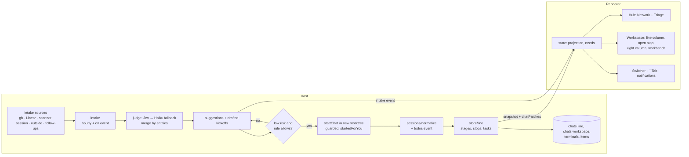
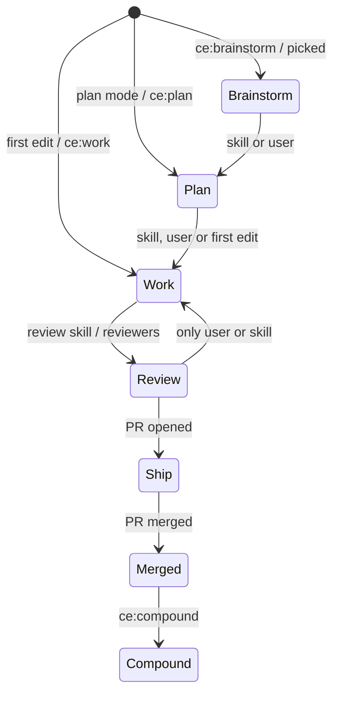
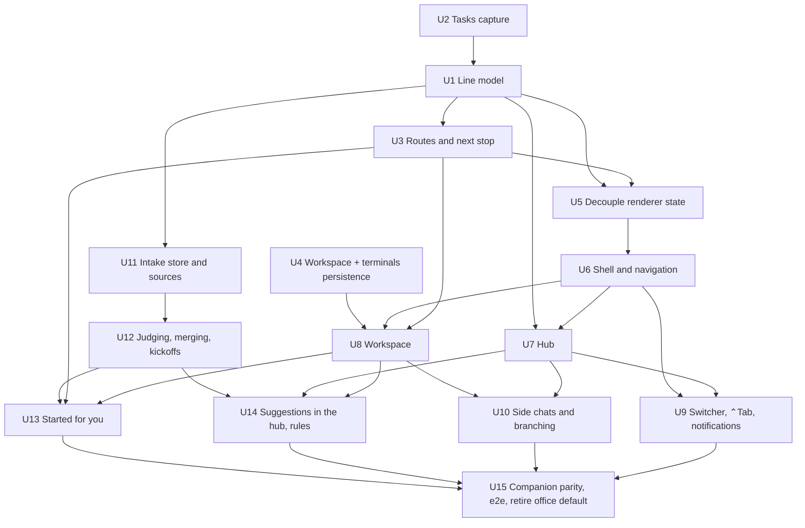

# feat: The hub and the workspace

## Overview

This plan replaces the 3D office as the app's home with two places (see origin: `docs/brainstorms/2026-09-27-metro-workspace-requirements.md`):

- **The hub.** A network of every chat's line on the left and a triage column on the right: Start something, Jump in, Review and Your call.
- **The workspace.** One chat, with its line squeezed beside the reply, the open stop given the page, a right column for what matters now, and a ⌘J workbench.

Around them it adds:
- a route of stages with tasks, which gives every chat a line
- a switcher, ⌃Tab and bottom-right notifications for getting around
- side chats and branching from any stop
- an intake that reads the user's connectors hourly and turns what matters into suggested work
- low-risk lines that start by themselves

The work is split into five phases so each one ships on its own and leaves the app usable:
- **A.** The data a line needs.
- **B.** The new shell, hub and workspace.
- **C.** Branching.
- **D.** Connectors and suggested work.
- **E.** Companion parity and retiring the office as home.

## Problem Frame

The 3D office uses most of the screen for characters and leaves the work about a third of it. The app doesn't know the compound-engineering stages. You can't see a chat's progress, the defaults it chose, or what it's waiting for without reading its transcript. Work that starts in Sentry, Gmail, Linear, GitHub or Slack never reaches the office by itself. The design rounds on the prototype canvas settled the direction, with Round 14 for the hub and Rounds 8–10 for the chat view, switcher and connectors: https://claude.ai/artifact/VriJh789MbBDismRPxar73

## Requirements Trace

Grouped from the origin document. Every unit names the requirements it covers.

- **Visual language (R1–R3):** a dense, dark-first tool; metro elements only where they explain; one meaning per colour; no machinery shown.
- **Hub (R4–R9):**
  - the network grows outward from each repo's `main` through shared stage columns
  - lines are collapsed by default and expand, with branching from a stop
  - state shows at each line's tip
  - a triage column with Start, Jump in, Review, Your call and Finished
  - rows and lines are linked
- **Workspace (R10–R15):**
  - the header in the title bar and no sidebar
  - the squeezed line
  - the open stop gets the page
  - a right column with Open, Tasks and Connected
  - a ⌘J workbench
  - the workspace kept per chat and restored after restart
- **Getting around (R16–R18):** bottom-right notifications answered in place; the switcher dropdown; the ⌃Tab overlay; ⌘K.
- **Route (R19–R22):** the CE route with skill fallbacks; stage detection; next-stop suggestions; routes as config.
- **Side chats (R23–R25):** branch from any stop; worktree on first edit; reconnect with a summary, code or both; continue from a stop in a new chat.
- **Connectors (R26–R30):**
  - hourly scans of GitHub, Sentry, Gmail, Linear, Slack, Claude Code sessions and the office's own follow-ups
  - hidden judging and merging
  - drafted kickoffs
  - rules that learn
  - acting as the user always waits for an allow
- **Started for you (R31–R32):** low-risk lines start themselves under enforced limits; a Sentry rule; a "started for you" tag and Stop.
- **Companion agents (R33):** the same lines and rows, no message box, branching only for hosted chats.

## Scope Boundaries

- The 3D office and characters are parked. They stay reachable behind a setting until Phase E, then leave the default path. Their code isn't deleted in this plan.
- No time estimates or predictions.
- No code editor.
- No reading of claude.ai conversations.
- Nothing is sent, pushed or deployed for the user without an explicit allow, including by lines started for you.
- One level of branch drawing.

### Deferred to Separate Tasks

- Characters in a new form: a later brainstorm.
- A dark and light theme for the 3D office: not needed, since it's parked.
- Mobile or web access to the hub: out of scope.
- Public-release packaging of the connector scanner: handled with `docs/brainstorms/2026-09-27-open-source-release-requirements.md`.

## Context & Research

### Relevant Code and Patterns

- **Renderer entry**
  - `src/renderer/App.vue:29-76` picks the `ChatSource`, which is the demo source or `window.office`, and mounts `Office`.
  - `src/renderer/office/Office.vue` holds the scene, the `<aside class="inbox">` panel switching (:419-424), `select()` (:97-113), `navigate()` (:203) and keyboard handling (:328-352).
- **Renderer state that is coupled to the office**
  - `state/projection.ts:22-100` applies `chatPatches`, but imports `three` and `office/layout`.
  - `state/inbox.ts:5-7,98-138` imports `office/labels`, `layout` and `standby`.
  - `state/keys.ts:11-39` holds the 1/2/3 answers and the waiting-chat navigation.
- **Chat panel pieces reusable as they are:** `panels/chat/`
  - `Transcript.vue`, including rewind
  - `Composer.vue` with `SlashInput`, `CommandPicker` and `CommandBrowser`
  - `PlanCard`, `QuestionCard`, `RequestCard`
  - `SubagentStrip`, `SubagentView`
  - `Terminal.vue`, `Simulator.vue`, `ArtifactCard.vue`, `Preview.vue`
  - `ShipIt.vue`
  - `panels/Review.vue`

  `panels/Chat.vue` depends on the office's `AgentEntry` and `canRest`.
- **Data model:** `src/shared/chat.ts`, with `ChatRow` at :38-42, `ChatFields` at :74-113, `Subagent` at :115-123 and `applyPatch` at :177. Pending requests are in `src/shared/permissions.ts:13-22`. Plan mode is `permissionMode: 'plan'` (`store/chats.ts:517-527`). Nothing reads todo lists today. `panels/chat/groups.ts:32` only labels a `TodoWrite` row, and a tool row's `input` is `unknown` (`shared/chat.ts:41`).
- **Persistence:** `src/main/store/db.ts`.
  - A new chat column goes in four places: `addedColumns` (:64-70), `columns` (:72-97), the `json`/`flags` sets (:98-99) and `ChatRecord` (:7-32).
  - Settings are stored through `db.setting`/`saveSetting` (:160-164).
  - Runtime-only fields are stripped in `store/chats.ts:145-148`.
- **Sessions:** `src/main/sessions/manager.ts`.
  - `StartOptions` (:17-26) includes `resume` and `forkSession`.
  - `rewindFiles` is at :219-221.
  - There's no `resumeSessionAt` yet.
  - The events come from `sessions/normalize.ts:4-23,101`.
- **Worktrees:** `src/main/worktrees/create.ts:56-89` and `store/chats.ts:381-403,530-560`.
- **Requests and notifications**
  - `permissions/registry.ts:62,102,140` covers the broker, `resolveRequest` and the window resolver.
  - `notify/index.ts:77-148` covers desktop notifications.
  - `shared/queue.ts:21` is `buildQueue`.
  - `panels/Inbox.vue:37` answers requests inline.
- **Integrations**
  - `workflow/index.ts:28` has `wireWorkflow`.
  - `workflow/linear.ts:23-96` reads Linear over GraphQL with the vault key and a 5-minute cache.
  - `workflow/review-requests.ts:33-38,129` polls `gh` every 5 minutes and on focus.
  - `review/github.ts` has `pr view`, review threads and failed runs.
  - `departments/jev.ts` has the Jev client with its choice and confidence fields and a 3-second timeout (:49). `createJev` (:35) returns a single-purpose room picker, `place(cwd, task)`, with `minConfidence` 0.5 (:8). It isn't a general client yet.
- **Companion sessions:** `outside/index.ts:53-106` watches `~/.claude/projects/**/*.jsonl` and hooks, and `visitors.ts:48` builds visitor chats.
- **Terminals:** `main/terminal.ts:23-77` keeps one pty per chat with a buffer capped at `maxBuffer = 200_000` characters (:13). `state/terminal.ts` holds a global "shown" flag in localStorage.
- **IPC:** channel names equal the keys of `Commands`/`Events` (`shared/ipc.ts:82-163` and `:165-177`).
  - A new command also needs an entry in `main/host/forwarded.ts:5`, which typecheck enforces unless the command is `Local` (:3). It also needs its `ipcRenderer.invoke` in `src/preload/index.ts`.
  - A new host-to-renderer event goes in `rendererEvents` (`forwarded.ts:78`).
  - Handlers live in the module that owns them (`store/ipc-sync.ts`, `workflow/index.ts`, `terminal.ts`, `outside/index.ts` and others), and `main/host/core.ts` wires those modules together.
- **Tests**
  - vitest runs a node project (`tests/**/*.test.ts`) and a client project (`*.client.test.ts`).
  - Playwright e2e specs are in `tests/e2e`, using the fake engine, fake `gh` and the inline host (`tests/e2e/chat-panel.spec.ts`).
  - The demo source is `state/demo.ts:184`.

- **Start options:** `startChat(accountId, cwd, prompt, model?, effort?, options?)` (`shared/ipc.ts:96`) takes the renderer-side `StartOptions` from `shared/departments.ts:61-66` (`dept`, `worktree`, `title`, `review`). That's a different type from the engine's `StartOptions` (`sessions/manager.ts:17-26`). The handler is `workflow/index.ts:36`, and it calls `store.start()` (`store/chats.ts:529`).
- **Config:** `departments.json` is read by `loadConfig` (`departments/config.ts:74`) from `$AGENT_OFFICE_CONFIG_DIR` or `~/.config/agent-office`.
  - Its top-level keys are `rooms`, `playground` and `commands`, and there's no `routes` key yet.
  - `commands` is `{ ship?: string[], fixCi?, answerComments?, review? }` (`shared/departments.ts:15-20`, parsed at `config.ts:46-56`).
- **Vault:** `accounts/tokens.ts:19` (`openVault`). Each secret is `safeStorage`-encrypted into `<userData>/secrets/<name>.bin` (mode 0600). The names are `linear`, `jev`, `ntfy-hmac` and `account-<id>`. The renderer asks through `hasLinearKey`/`hasJevKey` (`host/core.ts:78-86`).
- **Permissions:** the dangerous-request rules are `permissions/danger.ts`, and saved allow rules are `permissions/rules.ts`. `src/shared/guardrails.ts` is about account headroom (usage warnings), not permissions.
- **Keyboard today**
  - The menu (`src/main/index.ts:187-210`) is a custom template with no `viewMenu` role, so ⌘0 and zoom aren't bound. It binds New Agent to ⌘N (:205), Inbox to ⌘1 and Housekeeping to ⌘2 (:207), and ⌘R and ⌥⌘I in unpackaged builds only.
  - `Office.vue` `onKey` (:327-353) binds ⌘K, ⌃Tab and ⇧⌃Tab (keydown only, with no hold-and-release), Esc, 1/2/3 (allow / always / deny) and j/k.
  - `QuestionCard.vue:36` captures 1–9, ↑/↓ and Space during a question.
  - `Terminal.vue:46` stops Esc from propagating, and `Chat.vue:102` binds Ctrl+` to the terminal.
  - ⌘0, ⌘J, ⌘L, ⌘D, ⌥Y, ⌥N and B are free.
- **Theme today:** light only. The tokens are in `src/renderer/styles.css:1-23` with `color-scheme: light`, and there's no `prefers-color-scheme` or `nativeTheme`. The window background is hardcoded to `#f6f8fc` (`src/main/index.ts:230`). Many components hardcode hex values, such as `Inbox.vue`, `Office.vue`, `Transcript.vue` and `Review.vue`.
- **The Markdown renderer** is `panels/chat/markdown.ts`.

### Institutional Learnings

- `docs/solutions/2026-09-sdk-dual-account-spike.md`: SDK sessions can fork, and the spike (`spikes/fork-adopt.ts`) showed forked sessions don't disturb the original transcript.
- The same spike confirmed a **connector gap**. Sessions started with a `setup-token` token see only local MCP servers (on Aaron's Mac: growthbook, indesign and storyblok) and **none of the claude.ai connectors** (Linear, Slack, Sentry, Gmail, and so on). That's the auth every office session uses (`manager.ts:66-70`). It decides how U11 reads Sentry, Gmail and Slack.
- The rooms plan (`docs/plans/2026-09-25-001-feat-rooms-for-any-setup-plan.md`) established that the host owns derived structure and sends it in the snapshot plus a dedicated event. This plan follows the same pattern for lines and intake items.

### External References

- Claude Agent SDK: `resume` plus `forkSession`, `canUseTool`, permission modes, `settingSources`, MCP server configuration and file checkpointing are already in use. Whether a fork can target an earlier message is to be verified in U10.
- TypeSafe `systemone` (Jev): `state` plus `questions` with `choice` criteria, returning `answers.<q>.choice/confidence`, as used in `departments/jev.ts`.

## Key Technical Decisions

- **The host owns each chat's line.** A new `src/shared/line.ts` defines `Line`, `Stop`, `Stage` and `Task`. `src/main/store/line.ts` keeps each chat's line up to date from session events and persists it in a new `line` JSON column.
  - Rationale: rows are capped at 200 in memory, so a line built in the renderer would lose early stages. Stage history must survive restarts, and companion chats need the same line built from transcripts.
- **Tasks come from the plan first, then the agent's todo list.**
  - When the chat wrote or read a plan document in `docs/plans/`, its implementation units become Work's tasks.
  - Otherwise the latest `TodoWrite` list is used. A new `todos` event in `normalize.ts` carries it.
  - A task's sub-steps come from the todo list while that task is current.
- **Stage detection is event-driven and never goes backwards on its own.**
  - A stage starts when its skill runs (slash command or Skill tool), when the user picks it, or on the first strong signal:
    - plan mode or `ExitPlanMode` → Plan
    - the first file edit outside `docs/` → Work
    - a review skill or review subagent → Review
    - `gh pr create` or an open PR on the branch → Ship
    - a merged PR → Merged
  - Only the user or a skill moves a chat back to an earlier stage. That prevents flapping.
- **Routes are config.** A `routes` section in `departments.json` defines stations with a label, skill or prompt, and palette colour. The CE route is the built-in default. `nextSteps` in `next-step.ts` becomes the source of Ship's stops instead of its own strip.
- **The renderer gets a new shell and keeps the office as an optional view.**
  - `App.vue` mounts `Shell.vue`, which holds the title bar, the view router (hub or workspace), the overlays (switcher, ⌃Tab, ⌘K) and the notifications.
  - `Office.vue` stays reachable through a setting during Phases B–D.
  - `projection.ts` and `inbox.ts` lose their `three` and office imports first (U5), so the shell doesn't load the 3D bundle.
- **The network is drawn by a pure layout function plus SVG.** `src/renderer/hub/network.ts` turns lines into positioned segments, stops, pills and labels (repo hubs, lanes, stage columns, branches), and `Network.vue` renders them.
  - Rationale: layout can be unit-tested, SVG keeps every stop focusable, and the prototype's geometry (`docs/design/2026-09-27-hub-and-workspace/hub.py`) transfers directly.
- **Workspace state is a per-chat JSON column.** A `workspace` column holds the workbench state, tabs, sizes, the line's expanded state and scroll. Terminals get a small per-chat registry in `main/terminal.ts`: several shells per chat, each with a name and folder. Their scrollback is persisted, capped at 200 KB, in a `terminals` table.
- **Side chats reuse forking.**
  - A side chat is a chat with `parentId`, `forkStopId` and `forkMessageId`. Branching at the tip uses `resume` plus `forkSession`.
  - Branching at an earlier stop uses the SDK's `forkSession(id, { upToMessageId })` (checked in 0.3.280, see U10). Files come from a git snapshot the stop took when it started, not from `rewindFiles`, which only rewinds the session's own folder.
- **The intake is a host service with its own table, and it scans with the user's connectors.**
  - GitHub and Linear use the existing integrations (`gh`, the Linear key).
  - Sentry, Gmail and Slack are read by a headless scanner session. It's an Agent SDK query run with the user's configured MCP servers and an allowlist of their read-only tools, and it returns strict JSON items. Nothing else in the app talks to those APIs.
  - Claude Code sessions come from the outside watcher, specifically the "next step" notes at the end of sessions. Office follow-ups come from the line store, such as review findings left for later.
  - Rationale: this reuses auth the user already granted, and adds no OAuth apps for Gmail or Slack.
  - **Caveat, found in review:** the office's `setup-token` sessions can't see claude.ai connectors. U11 opens with a spike that picks the scanner's account and servers, and Phase D ships without Sentry, Gmail and Slack if neither route works.
- **Judging is Jev first and Haiku as fallback, and neither is ever shown.**
  - `departments/jev.ts` gains a general `ask(state, questions)` next to today's `place()`, and `intake/judge.ts` builds `judge(item, context)` on it with several questions:
    - `importance`
    - `agent_can_do`
    - `belongs_to` (the choices are the current lines, the repositories, new or none)
    - `kind`
  - The user's rules become the criteria text. Without a Jev key, or below 0.5 confidence, a Haiku call answers the same questions.
  - Merging keys on shared entities (PR number, ticket id, file path, Sentry issue id), then on a `same_as` question for near matches.
- **Kickoffs are drafted by one short model call per suggestion, not per item.** A suggestion stores its repository, starting stage, skill and one-sentence prompt. `startChat`'s options (`StartOptions` in `shared/departments.ts:61-66`) gain `route` and `origin` so a started suggestion keeps its sources for "Connected to this line".
- **"Low risk" is enforced by the host, not promised by a prompt.** A line started for you runs with all of these:
  - a mandatory new worktree
  - permission mode `default`
  - deny rules for `git push`, `gh pr create|merge|comment`, deploy scripts named in config, and any MCP tool not on the read-only allowlist
  - a `canUseTool` guard that turns every other ask into a Jump in request

  The deny list lives in a new `src/main/permissions/started-for-you.ts`, next to the dangerous-request rules in `permissions/danger.ts`.
- **Acting as the user is always a request.** MCP tools that send (Slack post, Gmail send, GitHub comment, Linear update) are classified as outward actions and always raise a request, even in accept-edits mode. The request card shows the exact content, with Allow once, Edit and Don't post.

## Open Questions

### Resolved During Planning

- Where the line lives: in the host, persisted, sent in the snapshot and patches.
- Where tasks come from: plan units first, then `TodoWrite`.
- How connectors are read: the existing integrations plus a read-only scanner session with the user's MCP servers.
- How low risk is guaranteed: a worktree, deny rules and the request guard, enforced in the host.

### Deferred to Implementation

- ~~Whether the SDK exposes resume-at-message.~~ Resolved in review: it does (`forkSession` with `upToMessageId`, and `resumeSessionAt`; see U10). What's left for U10's spike is resuming from a different `cwd`, and the exact fork-point UUID.
- The exact default rules and importance thresholds (U12). They'll be tuned on Aaron's real traffic in the first week.
- How the app preview finds a dev server (U8): the first `localhost:<port>` printed in the chat's terminals, or a `preview` entry in config.
- Whether Merged lines leave the map after 24 hours or at the next day's first scan (U7).

## High-Level Technical Design

> *This illustrates the intended approach and is directional guidance for review, not implementation specification.*

A chat's stage over time:

## Implementation Units

### Phase A: the data a line needs

- [ ] **Unit 1: Line model**

**Goal:** Every chat, hosted or companion, has a persisted line: the stages it entered and when, its stops, its current stop and its tasks. It travels in the snapshot and patches.

**Requirements:** R5–R7, R11, R19, R20

**Dependencies:** U2

**Files:**
- Create: `src/shared/line.ts` (including the `Route` type and the built-in CE route, so the reducer doesn't wait on U3), `src/main/store/line.ts`, `src/main/store/stop-snapshot.ts`
- Modify: `src/shared/chat.ts` (`line` on `ChatFields`), `src/main/store/db.ts` (`line` JSON column), `src/main/store/chats.ts` (feed events, persist), `src/main/outside/visitors.ts` (lines for companion chats), `src/main/sessions/normalize.ts` (skill-started events if missing)
- Test: `tests/main/line.test.ts`, `tests/main/line-store.test.ts`

**Approach:**
- `advance(line, event, route)` is a pure reducer over `ChatEvent`s and PR state, following the detection rules in Key Technical Decisions. It never moves backwards unless the event is a skill run or a user pick.
- Work stops come from the tasks (U2). Ship is a single stop until U3 splits it into the `commands.ship` steps.
- Each `Stop` records what branching needs later, because it can't be rebuilt afterwards:
  - `firstEntryId`, and `lastEntryId`: the SDK chain UUID of the last entry of the stop's final turn (see U10)
  - `snapshot`: a commit of the chat's folder taken when the stop starts, with a temporary index, `git add -A`, `write-tree` and `commit-tree`, kept under `refs/agent-office/stops/<chatId>/<stopId>`. It never touches the working tree or the index.
- The store applies the reducer on each event, saves only when the line changes, and emits a `line` patch.
- For companion chats, the reducer replays the transcript once on discovery, then follows new lines.

**Patterns to follow:** the host-owned rooms in `src/main/departments/rooms.ts`, and the patch emission in `store/chats.ts`.

**Execution note:** Run U10's fork spike (`spikes/fork-at-stop.ts`) before fixing the `Stop` shape. It settles which chain UUID a stop has to record. Stops recorded before this can't be branched from precisely.

**Test scenarios:**
- Happy path: running `ce:brainstorm`, then `ce:plan`, then the first edit gives Brainstorm → Plan → Work with timestamps.
- Happy path: a chat whose first action is an edit enters at Work, and Brainstorm and Plan are marked skipped.
- Edge case: after Work, a read-only question to the agent doesn't move it back.
- Edge case: a user pick of Plan from Review moves it back and adds a new stop.
- Happy path: `gh pr create` in a Bash tool moves it to Ship, and a merged PR moves it to Merged.
- Error path: a `gh pr create` that fails or is denied leaves the chat in its stage. Only a successful result or an open PR on the branch counts.
- Edge case: in Plan, writing `docs/plans/x.md` keeps the chat in Plan. The first edit outside `docs/` moves it to Work.
- Edge case: a review subagent that `ce:work` starts while Work's tasks are still open doesn't move the chat to Review.
- Happy path: each new stop gets a snapshot ref, and `git status` and `git stash list` of the chat's folder are unchanged afterwards.
- Integration: the line survives a restart. Rebuild the store from `office.db` and get an equal line.
- Integration: replaying a companion transcript fixture gives the same line as live events.

**Verification:** The snapshot for a fake-engine chat carries a line whose current stop follows the script's stages.

- [ ] **Unit 2: Tasks capture**

**Goal:** A chat knows its task list and the current task's sub-steps.

**Requirements:** R11, R13

**Dependencies:** None

**Files:**
- Modify: `src/main/sessions/normalize.ts` (a `todos` event from `TodoWrite` input), `src/shared/line.ts` (`Task`)
- Create: `src/main/store/plan-tasks.ts` (reads the implementation units from a plan file the chat wrote or read)
- Test: `tests/main/plan-tasks.test.ts`, `tests/main/normalize.test.ts` (extend)

**Approach:**
- The plan parser reads the `- [ ] **Unit N: …**` and `- [x]` headings in `docs/plans/*.md`, the format used in this repo. Other plan formats fall back to the todo list.
- A task's done state comes from plan checkboxes, or from todo status for todo-based tasks.
- Sub-steps are the todo items while that plan task is current.

**Test scenarios:**
- Happy path: this plan file yields 15 tasks with the right titles, all open.
- Happy path: a `TodoWrite` with three items, one in progress, gives three tasks with the right current task.
- Edge case: a plan file with no units falls back to todos.
- Edge case: a todo list replaced by a shorter one drops the removed items.
- Edge case: a chat that reads several plan files, as a review does, takes its tasks only from the plan passed to `ce:work`, or else from the last one it wrote. It never takes them from one it only read.

**Verification:** The fake engine's `TodoWrite` script shows as tasks on the chat's line.

- [ ] **Unit 3: Routes and the next stop**

**Goal:** Routes come from config, with the CE route as the default. Each stage knows its skill or fallback prompt, and a finished stage offers "Continue to <stage>".

**Requirements:** R19, R21, R22

**Dependencies:** U1

**Files:**
- Modify: `src/shared/departments.ts` (the `routes` type), `src/main/departments/config.ts` (parse `routes`), `src/main/workflow/next-step.ts` (Ship's stops, the next-stop suggestion), `src/shared/workflow.ts`
- Test: `tests/main/routes.test.ts`, `tests/main/next-step.test.ts` (extend)

**Approach:**
- The built-in route (defined in U1's `shared/line.ts`) is Brainstorm, Plan, Work, Review, Ship, Compound, each with its `ce:*` skill and a plain-prompt fallback. This unit adds the `routes` config and the skill lookups.
- A room's `route` picks a named route.
- "Looks finished" means the stage's skill ended, its document was written, and the turn is done.
- The suggestion carries the next stage's skill and what the last stage produced (the document path).
- The existing `commands` section of `departments.json` (`ship`, `fixCi`, `answerComments`, `review`; `shared/departments.ts:15-20`) maps onto Ship's stops.

**Test scenarios:**
- Happy path: with no config, a chat gets the CE route.
- Happy path: a config route with three stations replaces it for its room.
- Edge case: a missing skill uses the fallback prompt, and the suggestion says it's a prompt.
- Happy path: Plan finished with `docs/plans/x.md` written suggests Work with `/ce:work docs/plans/x.md`.
- Error path: an invalid route entry is skipped and named in the config errors.

**Verification:** A fake-engine chat that finishes Plan exposes a next-stop suggestion in its snapshot.

- [ ] **Unit 4: Workspace and terminals persistence**

**Goal:** Each chat keeps its workspace state and several named terminals across switches and restarts.

**Requirements:** R14, R15

**Dependencies:** None

**Files:**
- Modify: `src/main/store/db.ts` (a `workspace` JSON column and a `terminals` table), `src/main/terminal.ts` (several shells per chat, names, persisted scrollback), `src/shared/ipc.ts`, `src/main/host/forwarded.ts`, `src/main/host/core.ts`
- Test: `tests/main/terminal.test.ts` (extend), `tests/main/workspace-store.test.ts`

**Approach:**
- `setWorkspace(chatId, state)` is debounced and validated against a small schema.
- Terminals are keyed by `chatId` and `name`. Scrollback is flushed to the table on exit and every 10 seconds while dirty, capped at 200 KB.
- On restart, the saved terminals reopen in their folder, with a "restarted" line written into the buffer before new output.

**Test scenarios:**
- Happy path: two terminals for one chat keep separate buffers.
- Integration: after closing and reopening the store, the terminals list and scrollback come back, with the divider.
- Edge case: scrollback over 200 KB keeps the newest 200 KB.
- Error path: an invalid workspace payload is rejected, and the stored state stays as it was.
- Error path: after the host is killed without a clean exit, at most the last 10 seconds of scrollback are lost, and the divider still appears.

**Verification:** A chat with a shell and an open workbench restores both after an app restart in e2e (U15).

### Phase B: the shell, the hub and the workspace

- [ ] **Unit 5: Decouple renderer state from the office**

**Goal:** `projection` and the needs model work without `three` or office modules.

**Requirements:** R4, R8

**Dependencies:** U1, U3 (Review and Your call are derived from the line and the next-stop offer; only the import split can start earlier)

**Files:**
- Modify: `src/renderer/state/projection.ts`, `src/renderer/state/inbox.ts` (split it)
- Create: `src/renderer/state/needs.ts` (Jump in, Review, Your call and Finished from chats; suggestions are added in U14)
- Test: `tests/renderer/needs.test.ts`, `tests/renderer/projection.test.ts` (extend)

**Approach:**
- Colour and layout derivations move to `office/` adapters that the office view still uses.
- The needs model:
  - **Jump in:** pending requests and questions.
  - **Review:** a stage that finished with an output (a plan written, a fix ready meaning Work done with tests passing, results, an open PR awaiting you).
  - **Your call:** defaults in use (answered questions where the agent chose), next-stop suggestions that need a decision, and later, intake suggestions.
  - **Finished today:** lines merged or done today.

**Test scenarios:**
- Happy path: a chat with an `AskUserQuestion` request appears once in Jump in with its options.
- Happy path: a chat whose Plan finished with a document appears in Review with "Plan ready".
- Edge case: a request answered in another window leaves Jump in on the next patch.
- Integration: importing `state/projection` in a client test doesn't load `three`. Assert the module graph.

**Verification:** `pnpm typecheck` passes, and the office view still renders its inbox from the split modules.

- [ ] **Unit 6: Shell and navigation**

**Goal:** A new app shell with the title bar, the hub and workspace views, back and forward, Esc, ⌘K, and the office behind a setting.

**Requirements:** R1, R3, R10, R18 (⌘K)

**Dependencies:** U5

**Files:**
- Create: `src/renderer/Shell.vue`, `src/renderer/shell/TitleBar.vue`, `src/renderer/shell/router.ts`, `src/renderer/theme.css` (dark and light tokens, Geist)
- Modify: `src/renderer/App.vue` (mount Shell, with an Office setting), `src/renderer/styles.css`, `src/renderer/state/keys.ts`, `src/main/index.ts` (the menu, and the window background from `nativeTheme`), and the hardcoded hex colours in the chat components the workspace reuses (`Transcript.vue`, `Review.vue`, `Inbox.vue`)
- Test: `tests/renderer/router.test.ts`, `tests/renderer/keys.test.ts` (extend)

**Approach:**
- The router state is `{ view: 'hub' } | { view: 'chat', chatId }`, with a history stack for ‹ › and Esc going to the hub.
- `navigate()` events from main (notification clicks) route to the chat.
- Theme tokens follow R3's four colour roles. Stage colours come from the route config.
- **The app is light-only today** (`styles.css:1-23`, `color-scheme: light`, a fixed `#f6f8fc` window background), so dark-first means a real token pass. Every reused component has to take its colours from tokens.
- Contrast is part of the tokens, with the WCAG ratios as test assertions: 4.5:1 for text under 18 px and 3:1 for rings, strokes and the connector marks, on `bg`, `panel` and `raised` in both themes. The design boards' values fail in these places:
  - light amber `#e08a00`: 2.4:1 on the hub background. Use about `#c67a00` for rings; text keeps `needsInk`.
  - light `muted` `#74746e`: 4.3:1. Use about `#6d6d68`.
  - dark `muted` on `raised`: 4.2:1. Use about `#84847e`.
  - `faint` stop markers: 1.4–1.8:1 in both themes. Future stops need 3:1, while the remainder line may stay faint.
  - The connector colours: about 2:1 on light backgrounds, and not themed at all.
- **The keymap is a single table in `state/keys.ts`**, with these rules:
  - **⌘0 opens the hub.** Add it to the View menu in place of Inbox ⌘1. Housekeeping stays ⌘2.
  - **⌘N stays the menu's New Agent**, renamed New line. The page doesn't bind it a second time.
  - **Esc** goes back to the hub only when nothing inside wants it. Terminals (`Terminal.vue:46`), open popups, the palette and sheets keep it.
  - **Plain keys** (1–9, Space, B, j/k) never fire while typing. 1–9 belong to a focused `QuestionCard` first, then to the hub's top Jump in row. Space and B act only on a focused line.
- The existing ⌘K palette is reused, and extended to files and decisions later.

**Test scenarios:**
- Happy path: opening chat A, then B, then going back returns to A, and forward returns to B.
- Happy path: Esc in a chat goes to the hub. Esc in the hub does nothing.
- Edge case: a `navigate` to an unknown chat stays put and shows a notice.
- Happy path: with the Office setting on, the office view mounts instead of the hub.
- Edge case: Esc with focus in a terminal goes to the terminal and doesn't leave the chat.
- Edge case: the keymap table has no duplicate chord in any context, including the menu accelerators. Assert it.

The Office setting defaults to on (the office stays home) until U15 switches it off. U6's e2e and dogfooding run with it off.

**Verification:** The app boots into the hub with the fake engine, and every existing e2e flow that doesn't rely on the canvas still passes.

- [ ] **Unit 7: The hub**

**Goal:** The network and the triage column in one view.

**Requirements:** R4–R9

**Dependencies:** U1, U6

**Files:**
- Create: `src/renderer/hub/network.ts` (pure layout), `src/renderer/hub/Network.vue`, `src/renderer/hub/Triage.vue`, `src/renderer/hub/TriageRow.vue`, `src/renderer/hub/StartSomething.vue`
- Modify: `src/renderer/state/needs.ts` (selection linking)
- Test: `tests/renderer/network.test.ts`, `tests/renderer/triage.client.test.ts`

**Approach:**
- The layout groups lines by repository (the room registry gives repositories). Each group has a hub at the left, and lines fan out at 45° into lanes.
- Stage columns are shared. Work's width is split by that line's task count.
- A collapsed line gets a pill ("N done"), its current stop, and a faint remainder. An expanded line shows every stop.
- Side chats start at their parent's fork stop. Skipped stages are dashed.
- A connector-origin square is shown when the line has `origin` items (U14).
- The triage rows reuse the request answering from `Inbox.vue`, through `resolveRequest`, with number keys.
- Start something calls `startChat` with the repository, stage and prompt.

**Patterns to follow:** the prototype geometry in `docs/design/2026-09-27-hub-and-workspace/hub.py` and the boards next to it, and `panels/Inbox.vue` for answering.

**Test scenarios:**
- Happy path: three repositories with 1, 4 and 6 lines lay out without overlapping labels. Assert the label boxes don't intersect each other, any other line's segments or stops, or their own line's stops.
- Edge case: at a 1280×800 window (a map about 840 px wide), every column, the Merged column included, stays in view. No map text renders below 12 px after scaling, so the layout reflows to the width instead of scaling a fixed SVG.
- Edge case: a line that entered at Work puts its "N done" pill on the solid segment, never on the dashed lead.
- Edge case: a side chat's name doesn't cross its parent's fork segment.
- Happy path: at 1280×800 with 2 Jump in, 3 Review and 3 Your call rows, Jump in stays pinned and the rest scrolls. No row is cut off without a scroll affordance.
- Happy path: a line that entered at Work draws a dashed lead through Brainstorm and Plan.
- Happy path: a side chat forks at its parent's stop x and gets its own lane.
- Edge case: a repository with 12 lines stays within the view height by compressing lane spacing down to a minimum, then scrolling.
- Happy path: answering the top Jump in row with key 1 resolves the request and removes the row.
- Integration: hovering a row sets the selected line, and the network highlights it.
- Happy path: a row's ring and its line's tip have the same colour for every state: needs you, blocked, and each stage.
- Happy path: a line started for you carries its "started for you" tag (R32).

**Verification:** The demo source renders the hub with every row type. A screenshot test matches the reviewed baseline.

- [ ] **Unit 8: The workspace**

**Goal:** One chat with its squeezed line, the open stop's page, the right column and the workbench.

**Requirements:** R10–R15, R19–R21 (next-stop offer), R30 (outward request card)

**Dependencies:** U1, U3, U4, U6

**Files:**
- Create: `src/renderer/workspace/Workspace.vue`, `workspace/LineColumn.vue`, `workspace/StopPage.vue`, `workspace/RightColumn.vue`, `workspace/Workbench.vue`, `workspace/OutwardCard.vue`, `src/main/permissions/outward.ts` (which tools act as the user)
- Modify: `src/renderer/panels/Chat.vue` (extract what's reusable; drop `AgentEntry`), `panels/chat/Transcript.vue` (scope to a stop's rows, fold earlier stops), `panels/chat/Composer.vue` (the "Continue from…" mode, added in U10)
- Test: `tests/renderer/stop-rows.test.ts`, `tests/renderer/workspace.client.test.ts`

**Approach:**
- The line column draws finished stops as ticks, the open stop as a tall bar in its stage colour, and faint future ticks. ⌘L expands it into the stop list with one-line outcomes.
- The stop page shows the stop's rows, from the stop's first row to the next stop's first row. Earlier stops fold into one row each. Tool groups keep today's `ToolGroup` collapse, and connector tools get a source label.
- The right column:
  - **Open:** pending requests, answered defaults with Keep / Change (Change sends a correction message), and blockers.
  - **Tasks:** the tasks with sub-steps.
  - Tests and changes, from `getShipIt` and git status.
  - **Connected:** origin items and the PR.
- The workbench tabs are:
  - **Preview:** a webview on the detected localhost port.
  - **Changes:** reuses `panels/Review.vue`.
  - **Terminals:** U4.
  - **Documents:** brainstorm and plan files rendered with `panels/chat/markdown.ts`.
- Workspace state is saved through U4 on change.
- Each workbench tab carries the stop it came from (R14).
- A code block's **Apply** asks the chat to apply it, as a message naming the file. The office doesn't write files itself, since there's no code editor.
- **Outward actions (R30).** `permissions/outward.ts` classifies the tools that act as the user: Slack send, schedule and draft; Gmail send, reply, forward and draft; GitHub comment and review; Linear save and update; and `gh pr comment|review|merge` in Bash. `registry.ts` always turns them into a request, in every permission mode and whatever saved rules say. **Edit** sends the corrected content back as the tool's `updatedInput`.

**Test scenarios:**
- Happy path: a chat at task 6 of 9 shows 7 finished ticks, a Work bar and 5 future ticks.
- Happy path: the stop page for task 6 contains only rows after task 6 started.
- Happy path: an answered `AskUserQuestion` with a chosen default shows in Open with Keep and Change.
- Happy path: a Slack send tool request renders as an outward card with the message text and Allow once, Edit and Don't post.
- Error path: in accept-edits mode, with a saved allow rule for the Slack server, a send still raises a request.
- Happy path: Edit, then Allow, runs the tool with the edited text.
- Integration: switching away and back restores the workbench tab and scroll position.

**Verification:** The existing chat-panel e2e flows (send, answer a plan, answer a question, terminal) pass against the workspace.

- [ ] **Unit 9: Switcher, ⌃Tab and notifications**

**Goal:** Getting between chats without a sidebar, and answering other chats' requests where they appear.

**Requirements:** R16–R18 (⌘K over files and decisions included)

**Dependencies:** U6, U7 (the small line reuses U7's collapsed-line renderer)

**Files:**
- Create: `src/renderer/shell/Switcher.vue`, `shell/CtrlTab.vue`, `shell/Notifications.vue`
- Modify: `src/renderer/state/keys.ts` (⌃Tab hold and release, ⌥Y / ⌥N), `src/main/notify/index.ts` (align desktop notifications with in-app ones, and skip them while the app is focused on that chat)
- Test: `tests/renderer/switcher.client.test.ts`, `tests/renderer/keys.test.ts` (extend)

**Approach:**
- The switcher groups are needs you, running and waiting. Rows show the state in words and a small line, drawn by the collapsed-line renderer from U7. Side chats are indented.
- ⌃Tab orders needs-you first, then by most recent focus.
- Notifications stack in the bottom right. The newest is shown in full, older ones collapse to one line, and answered ones animate away. They never take focus.
- ⌃Tab is a hold-and-release gesture. Today it's keydown only (`Office.vue:332`). Terminals pass it on through xterm's `attachCustomKeyEventHandler`, and losing window focus while ⌃ is held cancels the overlay.
- ⌥Y and ⌥N match on `event.code` (`KeyY`, `KeyN`), because on a Mac `event.key` gives "¥" and a dead key. They act only while a request notification is showing, and never during IME composition. ⌥N is the dead key for ñ, so it must type normally otherwise.
- ⌘K grows from chats to files (the tracked files of the open chats' repositories) and decisions (answered questions and defaults in use).

**Test scenarios:**
- Happy path: holding ⌃ and pressing Tab twice selects the third entry, and releasing opens it.
- Happy path: a permission request from another chat shows a notification, and ⌥Y allows it through `resolveRequest`.
- Edge case: a request for the chat in view doesn't raise a notification, because it's in Open already.
- Edge case: three notifications show one in full and two collapsed.
- Edge case: ⌃Tab with focus in a terminal opens the overlay, and the terminal receives nothing.
- Edge case: ⌥N in the message box with no request notification showing types a normal dead-key ñ.
- Happy path: ⌘K finds a file by name and a decision by its words, and opening a decision opens its chat at that stop.

**Verification:** e2e: a request raised in a background chat is answered from the notification without leaving the current chat.

### Phase C: branching

- [ ] **Unit 10: Side chats and branching from any stop**

**Goal:** Branch from any stop into a side chat with its own worktree, see it on the lines, and reconnect with a summary, code or both.

**Requirements:** R23–R25

**Dependencies:** U7, U8

**Files:**
- Modify: `src/shared/chat.ts` (`parentId`, `forkStopId`, `forkMessageId`, `reconnects`), `src/main/store/db.ts`, `src/main/store/chats.ts` (a `branch` command, the move to a worktree on first edit, `reconnect`), `src/main/sessions/manager.ts` (`StartOptions.resumeSessionAt`, and a `fork(sessionId, upToMessageId, dir)` wrapper over the SDK's `forkSession`), `src/main/worktrees/create.ts` (create from a stop's snapshot commit)
- Create: `src/main/store/reconnect.ts`
- Test: `tests/main/branch.test.ts`, `tests/main/reconnect.test.ts`

**What the installed SDK offers** (`@anthropic-ai/claude-agent-sdk` 0.3.280, checked in `sdk.d.ts` on 2026-09-28):
- `forkSession(sessionId, { upToMessageId, dir, title })`, a standalone function (`sdk.d.ts:770-794`). It copies the transcript into a new session file up to and including that message, with fresh UUIDs, and returns the new `sessionId` to pass to `query({ options: { resume } })`. Its doc says forked sessions "start without undo history (file-history snapshots are not copied)".
- `Options.resumeSessionAt` (`sdk.d.ts:2027-2033`), used with `resume` and `forkSession: true`: resume only up to and including the given chain UUID. `Options.resumeDropsTurn` (`:2034-2083`) makes the CLI refuse a truncation that would drop anything except the named turn. The refusal is deterministic, so map it to "fork at the tip" instead of retrying. Both options work only on the headless path the office uses.
- The fork point is the kept turn's **last chain entry** (the assistant message, a trailing tool result, or a `structured_output` attachment), not the user message. The office already sets each user message's `uuid` itself (`manager.ts:90`). Stops also have to record the UUID of the last entry of their final turn, from the `uuid` on streamed messages.
- `Query.rewindFiles(userMessageId)` (`sdk.d.ts:2961-2976`) restores the tracked files **in place in the session's own folder**. It can't be pointed at another worktree, and a fork has no checkpoints to rewind (compare `store/chats.ts:670`).

**Approach:**
- Branching at the tip uses `resume` plus `forkSession: true`, as adoption does today.
- Branching at an earlier stop calls `forkSession(parent, { upToMessageId: stop.lastEntryId })` and resumes the new id. The trimmed-JSONL fallback isn't needed, so drop it.
- **Files for an earlier stop come from git, not `rewindFiles`.** Calling `rewindFiles` would roll back the parent's own folder. Instead, when a stop starts, U1 records a snapshot commit of the chat's folder (a temporary index with `git add -A`, `write-tree` and `commit-tree`, kept under `refs/agent-office/stops/<chatId>/<stopId>`), which touches neither the working tree nor the index. The side chat's worktree is created from that commit. Stops older than this feature have no snapshot, and branching from them offers "files as they are now" instead.
- A side chat that only reads stays in the parent's folder. The first edit or non-read-only Bash pauses the tool call, creates the worktree, restarts the engine there with `resume`, and replays the call.
- **Spike first:** the SDK keys session files by project folder. The spike has to show that `resume` of a fork still finds the session once `cwd` is the new worktree, both for branching and for the move on first edit. If it doesn't, write the fork with `dir` set to the worktree folder.
- Reconnect has three parts:
  - **Summary:** a model call inside the side chat, shown to the user for editing.
  - **Code:** commit the side chat's work (after asking), then merge it into the parent's branch. Conflicts are listed with "Hand to <parent>".
  - **The parent's line** records an interchange at the reconnect.

**Execution note:** Start with a spike against the real SDK (`spikes/fork-at-stop.ts`). It should cover `forkSession` with `upToMessageId`, then `resume` from a different `cwd`, then a `resumeDropsTurn` refusal. Use it to settle which UUID each stop records before U1 fixes the `Stop` shape.

- Reconnect defaults to summary plus code when the side chat changed files, and to the summary alone when it didn't (R24).

**Test scenarios:**
- Happy path: branching at the tip gives a new chat whose first message sees the parent's context, and the parent's transcript is unchanged.
- Happy path: branching at an earlier stop gives a chat whose context ends at that stop, with files as they were then. Assert the parent's folder and `git status` are unchanged afterwards, which is the failure `rewindFiles` would cause.
- Edge case: branching at a stop whose final turn ended on a tool result forks at that entry, and the SDK doesn't refuse.
- Edge case: a stop with no snapshot commit offers "files as they are now" and says so.
- Happy path: a side chat's first edit moves it to `.claude/worktrees/<slug>` before the edit lands.
- Happy path: reconnect with the code merges cleanly and the parent's line gains an interchange.
- Error path: reconnect with conflicting code lists the files and leaves both branches untouched.
- Edge case: reconnecting while the parent is mid-turn queues the summary until the turn ends.

**Verification:** e2e: branch, edit and reconnect from the workspace, with the network showing the branch and its rejoin.

### Phase D: connectors and suggested work

- [ ] **Unit 11: Intake store and sources**

**Goal:** A host service that collects items from every source hourly and on events, into an `items` table.

**Requirements:** R26

**Dependencies:** U1 (follow-ups come from lines)

**Files:**
- Create: `src/main/intake/index.ts` (the scheduler), `src/main/intake/store.ts`, `src/main/intake/sources/github.ts`, `sources/linear.ts`, `sources/scanner.ts` (the headless session for Sentry, Gmail and Slack through the user's MCP servers), `src/main/intake/allowlist.ts` (the per-connector read-only tool lists below), `sources/sessions.ts` (next-step notes from Claude Code sessions), `sources/followups.ts` (review findings and "later" notes from the office's lines), `src/shared/intake.ts`
- Modify: `src/main/store/db.ts` (the `items` table), `src/main/host/core.ts`, `src/shared/ipc.ts` (an `intake` event), `src/main/workflow/review-requests.ts` (feed the intake instead of its own queue)
- Test: `tests/main/intake-store.test.ts`, `tests/main/intake-sources.test.ts`, `tests/main/scanner.test.ts`

**Approach:**
- An item is `{ source, externalId, url, title, excerpt, author, at, entities: { repo?, pr?, ticket?, files?, sentryIssue? } }`, deduped by `source + externalId`.
- The scheduler runs hourly, on app start, and when a source signals (a GitHub notification, or a companion session ending).
- **Where Sentry, Gmail and Slack come from.** Office sessions use `setup-token` tokens, and those can't see claude.ai connectors (see Institutional Learnings). So "the user's configured MCP servers" in an ordinary office session holds none of these three today. Settle this in a spike before building the scanner. In order of preference:
  1. Run the scanner on an account added with **Claude login** (`claudeLogin: true`, `accounts/tokens.ts:10`), which uses the Mac's `claude /login` credentials. The spike checks whether that session lists the claude.ai connectors, and under which server names.
  2. Otherwise, add the vendors' own MCP servers to the user's Claude Code config and sign in once through `/mcp`: Sentry's remote server, Slack's and Google's Gmail server. The spike showed token sessions do load local servers.
  3. Otherwise, Sentry, Gmail and Slack stay "not connected", and Phase D ships with GitHub, Linear, Claude Code sessions and follow-ups.
- **Restricting the scanner's tools is enforced, not listed.** In the SDK, `allowedTools` only auto-approves tools, and its doc says "to restrict which tools are available, use the `tools` option instead" (`sdk.d.ts:1509-1516`). The scanner therefore runs with:
  - `tools: []`, so no built-in tools at all
  - `disallowedTools` naming every tool of each connector that isn't on its read-only list
  - a `canUseTool` that denies anything not on the list, and permission mode `default`, never `bypassPermissions`
  - `persistSession: false`
- The lists key on each tool's base name. The server prefix is resolved at scan time from the session's `init` message, because it differs by surface: `mcp__Sentry__…` in claude.ai sessions, a `claude_ai_` prefix for claude.ai connectors inside Claude Code, and the user's own name for a local server. These are the tools the claude.ai connectors on Aaron's account exposed on 2026-09-28:

  | Connector | Read-only allowlist | Never (examples) |
  |---|---|---|
  | Sentry | `search_issues`, `search_events`, `get_sentry_resource`, `find_organizations`, `find_projects` | `update_issue`; `execute_sentry_tool` and `search_sentry_tools`, because the dispatcher can call any catalog tool, write tools included |
  | Gmail | `search_threads`, `get_thread`, `get_message`, `list_labels` | `send_message`, `reply`, `forward`, `create_draft`, `update_draft`, `delete_draft`, `label_*`, `unlabel_*`, `update_message_labels`, `trash_*`, `untrash_*`, `mark_*_spam`, `unmark_*_spam`, `create_label`, `update_label`, `delete_label`, `apply_sensitive_*_label` |
  | Slack | `slack_search_public_and_private`, `slack_search_public`, `slack_read_channel`, `slack_read_thread`, `slack_read_user_profile`, `slack_list_user_channels`, `slack_search_channels`, `slack_search_users` | `slack_send_message`, `slack_send_message_draft` (it writes to the user's drafts), `slack_schedule_message`, `slack_add_reaction`, `slack_create_*`, `slack_update_*`, `slack_add_list_record`, `slack_get_file_upload_url`, `slack_complete_file_upload` |
  | Linear | Not through MCP: `workflow/linear.ts` over GraphQL with the vault key. If MCP is ever used: `get_notifications`, `list_issues`, `get_issue`, `list_comments`, `list_cycles`, `get_user` | `save_*`, `create_*`, `delete_*`, `mark_notification`, `merge_diff`, `update_diff`, `submit_diff_review`, `resolve_diff_thread`, `share_issue`, `unshare_issue`, `retire_*`, `restore_*`, `prepare_attachment_upload` |
  | GitHub | Not through MCP: `gh` (`review-requests.ts`, `review/github.ts`). The GitHub MCP server on the account has no notifications tool. | n/a |

  Anything a connector adds later is denied until it's put on the list.
- None of these connectors push events to a local app. "At once on an event" (R26) therefore means the events the app sees itself: a `gh` poll that finds something new, a companion session ending, or a line leaving a follow-up.
- The scanner returns JSON that's validated against the item schema. Anything invalid is dropped and logged.
- Sources without credentials are skipped quietly and shown as "not connected" in Settings.

**Test scenarios:**
- Happy path: the fake `gh` returns two PR notifications and a review request, and three items are stored.
- Happy path: the scanner's JSON with a Sentry issue and a Gmail thread stores two items with entities.
- Error path: scanner output that isn't valid JSON stores nothing and logs once.
- Edge case: a repeated scan of the same items stores nothing new.
- Integration: the scanner session is created with `tools: []`, and with `disallowedTools` covering every connector tool not on its list. Assert the options passed to the fake engine.
- Error path: the fake scanner model calls `slack_send_message`, `execute_sentry_tool` and a tool the allowlist has never seen. All three are denied by `canUseTool` and nothing runs. This catches the real failure, a tool that's merely not auto-approved.
- Edge case: server prefixes of `mcp__Sentry__` and `mcp__claude_ai_Sentry__` both resolve to the same allowlist.

**Verification:** After a scan with fakes, the `items` table holds each item once, with entities.

- [ ] **Unit 12: Judging, merging and drafted kickoffs**

**Goal:** Each item gets an importance, where it belongs, and whether an agent can do it. Related items merge. The ones worth doing get a drafted kickoff.

**Requirements:** R27–R29

**Dependencies:** U11

**Files:**
- Modify: `src/main/departments/jev.ts` (`judge()` with several questions; rules as criteria)
- Create: `src/main/intake/judge.ts` (Jev, then the Haiku fallback), `src/main/intake/merge.ts`, `src/main/intake/kickoff.ts`, `src/main/intake/rules.ts`
- Test: `tests/main/judge.test.ts`, `tests/main/merge.test.ts`, `tests/main/kickoff.test.ts`

**Approach:**
- The questions:
  - `importance`: act now, today, this week, FYI or none
  - `agent_can_do`: yes, partly or no
  - `belongs_to`: current line ids, repositories, new or none
  - `kind`: bug, review, reply, feature or question
- Rules are plain sentences stored in settings. The user's rules are appended to the criteria, and learned ones come from "Not now" and "Never for this kind".
- Merging uses shared entities first, then a `same_as` Jev question against the open groups in the same repository.
- A group becomes a suggestion when its importance is today or higher and an agent can do it. Its kickoff (repository, start stage, skill, one-sentence prompt) comes from one short model call.
- Everything else is placed on the list or left out, and stays reviewable.

**Test scenarios:**
- Happy path: a Sentry issue with 34 users after a release, under the rule "more than 10 users after a release is act now", is judged act now.
- Happy path: a Sentry issue, a Slack message and a PR that share `saved-cards.ts` and PR #214 merge into one group.
- Edge case: Jev times out, the Haiku fallback answers, and the judgement is marked with its source for logs only.
- Edge case: confidence below 0.5 on `belongs_to` gives "new line", not a guess.
- Happy path: "Never for this kind" on a Dependabot item adds a learned rule, and the next Dependabot item is left out.
- Happy path: a kickoff for a bug group starts at Work, with a prompt naming the file and the issue.

**Verification:** Replaying a recorded day of items (a fixture) gives a stable number of suggestions, list entries and left-out items.

- [ ] **Unit 13: Started for you**

**Goal:** Low-risk suggestions start themselves under limits the host enforces.

**Requirements:** R31, R32, R21 (the exception for lines started for you)

**Dependencies:** U3, U8 (outward classification), U12

**Files:**
- Create: `src/main/intake/autostart.ts`, `src/main/permissions/started-for-you.ts`
- Modify: `src/main/store/chats.ts` (a `startedForYou` flag, and `origin` items), `src/main/permissions/registry.ts` (apply the guard to flagged chats), `src/shared/permissions.ts` (a denied-by-guard reason)
- Test: `tests/main/autostart.test.ts`, `tests/main/started-for-you-guard.test.ts`

**Approach:**
- A suggestion is low risk when its kind is a bug, review or update, its repository is known, and the rule set allows auto-start for it. The default rule is Sentry act-now issues and Dependabot security updates.
- Autostart always creates a worktree and sets permission mode `default`. It adds deny rules for push, PR create, merge and comment, deploy commands from config, and all non-allowlisted MCP tools. It marks every other ask as a Jump in request.
- A cap limits how many lines can be started for you at once (two by default), and nothing starts while the machine is on battery below 20%.
- Stop ends the session and keeps the worktree for housekeeping.
- A line started for you accepts its own "Continue to <stage>" until the first request, question or failure. From then on it waits like any other line (R21).

**Test scenarios:**
- Happy path: an act-now Sentry group starts a line in a new worktree, flagged, and its origin lists the group's items.
- Error path: the flagged chat's `git push` is denied without asking, and shows as a denied step.
- Error path: the flagged chat's attempt to use a Slack send tool raises a request instead of running.
- Edge case: a third low-risk suggestion while two are running waits in Your call.
- Happy path: Stop ends the session, and the line shows as stopped.
- Happy path: a line started for you moves on from Work to Review by itself, and stops at its first permission request without continuing.

**Verification:** e2e with the fake engine: a fixture Sentry item produces a started-for-you line that pauses at its push request.

- [ ] **Unit 14: Suggestions in the hub, and rules**

**Goal:** Suggestions, the list and what was left out appear in the hub. Rules can be edited. Chats show what they're connected to.

**Requirements:** R7 (origin marks), R8 (Your call), R13 (Connected), R28, R29, R32 (the tag in the switcher)

**Dependencies:** U7, U8 (it extends `RightColumn.vue`), U12

**Files:**
- Modify: `src/renderer/state/needs.ts`, `src/renderer/hub/Triage.vue`, `src/renderer/hub/Network.vue` (origin squares), `src/renderer/workspace/RightColumn.vue` (Connected), `src/renderer/panels/Accounts.vue` (or a new Settings section: sources and rules)
- Create: `src/renderer/hub/Suggestion.vue`, `src/renderer/hub/ListSheet.vue`
- Test: `tests/renderer/suggestions.client.test.ts`

**Approach:**
- A suggestion row shows its title, "worth starting?", source squares, Start and Not now. Expanding it shows the kickoff with Edit and Why?. Why? lists the items in words and never shows scores.
- The list and the left-out items open as sheets from the Finished-style rows at the foot of the column.
- Rules are edited as sentences, with learned ones marked and removable.

**Test scenarios:**
- Happy path: a suggestion appears in Your call with its source squares, and Start opens the new chat with the kickoff prompt.
- Happy path: Not now moves it to the list. "Never for this kind" removes it and adds a learned rule.
- Happy path: a chat started from a suggestion shows its items under Connected, with links.
- Edge case: with no connected sources, the hub shows no suggestions area and no empty-state noise.

**Verification:** The demo source shows suggestions, list and left-out sheets. A screenshot test matches.

### Phase E: parity, tests, and the default switch

- [ ] **Unit 15: Companion parity, e2e, and retiring the office as home**

**Goal:** Companion chats get the same lines and rows. The whole flow is covered end to end. The hub becomes the default.

**Requirements:** R33, and the success criteria

**Dependencies:** U9, U10, U13, U14

**Files:**
- Modify: `src/main/outside/visitors.ts`, `src/renderer/workspace/Workspace.vue` (no message box for companion chats; copy-command next steps), `src/renderer/App.vue` (the hub as default, the Office setting defaulting to off), `README.md`
- Create: `tests/e2e/hub.spec.ts`, `tests/e2e/workspace.spec.ts`, `tests/e2e/notifications.spec.ts`, `tests/e2e/branch.spec.ts`, `tests/e2e/intake.spec.ts`
- Modify: existing e2e specs that locate `canvas` or the Inbox aside

**Approach:**
- Existing specs move to hub and workspace locators, with role-based locators throughout.
- The README drops the office tour for the hub and workspace, explains rules and started-for-you limits, and documents `routes` in `departments.json`.

**Test scenarios:**
- Integration: a companion session fixture appears on the network with its line and in Jump in when it asks for permission.
- Integration: after a restart, the chat opens with the same workbench tab, terminals and scroll.
- Integration: an act-now Sentry fixture produces a started-for-you line that reaches Review with "Fix ready".
- Integration: branch, reconnect and merge from the workspace, with the parent's line updated.
- Integration: a keyboard-only pass goes from the hub to Jump in to a workspace, then into a request notification and back to the hub, without a pointer (R1: every action has a shortcut).

**Verification:** `pnpm typecheck`, `pnpm test` and `pnpm test:e2e` pass. Aaron uses the build for a day with the Office setting off.

## System-Wide Impact

- **Interaction graph:**
  - Every new command is added to `Commands` in `shared/ipc.ts`, `main/host/forwarded.ts` and `main/host/core.ts`.
  - `notify` and the permission broker gain the started-for-you guard and the outward-action classification.
  - `review-requests.ts` feeds the intake instead of its own queue.
- **Error propagation:**
  - Scanner, Jev and kickoff failures never block chats. They log once, keep the last good items, and show a source as "not connected" in Settings only.
  - Guard denials show as denied steps in the chat.
- **State lifecycle risks:**
  - The `line` column must be updated in the same save as the state change that caused it, so a crash can't leave a line ahead of its chat.
  - Side chat worktrees join housekeeping's cleanup.
  - Started-for-you worktrees are never deleted without the existing safety checks.
- **API surface parity:** companion chats get lines and rows through `visitors.ts`. Anything added to hosted chats' `ChatFields` needs a companion value or an explicit absence.
- **Integration coverage:** the e2e specs in U15 cover the cross-layer flows: a request from a background chat answered in a notification, a restart restoring the workspace, and an intake item becoming a started line.
- **Unchanged invariants:**
  - Permission decisions still go through the one `resolveRequest` path.
  - Dangerous-request rules still need a click.
  - `departments.json` stays backwards compatible.
  - The office view keeps working behind its setting until it's removed in a later plan.

## Risks & Dependencies

| Risk | Mitigation |
|------|------------|
| A fork of an earlier stop can't be resumed from the side chat's worktree, or the SDK refuses the fork point | Spike first in U10. Fork into the worktree's project folder with `dir`, and fork at the kept turn's last entry. If it still fails, earlier-stop branching starts a fresh chat seeded with a summary of the conversation up to the stop, and the UI says so |
| The scanner session costs tokens every hour | Use Haiku, limit to new items since the last scan, skip sources with no changes (GitHub and Linear are checked directly first), and show the monthly scan cost in Settings |
| MCP servers for Gmail, Slack or Sentry aren't configured, or expose tools with different names | Per-connector read-only allowlists keyed by base tool name, with the server prefix resolved at scan time, and a "not connected" state. Recorded fixtures of the tool names are checked into `tests/fixtures/mcp/` |
| Token-authenticated sessions can't reach the claude.ai connectors at all (confirmed in the Phase 0 spike) | U11 starts with a spike: a Claude-login account first, then local vendor MCP servers. If both fail, Phase D ships with GitHub, Linear, sessions and follow-ups only |
| `allowedTools` is mistaken for a restriction | The scanner and the started-for-you guard rely on `tools: []`, `disallowedTools` and a default-deny `canUseTool`, and the tests call a send tool and assert the deny |
| Jev's multi-question calls are slower than 3 seconds | Judge in the background with no UI wait. Allow 10 seconds per call for intake, with the Haiku fallback |
| Started-for-you lines do something the user didn't expect | Host-enforced guard, a worktree always, a concurrency cap of two, Stop on every row, and a default rule set limited to Sentry act-now issues and Dependabot security updates |
| The hub's network gets crowded with many lines | Lane compression with a minimum spacing, then scroll. Merged lines leave after a day. Filters by state stay in ⌘K |
| The renderer rewrite breaks today's flows | The office stays behind a setting through Phase D. Phase B keeps the existing chat components, and the e2e flows are migrated rather than rewritten |

## Documentation / Operational Notes

- README: hub, workspace, routes config, rules, started-for-you limits, and connectors setup (which MCP servers are read, and that only read tools are used).
- Settings: sources with their state, rules, started-for-you on or off, and the concurrency cap.
- Per `CLAUDE.md`, each phase lands on `main` after `pnpm typecheck` and `pnpm test`, and the user updates the installed app from the Update button.

## Sources & References

- **Origin document:** `docs/brainstorms/2026-09-27-metro-workspace-requirements.md`
- Design canvas: https://claude.ai/artifact/VriJh789MbBDismRPxar73 (Round 14 hub; Rounds 8–10 chat view, switcher, connectors)
- Related plans: `docs/plans/2026-09-25-001-feat-rooms-for-any-setup-plan.md` (host-owned structure in the snapshot)
- Related requirements: `docs/brainstorms/2026-09-27-open-source-release-requirements.md` (companion agents, adapters)
- Code: `src/shared/chat.ts`, `src/main/store/db.ts`, `src/main/store/chats.ts`, `src/main/sessions/manager.ts`, `src/main/departments/jev.ts`, `src/main/workflow/*`, `src/main/outside/*`, `src/renderer/panels/chat/*`, `src/renderer/state/*`
